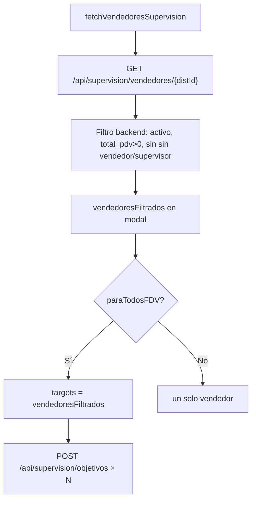
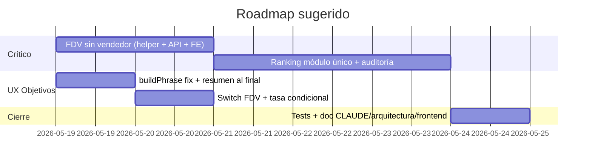

# SPEC-PLAN — Objetivos, ranking y UX (2026-05-18)

**Alcance:** solo planificación (documento de referencia para implementación).  
**Módulos:** `/objetivos`, backend de supervisión/objetivos, ranking/KPIs, watcher de objetivos.

---

## Resumen ejecutivo

| # | Tema | Severidad | Esfuerzo estimado |
|---|------|-----------|-------------------|
| 1 | FDV incluye “Sin vendedor” | Alta | M |
| 2 | Ranking por exhibición lógica | Alta | L |
| 3 | Frase “Objetivo generado” al final | Media | S |
| 4 | Checkbox → Switch (General FDV / por vendedor) | Baja | S |
| 5 | Tasa pendientes condicional por PDV | Media | S |

---

## 1. Objetivo general FDV asigna a “Sin vendedor”

### Síntoma

Al marcar **“¿Objetivo general para la FDV?”** se crea al menos un objetivo para el bucket operativo **Sin vendedor** (o equivalente).

### Análisis del flujo actual



**Frontend** (`shelfy-frontend/src/app/objetivos/page.tsx`):

- `paraTodosFDV` itera `vendedoresFiltrados` (líneas ~1198–1200, ~1415).
- Lista de vendedores desde `fetchVendedoresSupervision` → mapeo `nombre_erp: v.nombre_vendedor` (~3089–3093).

**Backend** (`CenterMind/routers/supervision.py` ~1147–1157):

- Excluye vendedores cuyo nombre contiene `"sin vendedor"` o `"supervisor"` (case-insensitive).
- Excluye inactivos (`vendedores_perfil`) y vendedores sin PDVs (`total_pdv == 0`).

**POST crear objetivo** (~2294–2299):

- Valida que `id_vendedor` exista en `vendedores_v2_{tenant}`.
- **No** rechaza explícitamente vendedores bucket / sin vendedor.

### Hipótesis de causa raíz (orden de probabilidad)

1. **Nombre ERP que no matchea el filtro literal**  
   Bucket con nombres como `POOL`, `VARIOS`, `GENERICO`, código numérico (`76261`), o variantes sin la subcadena `"sin vendedor"`. Patrón ya usado en ingesta/reportes (`prefijos_sin_vendedor` en `report_service.py` / scripts DH) pero **no** en supervisión/objetivos.

2. **Falta de defensa en profundidad en frontend**  
   Si el API devuelve un vendedor bucket por regresión o tenant distinto, el bulk FDV lo incluye sin filtro local.

3. **Confusión con la frase generada** (ver §3)  
   `buildPhrase()` usa `vendedorNombre` del estado; con `paraTodosFDV` el select queda vacío y la preview muestra `"[ Vendedor ] …"`. El usuario puede interpretar eso como “sin vendedor” aunque `nombre_vendedor` en DB sea correcto.

4. **Multi-sucursal sin sucursal elegida**  
   Con varias sucursales y `modalSucursal === ""`, `vendedoresFiltrados === vendedores` (toda la distribuidora). No es “sin vendedor” per se, pero amplía el blast radius.

### Criterios de aceptación

- [ ] Bulk FDV **nunca** crea objetivos para vendedores bucket (sin vendedor, supervisor, QA operativo si aplica).
- [ ] Misma regla en portal, mapa (`TabSupervision`) y API POST.
- [ ] Con multi-sucursal, FDV aplica solo a la sucursal seleccionada (o exige selección explícita).
- [ ] Script de auditoría por tenant lista candidatos excluidos vs incluidos antes del deploy.

### Plan de implementación

| Fase | Acción | Archivos |
|------|--------|----------|
| **A. Diagnóstico** | Ejecutar query/script: vendedores con PDVs en ruta que pasan filtro actual pero son bucket (reutilizar `check_weird_vendors.py`, `check_objective_candidates.py`). | `CenterMind/check_*.py` |
| **B. Helper central** | Crear `is_vendedor_excluido_objetivos(nombre_erp: str) -> bool` en `CenterMind/core/helpers.py`: subcadenas `sin vendedor`, `supervisor`, prefijos configurables por tenant (`distribuidor_config` o constante alineada a reportes). | `core/helpers.py` |
| **C. Backend lista** | Usar helper en `supervision_vendedores` (reemplazar `if "sin vendedor" in ...`). | `routers/supervision.py` |
| **D. Backend create** | En `crear_objetivo`, resolver `nombre_erp` del `id_vendedor` y devolver **400** si está excluido. | `routers/supervision.py` |
| **E. Frontend** | Filtrar `vendedores` / `vendedoresFiltrados` con la misma regla (función en `api.ts` o util compartida). Mostrar contador: “Se asignará a N vendedores”. | `objetivos/page.tsx` |
| **F. UX FDV** | Deshabilitar `paraTodosFDV` si `mustSelectSucursalFirst`. Confirmación si N > umbral (ej. 15). | `objetivos/page.tsx` |
| **G. Verificación** | Crear objetivo FDV en tenant de prueba; assert 0 filas con `nombre_vendedor` bucket en `objetivos`. | test manual + script |

---

## 2. Ranking por exhibición lógica (no por cantidad de fotos)

### Invariante de negocio (CLAUDE.md)

> KPI y ranking deben usar **exhibición lógica única** (no contar fotos duplicadas).

### Estado actual por superficie

| Superficie | ¿Dedup lógica? | Clave de dedup | Riesgo |
|------------|----------------|----------------|--------|
| **Dashboard ranking** `GET /api/dashboard/ranking/{id}` | Sí | `integrante + cliente + día` (+ fallback URL/msg/id) | Bajo |
| **Dashboard KPIs** `GET /api/dashboard/kpis/{id}` | Sí (similar) | `seen_logic` tuple | Pendientes cuentan como filas lógicas separadas (diseño) |
| **Bot `/ranking`** `get_ranking_periodo` | Sí | `iid_cliente_día` + best score | Bajo |
| **Bot `/stats`** `_calc_counts` | Sí | misma lógica | Bajo |
| **Objetivos watcher** `_diff_exhibicion` | Sí | `cli_id + day` por aprobados | Bajo para progreso |
| **Supervisión vendedores** `pdv_exhibidos` | Parcial | Set de `id_cliente_pdv` con **cualquier** foto en 30d | No es “fotos”, pero tampoco “exhibición/día” |
| **Supervisión clientes** `total_exhibiciones` | **No** | `exh_count_map[cid] += 1` por fila | **Cuenta fotos** |
| **RPC fallback** `fn_dashboard_ranking` en bot | Desconocido / legacy | URL/msg (audit Tabaco 2026-04) | **Alto** si se usa el fallback |
| **Ranking histórico diario** | Revisar `seen_daily_logic` en `reportes.py` ~495+ | Por día | Auditar en implementación |

### Hallazgo clave

La lógica correcta **ya existe** en `reportes.py` (`dashboard_ranking`, ~379–469) y `bot_worker.py` (`get_ranking_periodo`, ~762–822). El problema es **inconsistencia**: otros consumidores siguen contando filas crudas o usan RPC legacy.

### Definición canónica (propuesta)

**Una exhibición lógica** = máximo un conteo por:

```
(id_integrante, cliente_key, calendar_day_AR)
```

- `cliente_key` = `id_cliente_pdv` → `id_cliente` → `cliente_sombra_codigo` (orden actual).
- `calendar_day_AR` = primeros 10 chars de `timestamp_subida` (TZ AR ya usada en bot).
- Si faltan cliente o día: fallback `url_foto_drive` → `(telegram_chat_id, telegram_msg_id)` → `id_exhibicion`.
- Si hay varias filas para la misma clave: **ganador por score** (Destacado 3 > Aprobado 2 > Rechazado 1 > Pendiente 0), igual que ranking.

**Puntos** (alineado a bot): aprobada +1, destacada +2 (y aprobada implícita en UI), rechazada no suma puntos.

### Plan de implementación

| Fase | Acción |
|------|--------|
| **A. Extraer módulo** | `CenterMind/core/exhibicion_aggregate.py` (o función en `helpers.py`): `aggregate_exhibiciones_logicas(rows, *, iid_to_erp, qa_filter, allowed_iids) -> dict[vendedor, stats]` |
| **B. Refactor consumidores** | Migrar `dashboard_ranking`, `dashboard_kpis`, `get_ranking_periodo`, watcher (opcional, ya inline) al módulo único |
| **C. Supervisión** | `total_exhibiciones` → `exhibiciones_logicas_30d` (o mantener ambos con labels claros en UI). `exhibidos_30d`: documentar si es “PDV con ≥1 exhibición lógica en 30d” y ajustar loop si se requiere paridad |
| **D. Eliminar fallback RPC** | En `bot_worker.py` ~851–857: log + error controlado; no usar `fn_dashboard_ranking` salvo feature flag. Migración SQL para deprecar RPC o alinearla a la misma función (opcional) |
| **E. Auditoría regresión** | Correr `CenterMind/scripts/audit_ranking_abril_tabaco.py` antes/después; umbral: delta puntos top-10 < 1% salvo casos documentados (Ivan/Monchi, etc.) |
| **F. Tests** | Unit tests con fixture: 3 fotos mismo PDV/día → cuenta 1; 2 días → cuenta 2; destacado gana sobre aprobado |

### Criterios de aceptación

- [ ] Ranking portal, bot `/ranking` y bonos (si usan misma fuente) coinciden en top-N para un período fijo (ej. 2026-04 tabaco).
- [ ] Ningún KPI de “ranking” visible al usuario usa `COUNT(*)` de `exhibiciones` sin dedup.
- [ ] Documentar en `arquitectura.md` la definición de exhibición lógica y el módulo único.

---

## 3. “Objetivo generado” como resumen al final del formulario

### Estado actual

En `NuevoObjetivoModal`, el bloque **“Objetivo generado”** está **arriba** del formulario (~1639–1643), antes de sucursal, vendedor, tipo y campos contextuales.

### Problemas detectados

1. **Orden UX**  
   El usuario configura tipo/meta/PDVs y la frase arriba no refleja el estado final hasta volver a mirar arriba.

2. **Bug funcional en bulk FDV**  
   `buildPhrase()` no recibe parámetro de vendedor; usa solo `vendedorNombre` del state (~1336–1404).  
   En `handleSubmit` se llama `buildPhrase(target.nombre_erp)` (~1441+), pero **TypeScript ignora el argumento** → todas las descripciones bulk usan el mismo nombre (vacío con `paraTodosFDV`).

3. **Preview vs persistencia**  
   La preview y lo guardado en `descripcion` pueden divergir.

### Diseño objetivo (orden del modal)

1. Origen (distribuidora / compañía)  
2. Sucursal → Vendedor + Switch FDV  
3. Tipo + paneles contextuales  
4. Tasa pendientes *(condicional, §5)*  
5. Fecha límite *(distribuidora)*  
6. Descripción opcional (override)  
7. **Resumen — Objetivo generado** (card fija, texto `buildPhrase(vendorName?)`)  
8. Acciones Crear / Cancelar  

### Plan de implementación

| Tarea | Detalle |
|-------|---------|
| Refactor `buildPhrase` | `buildPhrase(opts?: { vendorName?: string; ... })` con todos los inputs explícitos (tipo, modos, cantidades, fecha, PDVs seleccionados) |
| Preview reactiva | `useMemo(() => buildPhrase({ vendorName: paraTodosFDV ? "Cada vendedor" : vendedorNombre, ... }), [deps])` |
| Submit bulk | `desc \|\| buildPhrase({ vendorName: target.nombre_erp, ... })` por cada `target` |
| Modo FDV en resumen | Frase plantilla sin nombre propio: “Cada vendedor de la FDV debe…” o listar sucursal si aplica |
| Coherencia mapa | Revisar `buildObjectivePhrase` en `TabSupervision.tsx` para mismas reglas de copy |

### Criterios de aceptación

- [ ] El resumen está **debajo** de todos los campos editables y **encima** de Crear.
- [ ] Crear 3 objetivos FDV produce **3 descripciones distintas** con el nombre ERP correcto.
- [ ] Si `desc` no está vacío, el resumen muestra la custom pero indica “usando descripción personalizada”.

---

## 4. Checkbox → Switch (General FDV / por vendedor)

### Estado actual

- FDV: `<input type="checkbox">` (~1688–1699).
- Modos “general” por tipo: **botones** segmentados (alteo, activación, exhibición), no checkbox.

### Interpretación del pedido

- **Switch principal:** “Objetivo general para la FDV” vs asignación a un vendedor.
- **Opcional (confirmar con producto):** reemplazar toggles “Meta general por cantidad” / “Seleccionar PDVs” por Switch General | Por PDV (misma semántica, distinto control).

### Plan de implementación

| Tarea | Detalle |
|-------|---------|
| Componente | `Switch` de `@/components/ui/switch` (shadcn ya en repo) |
| FDV | `Switch` + label; al activar: limpiar `vendedorId`, deshabilitar select vendedor |
| Accesibilidad | `aria-labelledby`, estado visible “Por vendedor” / “Toda la FDV” |
| Consistencia | Mismos tokens que otros switches del portal (`frontend.md`) |
| (Opcional) | Unificar toggles de modo general/por PDV en exhibición/activación/alteo |

### Criterios de aceptación

- [ ] Control FDV es Switch, no checkbox nativo.
- [ ] Comportamiento idéntico al actual (sin regresión en submit).

---

## 5. Tasa de pendientes — visualización condicional (PDV particular)

### Semántica de negocio

`tasa_pendientes` = margen de tolerancia: la meta se cumple con `valor_actual >= valor_objetivo - tasa`. Los ítems pendientes siguen visibles (`objetivos_watcher_service.py` ~107–122, ~124–148).

Tiene sentido cuando hay **ítems por PDV** (`objetivo_items`), no en metas globales sin lista.

### Estado actual

- Campo **siempre visible** en modal objetivos (~2403–2418).
- En kanban, `tasa_pendientes` se muestra en cards con `desglose_cache.pendientes_count` (~941–950).
- `TabSupervision` ya crea desde PDVs seleccionados en mapa (~3426: “siempre visible” allí es aceptable).

### Regla de visibilidad propuesta (modal `/objetivos`)

Mostrar input **solo si**:

```ts
const showTasaPendientes =
  !paraTodosFDV &&
  (
    (tipo === "conversion_estado" && activacionMode === "por_pdv" && selectedPdvIds.size > 0) ||
    (tipo === "exhibicion" && exhibicionMode === "por_pdv" && selectedPdvIds.size > 0) ||
    (tipo === "ruteo" && selectedPdvIds.size > 0) ||
    (tipo === "ruteo_alteo" && alteoMode === "por_dia" && selectedDias.size > 0)
  );
```

Ocultar cuando:

- `paraTodosFDV`
- Metas “general por cantidad” sin PDVs explícitos
- `origen === "compania"` sin ítems *(confirmar con negocio)*

Al ocultar: limpiar `tasaPendientes` en state para no enviar campo residual.

### Plan de implementación

| Tarea | Detalle |
|-------|---------|
| Condición UI | Envolver bloque en `showTasaPendientes` |
| Reset | `useEffect` que pone `tasaPendientes=""` cuando pasa a false |
| Helper texto | “Aplica cuando el objetivo tiene PDVs asignados: podés cerrar la meta dejando hasta N ítems pendientes.” |
| Backend | Opcional: rechazar `tasa_pendientes` si `pdv_items` vacío y tipo no es por-ítems |
| Kanban | Mantener visualización en cards que ya tienen `tasa_pendientes` en DB |

### Criterios de aceptación

- [ ] En meta general FDV o exhibición “solo cantidad”, el campo no aparece.
- [ ] Al seleccionar ≥1 PDV en activación/exhibición por PDV, el campo aparece.
- [ ] Objetivos creados sin el campo no incluyen `tasa_pendientes` en payload.

---

## Orden de ejecución recomendado



1. **§1 + §3** juntos (misma pantalla, riesgo operativo alto).  
2. **§2** (impacto transversal, requiere auditoría).  
3. **§4 + §5** (UX rápida).

---

## Verificación global (checklist pre-merge)

- [ ] Tenant tabaco: FDV con sucursal elegida → N objetivos = N vendedores activos filtrados, 0 bucket.
- [ ] Ranking abril 2026: diff audit script vs baseline aceptado.
- [ ] Modal objetivos: resumen abajo coherente con submit.
- [ ] Switch FDV funcional en mobile.
- [ ] Tasa pendientes solo con PDVs; watcher respeta umbral en objetivo por-ítems.
- [ ] Protocolo Shelfy: actualizar `progress.md`, `frontend.md`, `arquitectura.md` al implementar.

---

## Archivos principales de referencia

| Tema | Archivo |
|------|---------|
| Modal objetivos | `shelfy-frontend/src/app/objetivos/page.tsx` |
| API vendedores | `shelfy-frontend/src/lib/api.ts` → `fetchVendedoresSupervision` |
| Lista + filtro vendedores | `CenterMind/routers/supervision.py` ~976–1158 |
| Crear objetivo | `CenterMind/routers/supervision.py` ~2239+ |
| Ranking dashboard | `CenterMind/routers/reportes.py` ~379–469 |
| Ranking bot | `CenterMind/bot_worker.py` ~685–857 |
| Watcher exhibición | `CenterMind/services/objetivos_watcher_service.py` ~752+ |
| Auditoría ranking | `CenterMind/scripts/audit_ranking_abril_tabaco.py`, `audit_ranking_tabaco_2026_04.md` |
| Switch UI | `shelfy-frontend/src/components/ui/switch.tsx` |
| Mapa objetivos | `shelfy-frontend/src/components/admin/TabSupervision.tsx` |

---

## PRs sugeridos

| PR | Contenido |
|----|-----------|
| PR-1 | §1 FDV + helper vendedores excluidos |
| PR-2 | §3 buildPhrase + resumen al final |
| PR-3 | §2 ranking módulo único + auditoría |
| PR-4 | §4 Switch + §5 tasa condicional |

---

**Última actualización:** 2026-05-18  
**Estado:** Planificación — pendiente de implementación
