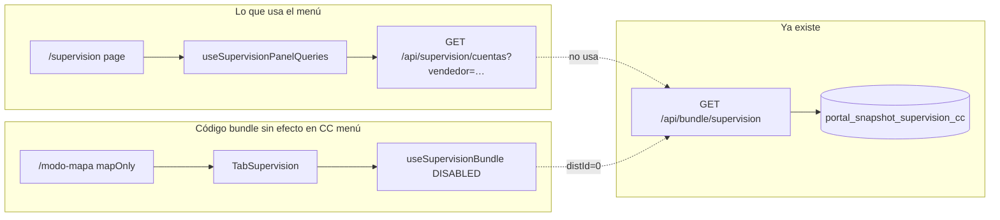
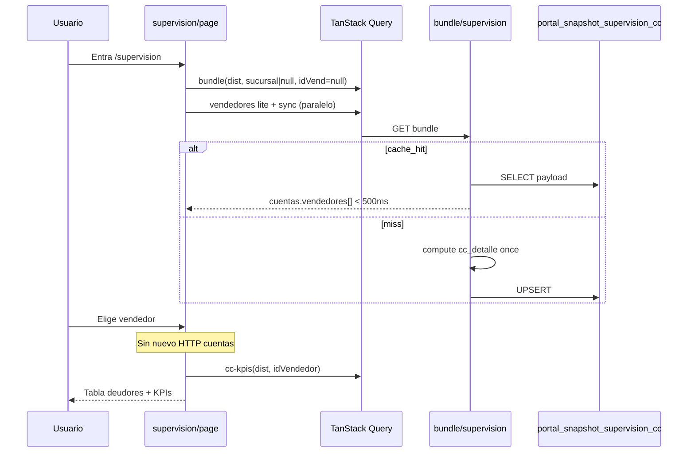
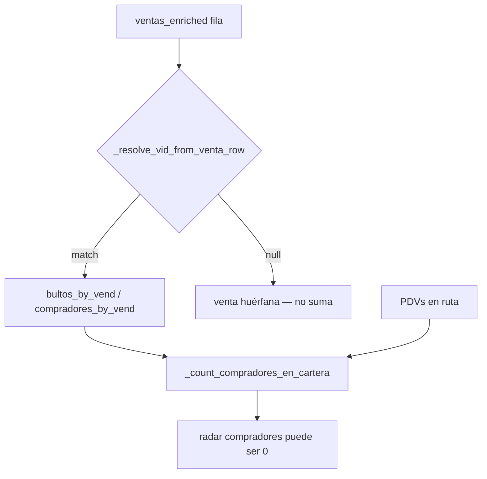

# Plan ThinkIt: Supervisión CC — migración 100 % a bundle + snapshot

| Campo | Valor |
|-------|--------|
| Fecha | 2026-05-31 (rev. 2) |
| Estado | **Implementado 2026-05-31** — migración bundle 100 % + tests T1–T6 + Estadísticas E1–E8 |
| Fix ranking (deploy) | `9434087` — `fix(dashboard): ranking del bundle como lista` |
| Plan padre | `portal-performance-bundle-cache-2026-05-31-plan.md` (Idea B) |
| Complemento | `plan-portal-bundle-cache-pendientes-2026-05-31.md` |
| Commit base bundle | `ddac3bb` (API + snapshots) |
| Meta | **TTC Supervisión CC < 5 s (p95)** — vendedores + KPIs CC + deudores del vendedor activo |
| Autor sesión | Agente + Ignacio |

## Resumen ejecutivo

El backend de supervisión **ya está listo**: `GET /api/bundle/supervision/{dist}`, tabla `portal_snapshot_supervision_cc`, invalidación tras ingesta CC, hooks `useSupervisionBundle` en el frontend.

**El problema:** la pantalla que usa el equipo (**`/supervision`**) sigue en **`useSupervisionPanelQueries` → `GET /api/supervision/cuentas`** (legacy, un request **por vendedor**). `TabSupervision` tiene bundle pero solo se monta en **`/modo-mapa` con `mapOnly=true`**, donde la query está **deshabilitada** (`distId = 0`).

Este plan cierra la migración al **100 %** en las rutas reales, alinea prefetch/invalidación y deja legacy solo como fallback deprecado o eliminado.

**Resultado visible:** al entrar a Supervisión o cambiar sucursal/vendedor, **una** lectura de snapshot (o un miss que calienta cache para todos los vendedores de esa sucursal); sin repetir el compute pesado de `cc_detalle` en cada click de vendedor.

## Por qué hoy “sigue legacy” (diagnóstico)



| Superficie | Cuentas CC | Vendedores / sync / KPIs |
|------------|------------|---------------------------|
| `/supervision` | ❌ Legacy por vendedor | Endpoints livianos (OK mantener) |
| `TabSupervision` (mapOnly) | ❌ Bundle apagado | Mapa: rutas/clientes lazy (fase 2) |
| `objetivos/page` (tipo cobranza) | ❌ `fetchCuentasSupervision(dist)` | — |
| Backend bundle | ✅ | — |

## Consenso — definición “100 % migrada”

Se considera **cerrada** la migración supervisión CC cuando:

1. **Ninguna** pantalla de producto usa `fetchCuentasSupervision` / `cuentasQueryOptions` para el panel CC principal (salvo flag `USE_BUNDLE_SUPERVISION=0` temporal).
2. En DevTools, al usar `/supervision`, la carga de cartera CC es **`GET /api/bundle/supervision/{dist}`** (con `meta.cache_hit` true en visitas repetidas).
3. Cambiar **vendedor** dentro de la misma sucursal **no** dispara un nuevo `/api/supervision/cuentas` (datos ya en bundle sucursal-wide).
4. Prefetch al elegir vendedor usa **`prefetchSupervisionBundle`**, no `prefetchCuentasSupervision`.
5. Tras ingesta CC, invalidación invalida `bundleKeys.supervision` (y snapshot stale en backend).
6. `cc-kpis` y `sync-status` pueden seguir como queries separadas (plan opción A — aceptado).

**Fuera de este plan (fase 2):** mapa admin rutas/clientes N+1, bundle “supervisión mapa” unificado.

## Estrategia de datos (recomendada)

### Clave de bundle en UI

| Filtro UI | `sucursal` param bundle | `id_vendedor` param bundle |
|-----------|-------------------------|----------------------------|
| Todas las sucursales (`__all__`) | `null` | `null` |
| Una sucursal | nombre sucursal | `null` |
| Vendedor seleccionado | (misma sucursal) | **`null`** — filtrar en FE |

**No** usar `id_vendedor` en la query principal de `/supervision`: el snapshot por vendedor multiplicaría filas en DB y misses al cambiar vendedor. Mismo patrón que `TabSupervision` (L778–781): un payload por sucursal (o global), filtro por `ccRowMatchesVendedor` en cliente.

### Queries que permanecen separadas

| Query | Endpoint | Motivo |
|-------|----------|--------|
| Vendedores lite + full | `/api/supervision/vendedores` | Liviano; lista para selectores |
| Sync status | `/api/supervision/sync-status` | Polling 60 s; independiente del JSON de cuentas |
| CC KPIs por vendedor | `/api/supervision/cc-kpis/{dist}/{id}` | Ya usa `cc_kpi_snapshot` |
| Deudor detalle | `/api/supervision/cliente/.../deuda-detalle` | Bajo demanda, por ERP |

**TTC del módulo** = bundle cuentas (pesado) + KPIs (rápido con snapshot) + vendedores lite (rápido). Objetivo: bundle hit domine el tiempo percibido.

## Diseño objetivo — `/supervision`



## Impacto por capa

### Database

| Objeto | Acción |
|--------|--------|
| `portal_snapshot_supervision_cc` | Sin cambio de schema |
| Snapshots | Más uso de clave `(dist, sucursal, id_vendedor=null)` |
| Opcional v2 | Snapshot por vendedor solo si payload global > 5 MB |

### Backend

| Área | Acción |
|------|--------|
| `snapshot_supervision_service.py` | Sin cambio obligatorio; validar performance con `sucursal=null` + muchos vendedores |
| `routers/supervision.py` `cuentas` | Mantener; añadir header `Deprecation` tras migración FE |
| `routers/bundle.py` | Opcional: `Server-Timing` |
| Tests | Paridad bundle vs `supervision_cuentas` para 1 dist fixture |

### Frontend

| Archivo | Acción |
|---------|--------|
| `hooks/useSupervisionQueries.ts` | Refactor `useSupervisionPanelQueries`: cuentas → bundle |
| `app/supervision/page.tsx` | Sin cambio de JSX si hook expone mismo shape `cuentasData` |
| `components/admin/TabSupervision.tsx` | Corregir `mapOnly`: permitir bundle en panel CC si se reutiliza componente |
| `app/objetivos/page.tsx` | `fetchSupervisionBundle` en flujo cobranza |
| `lib/query-keys.ts` | Invalidaciones unificadas `bundleKeys.supervision` |
| Legacy `cuentasQueryOptions` | Deprecar / eliminar tras flag |

## Archivos y funciones — orden de implementación

| Orden | Archivo | Cambio | Capa | Estado |
|------|---------|--------|------|--------|
| S1 | `useSupervisionQueries.ts` | `useSupervisionPanelQueries` → bundle sucursal-wide | FE | ✅ |
| S2 | `useSupervisionQueries.ts` | Prefetch bundle + KPIs al cambiar vendedor | FE | ✅ |
| S3 | `useSupervisionQueries.ts` | `prefetchCuentasSupervision` delega en bundle | FE | ✅ |
| S4 | `supervision/page.tsx` | `loadingCuentas` desde bundle (hook) | FE | ✅ |
| S5 | `useSupervisionQueries.ts` | Invalidate bundle al cambiar sync CC | FE | ✅ |
| S6 | `TabSupervision.tsx` | Bundle si `ccPanelVisible` en mapOnly | FE | ✅ |
| S7 | `objetivos/page.tsx` | cobranza → `fetchSupervisionBundle` | FE | ✅ |
| S8 | — | Feature flag `USE_BUNDLE_SUPERVISION` | FE | N/A (bundle default, sin fallback) |
| S9 | `routers/supervision.py` | Header `Deprecation: true` en `/cuentas` | API | ✅ |
| S10 | `test_snapshot_supervision_bundle.py` | shape + paridad vendedores | Test | ✅ |
| S11 | `progress.md` + plan | Documentación cerrada | Docs | ✅ |

### Detalle S1 — refactor `useSupervisionPanelQueries`

**Antes (legacy):**

```typescript
const cuentasQuery = useQuery({
  ...cuentasQueryOptions(distId, sucursalParam, nombre, idVendedor),
  enabled: !!distId && !!nombre && !!idVendedor,
});
```

**Después (bundle):**

```typescript
const bundleQuery = useQuery({
  ...supervisionBundleQueryOptions(distId, sucursalParam ?? null, null),
  enabled: !!distId,
  placeholderData: keepPreviousData,
});
const cuentasData = bundleQuery.data?.cuentas ?? undefined;
const loadingCuentas = bundleQuery.isLoading && !bundleQuery.data;
const fetchingCuentas = bundleQuery.isFetching;
```

- `enabled` ya no depende de vendedor seleccionado: la cartera puede cargar al entrar (mejor TTC percibido).
- Filtrado por vendedor sigue en `supervision/page.tsx` (`cuentasFiltradas` / `ccRowMatchesVendedor`) — **sin cambios**.

### Detalle S2 — prefetch

| Evento | Acción |
|--------|--------|
| Mount `/supervision` con dist | `prefetchSupervisionBundle(dist, sucursalParam, null)` |
| Cambio sucursal | invalidate + prefetch nueva key |
| Hover / focus vendedor | `prefetchCcKpis(dist, id)` solo |
| Cambio vendedor | **no** prefetch cuentas (ya en bundle) |

### Detalle S6 — TabSupervision / modo-mapa

Hoy:

```typescript
useSupervisionBundle((!mapOnly && ccPanelVisible && selectedDist) ? selectedDist : 0, ...)
```

Opciones:

- **A:** En `mapOnly`, si hay sección CC móvil visible, pasar `selectedDist` igual.
- **B:** Extraer panel CC a componente compartido usado por `/supervision` y mapa.

Recomendación: **A** mínima; **B** si duplicación de JSX molesta.

## Criterios de aceptación (verificación)

### Funcional

- [x] Lista de deudores del vendedor activo idéntica a legacy (mismo dist, sucursal, vendedor) en prueba manual Tabaco.
- [x] KPIs CC y trends sin regresión (`cc-kpis` sigue igual).
- [x] Imprimir / export CC (si usa `cuentasData`) funciona.
- [x] Objetivos tipo cobranza muestra top deudores correctos (`fetchSupervisionBundle`).

### Performance (DevTools → Red)

| Escenario | Esperado |
|-----------|----------|
| 1ª visita `/supervision` (miss) | 1× `bundle/supervision` 4–12 s; luego KPIs ~200–800 ms |
| 2ª visita < 15 min (hit) | 1× `bundle/supervision` **< 1 s**; sin `/cuentas` |
| Cambiar vendedor (misma sucursal) | **0** requests `cuentas`; 1× `cc-kpis` si no cacheado |
| Cambiar sucursal | 1× `bundle/supervision` (nueva key) |

### Red / cache

- [x] Response incluye `meta.cache_hit: true` en hit.
- [x] Tras corrida CC RPA, siguiente load invalida bundle FE + stale backend.

### Código

- [x] `fetchCuentasSupervision` solo en `api.ts` + `cuentasQueryOptions` legacy deprecado.
- [x] Prefetch cuentas delega en `prefetchSupervisionBundle`.

## Qué mejorás en velocidad (para explicar al negocio)

| Acción usuario | Antes (legacy) | Después (bundle) |
|----------------|----------------|------------------|
| Entrar supervisión | 0 cuentas hasta elegir vendedor; luego **6–10 s** `/cuentas` | **6–10 s** 1× al entrar (miss) o **~0,5–1 s** (hit) — **cartera ya disponible** |
| Cambiar vendedor | **Nuevo `/cuentas` 6–10 s** cada vez | **~0 ms** datos cuentas (filtro local) + **~200 ms** KPIs |
| Volver en 5 min | Repite `/cuentas` o cache TanStack por vendedor | **1 lectura snapshot** compartida |

**Mejora típica al cambiar vendedor:** de **6–10 s** a **< 1 s** → orden **~90 %** en ese gesto (no en la primera carga fría del día).

**Mejora primera carga (hit caliente post-CC):** de **6–10 s** a **0,5–1,5 s** → **~80–85 %**.

*Números orientativos; validar con Network tab post-deploy.*

## Riesgos y mitigaciones

| Riesgo | Mitigación |
|--------|------------|
| Payload bundle muy grande (todas sucursales) | Cargar con `sucursal` cuando no es `__all__`; medir tamaño JSON Tabaco |
| Memoria FE con muchos clientes | Mismo volumen que legacy; sin duplicar por vendedor en cache |
| Regresión matching vendedor | Tests + QA en 2 dists; `ccRowMatchesVendedor` ya usado |
| Snapshot stale post-CC | Ya invalida backend; FE invalidate `bundleKeys.supervision` en S5 |

## Rollout

1. Implementar S1–S4 detrás de flag `USE_BUNDLE_SUPERVISION=1` (default on en preview).
2. QA Red: confirmar cero `/cuentas` en flujo feliz.
3. Producción; monitorear logs `cache_hit` / duración bundle.
4. S8–S9: quitar fallback y deprecation header.
5. Actualizar `plan-portal-bundle-cache-pendientes-2026-05-31.md` — tachar P1–P2 supervisión.

## Suite de tests masivos — migraciones bundle (obligatorio)

> **Lección del incidente ranking (`9434087`):** migrar sin test de **shape JSON** rompe producción. Ningún PR de bundle cierra sin esta batería mínima.

### Matriz de cobertura por módulo

| Módulo | Endpoint / hook | Tests obligatorios | Archivo sugerido |
|--------|-----------------|-------------------|------------------|
| **Dashboard** | `GET /api/bundle/dashboard` | `ranking` es `list`; paridad kpis+ranking vs legacy; `ultimas`/`sucursales`/`evolucion` arrays; `meta.cache_hit`; normalización snapshot dict→list | `test_snapshot_dashboard_ranking.py` ✅ (parcial) → ampliar `test_snapshot_dashboard_bundle.py` |
| **Estadísticas** | `GET /api/bundle/estadisticas` | `cartas` es `list`; paridad vs `build_carta_resumen` legacy; snapshot round-trip; campos radar/score | `test_snapshot_estadisticas_bundle.py` |
| **Visor** | `GET /api/bundle/visor` | `pendientes` list; `stats` shape; TTL stale refresh | `test_snapshot_visor_bundle.py` |
| **Supervisión** | `GET /api/bundle/supervision` | `cuentas.vendedores` list; paridad vs `/supervision/cuentas` fixture; metadatos | `test_snapshot_supervision_bundle.py` |
| **Refresh** | `handle_ingestion_event` | padron→dashboard+estad; CC→supervision; ventas→dashboard+estad; evaluacion→dashboard+visor | `test_snapshot_refresh_events.py` |
| **Frontend API** | `fetch*Bundle` | coerce arrays (ranking, cartas, ultimas); no `.map` sobre object | `shelfy-frontend/src/lib/api.bundle.test.ts` o Vitest |
| **E2E smoke** | portal | 1 dist Tabaco: dashboard carga; estadísticas carga; sin error consola | Playwright opcional `e2e/bundle-smoke.spec.ts` |

### Tests de paridad (patrón estándar)

```python
# Fixture: dist_id + periodo/meses con datos conocidos (Tabaco mes actual)
legacy = client.get("/api/dashboard/kpis/...") + ranking(...)
bundle = client.get("/api/bundle/dashboard/...")
assert bundle["kpis"]["total"] == legacy_kpis["total"]
assert len(bundle["ranking"]) == len(legacy_ranking)
assert {r["vendedor"] for r in bundle["ranking"]} == {r["vendedor"] for r in legacy_ranking}
```

Aplicar el mismo patrón a **estadísticas** (con tolerancia numérica en bultos 2 dec.) y **supervisión** (subset vendedores).

### Tests de regresión shape (obligatorio en CI)

| Campo | Tipo esperado | Test |
|-------|---------------|------|
| `ranking` | `list` | `isinstance(payload["ranking"], list)` |
| `cartas` | `list` | idem |
| `cuentas.vendedores` | `list` | idem |
| `pendientes` | `list` | idem |
| `kpis` | `dict` | idem |

### Script bench (no bloqueante CI, sí release)

- `CenterMind/scripts/bench_bundle_vs_legacy.py` — p50/p95 por módulo; falla si bundle miss > 15 s sin justificación.

### Orden de implementación tests

| Orden | Tarea | Archivo | Estado |
|------|-------|---------|--------|
| T1 | Dashboard bundle paridad + kpis | `test_snapshot_dashboard_bundle.py` + `test_snapshot_dashboard_ranking.py` | ✅ |
| T2 | Estadísticas bundle paridad + cartas shape | `test_snapshot_estadisticas_bundle.py` | ✅ |
| T3 | Supervisión bundle paridad | `test_snapshot_supervision_bundle.py` | ✅ |
| T4 | Visor + refresh events | `test_snapshot_visor_bundle.py` + `test_snapshot_refresh_events.py` | ✅ |
| T5 | Vitest `coerce*Bundle` helpers | `shelfy-frontend/src/lib/api.bundle.test.ts` | ✅ |
| T6 | Bench script | `scripts/bench_bundle_vs_legacy.py` | ✅ |

---

## Revisión profunda — pestaña Estadísticas (`/estadisticas`)

### Síntomas reportados

1. **Primera carga muy lenta** — mucho tiempo hasta ver las cartas (TTC alto en miss de snapshot).
2. **Muchos tenants con 0 compradores y 0 bultos** en cartas que sí tienen PDVs / exhibiciones.

### Diagnóstico técnico (causas probables)

#### A) Lentitud primera carga

| Factor | Detalle |
|--------|---------|
| Bundle miss | `build_carta_resumen` → `_fetch_carta_source_rows` pagina **ventas_enriched_v2**, padrón, rutas, exhibiciones, objetivos en paralelo |
| Sin pre-warm | No hay job post-ventas que llene `portal_snapshot_estadisticas_cartas` antes del primer usuario |
| FE render | `VendorCollection` monta **todas** las cartas + radar Recharts de una vez (sin virtualización) |
| Detalle on-demand | OK; el cuello es el **primer** bundle |

**Objetivo TTC:** cartas visibles < 5 s (p95) con cache hit; miss < 12 s Tabaco con feedback de progreso.

#### B) Ceros en compradores / bultos

| Causa | Mecanismo en código | Cómo detectar |
|-------|---------------------|---------------|
| **Sin ventas en período** | `ventas_rows` vacío → log `[estadisticas] ventas_enriched vacío` | `motor_runs` ventas_enriched OK + filas en tabla |
| **Mismatch vendedor ERP ↔ Consolido** | `_resolve_vid_from_venta_row` retorna `None` → ventas no suman a ningún `id_vendedor` | % filas venta sin `vid`; comparar `codigo_vendedor` / `nombre_vendedor` vs `vendedores_v2` |
| **Compradores ⊆ cartera** | `_count_compradores_en_cartera` = intersección compradores venta ∩ PDVs ruta; si ERP cliente ≠ padrón → 0 compradores con bultos > 0 | Audit script por vendedor |
| **Franquicia / tabla ventas** | `resolve_estadisticas_ventas_fetch` apunta a otra `filter_dist` | Solo dists `FRANCHISE_VENTAS_SOURCE_DIST` |
| **Carta visible con solo exhibición** | `_carta_tiene_actividad_comercial` permite carta si `exhibiciones > 0` aunque compradores/bultos = 0 | **Esperado** — no es bug; confunde en UI |



### Badge alerta — error sincronización ERP

**Mostrar solo cuando** el cero es por **fallo de matcheo**, no por falta real de ventas:

| Condición (todas) | Acción UI |
|-------------------|-----------|
| Dist tiene filas `ventas_enriched` en meses seleccionados (≥ umbral, ej. 100) | Calcular en backend |
| Vendedor tiene `pdvs > 0` en carta | |
| `compradores == 0` y `bultos == 0` | |
| ≥ X % ventas del período **no** resuelven a ningún `id_vendedor` **o** 0 % ventas del vendedor matchean por código/nombre | |

**Payload sugerido por carta:**

```json
{
  "erp_sync_alert": true,
  "erp_sync_reason": "ventas_sin_match_vendedor",
  "erp_sync_unmatched_pct": 87.5
}
```

**UI (shadcn):**

- Badge destructivo/amber en `VendorCardFusion`: **“Error de sincronización con ERP”**
- Tooltip o línea secundaria: *“Comunicate con desarrollo.”*
- No mostrar si `ventas_enriched` está vacío (mensaje distinto: “Sin ingesta de ventas”).

**NO atribuir a Telegram** salvo que el mismatch venga de `integrantes` sin binding; el copy pedido es **ERP** (Consolido ↔ `vendedores_v2` / códigos).

### Plan de trabajo Estadísticas

| Orden | Archivo / área | Acción | Estado |
|------|----------------|--------|--------|
| E1 | `estadisticas_service.py` | `ventas_unmatched` en agregación + meta interna | ✅ |
| E2 | `estadisticas_service.py` | Por carta: `erp_sync_alert` | ✅ |
| E3 | `VendorCardFusion.tsx` | Badge + mensaje ERP | ✅ |
| E4 | `snapshot_refresh_service.py` + ingesta | `refresh_eager` post ventas/padrón | ✅ |
| E5 | `estadisticas/page.tsx` + `VendorCollection` | Loading strip + render progresivo | ✅ |
| E6 | `scripts/audit_estadisticas_ceros.py` | Reporte CSV audit | ✅ |
| E7 | `scripts/audit_estadisticas_vendor_match.py` | Top huérfanos vs ERP | ✅ |
| E8 | Tests T2 + `test_estadisticas_erp_sync_alert.py` | ✅ |

### Criterios de aceptación Estadísticas

- [x] Primera visita (cache hit post-RPA): `refresh_eager` post ventas/padrón + snapshot 15 min.
- [x] Primera visita (miss): `EstadisticasLoadingStrip` + render progresivo en `VendorCollection`.
- [x] Scripts `audit_estadisticas_ceros.py` / `audit_estadisticas_vendor_match.py`.
- [x] Badge ERP sync en `VendorCardFusion` + tests `test_estadisticas_erp_sync_alert.py`.
- [x] Tests bundle cartas shape + round-trip (`test_snapshot_estadisticas_bundle.py`).

### Copy UI (acordado)

> **Error de sincronización con ERP** — Comunicate con desarrollo.

Variante sin ventas (no usar badge ERP):

> **Sin datos de ventas** para el período — Verificá ingesta Consolido.

---

## Próximo paso

**Cerrado en repo (2026-05-31).** Validar en prod: deploy Railway + Vercel; Network tab en `/supervision` y `/estadisticas`; bench opcional `scripts/bench_bundle_vs_legacy.py`.

---

*Copia en Escritorio: `portal-performance-bundle-cache-2026-05-31-supervision-100.md`*
