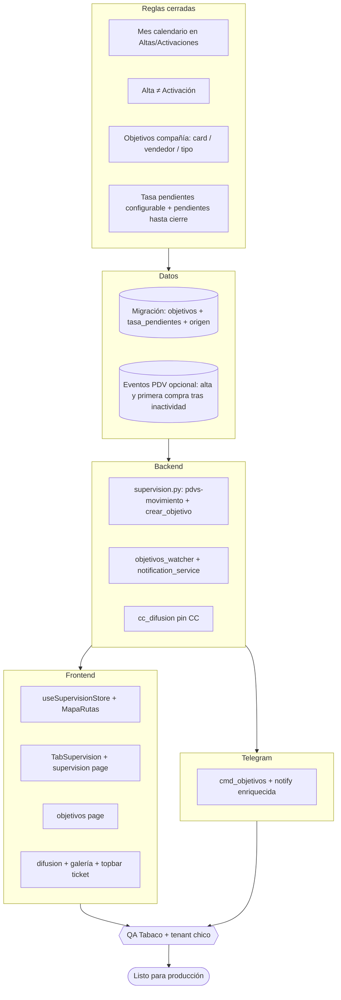

# SPEC MAESTRO — Supervisión · Mapa · Objetivos · Galería · Difusión / Tickets

**Fecha:** 2026-05-06 (actualizado con reglas de negocio finales)  
**Pre-especificación:** [`pre-spec-modulos-supervision-mapa-objetivos-2026-05-06.md`](./pre-spec-modulos-supervision-mapa-objetivos-2026-05-06.md)

Este maestro enlaza los specs hijos y fija reglas globales cerradas, dependencias, criterios de aceptación y alcance de rollout.  
Si hay conflicto entre documentos, este maestro prevalece.

---

## Documentos hijo

| Spec | Alcance |
|------|---------|
| [`SPEC-supervision-cc-altas-2026-05-06.md`](./SPEC-supervision-cc-altas-2026-05-06.md) | CC, panel Altas/Activaciones (mes calendario), selectores |
| [`SPEC-mapa-rutas-ux-print-2026-05-06.md`](./SPEC-mapa-rutas-ux-print-2026-05-06.md) | Mapa, 7 días corridos, impresión = viewport, leyenda |
| [`SPEC-objetivos-compania-distribuidora-telegram-2026-05-06.md`](./SPEC-objetivos-compania-distribuidora-telegram-2026-05-06.md) | Compañía, tasa pendientes, prorrateo lun–sáb, Telegram |
| [`SPEC-galeria-toolbar-ids-2026-05-06.md`](./SPEC-galeria-toolbar-ids-2026-05-06.md) | Layout, **nunca** ID interno Shelfy |
| [`SPEC-difusion-sigo-plantillas-ticket-flotante-2026-05-06.md`](./SPEC-difusion-sigo-plantillas-ticket-flotante-2026-05-06.md) | SIGO solo superadmin, plantillas por usuario, tickets |
| [`SPEC-qa-smoke-playwright-epic-modulos-2026-05-06.md`](./SPEC-qa-smoke-playwright-epic-modulos-2026-05-06.md) | QA integral: smoke, E2E Playwright, roles, tenants y criterios release |

---

## Reglas globales aprobadas (fuente de verdad)

### PDV Nuevo (alteo / alta en base)

- PDV que **no existía** en `clientes_pdv_v2_*` y se dio de **alta desde cero** (primera inserción en nuestra base por ingesta padrón).
- **No** confundir con “activación”.

### Activación (compra tras inactividad)

- PDV que **pasa de no comprar** (nunca compró **o** última compra hace **más de 30 días**) **a** registrar compra (queda “comprando” según criterio operativo: `fecha_ultima_compra` actualizada en el padrón).
- Es el mismo criterio en **Supervisión (panel por mes)** y en **métricas del mapa** donde aplique.

### Panel Supervisión “Altas y Activaciones”

- Siempre referido al **mes calendario** seleccionable (`YYYY-MM`). No hay ventana rodante en ese panel.
- El panel debe ser **listado accionable**, no solo conteo agregado.

### Mapa — KPI bajo vendedor

- **Últimos 7 días:** **7 días corridos** hacia atrás desde “hoy” (timezone AR).
- Conteos separados: **PDV nuevos (alta en base)** vs **PDV activados** (transición compra según arriba).

### Objetivos de compañía

- Quién crea: **`directorio`** y **`superadmin`**.
- UI: **una card por vendedor por tipo de objetivo** (misma fila `(vendedor, tipo_compañía, mes)` sin duplicar).
- Prorrateo de meta mensual para vista semanal/diaria: **lunes a sábado** únicamente (domingo excluido del prorrateo).
- `mes_referencia` es obligatorio para objetivos de compañía.

### Tasa de pendientes (activación)

- Valor **configurable** al crear/asignar el objetivo (no es fijo).
- Si el objetivo alcanza **100 %** por el margen, los ítems **siguen pendientes** hasta el **cierre temporal del objetivo**; la UI debe mostrar siempre **tasa configurada**, **cuántos** y **cuáles** siguen pendientes.
- Semántica de texto obligatoria: “pendiente(s)”.

### Tipos en base de datos

- **Sin renombrar valores** en PostgreSQL (`conversion_estado`, `ruteo_alteo`, etc.); todo renombre es **solo frontend** (labels).

### Difusión

- **SIGO:** visible **solo** para `superadmin`.
- **Plantillas** personalizadas: persistencia **por usuario**.
- Mensajes CC enviados al grupo deben quedar pinneados según regla del módulo.

### Galería

- **Prohibido** mostrar el ID interno Shelfy del PDV en cualquier rol.

### Tickets / log

- Capturar **en lo posible todo** el contexto útil (ruta, acciones, entidades no sensibles).
- **Retención del log adjunto al ticket:** **30 días**.

### Impresión mapa

- Imprime el mapa **según lo visible en pantalla en ese momento** (viewport actual, capas/toggles aplicados).

---

## Diagrama — flujo de resolución del epic (Mermaid)

---

## Orden de implementación recomendado

1. **Modelo y contratos backend**  
   - Migraciones de `objetivos` (`origen`, `mes_referencia`, `tasa_pendientes`) y tablas auxiliares necesarias.  
   - Definición de endpoint(s) para listado de movimientos PDV por vendedor/mes.
2. **Capa servicios**  
   - Cálculo estable de alta/activación y watcher de objetivos con regla de pendientes.  
   - Notificaciones Telegram enriquecidas y pin CC.
3. **Mapa (frontend)**  
   - Eliminación de deudores, interacción clic/doble clic, popup, leyenda e impresión viewport.
4. **Supervisión (frontend)**  
   - Nuevo layout y panel Altas/Activaciones con mes calendario y jerarquía de filtros limpia.
5. **Objetivos (frontend + bot)**  
   - Flujos compañía/distribuidora y drill-down mensual/semanal/diario.
6. **Difusión + Galería + Ticket flotante**  
   - Hardening de permisos, UX y retención de logs.

---

## Criterio de “terminado” global

- [ ] Reglas de Alta vs Activación coherentes entre Supervisión (mes) y Mapa (7 días / listados).  
- [ ] Sin ID interno PDV en galería.  
- [ ] SIGO solo superadmin; plantillas por usuario.  
- [ ] Log ticket con retención 30 días.  
- [ ] Actualizar documentación del repo al cerrar epic (`progress.md` / `frontend.md`).
- [ ] Panel nuevo de Altas/Activaciones visible y operativo en Supervisión.
- [ ] Objetivos de compañía respetan una-card-por-vendedor-y-tipo y prorrateo lun-sáb.
- [ ] Smoke manual y Playwright E2E del epic ejecutados y aprobados.

---

## Checklist ordenado — archivos y funciones (implementación)

Orden sugerido para minimizar conflictos y dependencias rotas:

1. **SQL (Supabase / `CenterMind/migrations`)** — columnas `objetivos` (`origen`, `mes_referencia`, `tasa_pendientes`); tabla opcional `pdv_negocio_eventos` o nombre acordado; tabla `difusion_plantilla_usuario`; políticas RLS si aplican.  
2. **`CenterMind/models/schemas.py`** — `ObjetivoCreate`, DTOs movimiento PDV, plantillas.  
3. **`CenterMind/routers/supervision.py`** — `crear_objetivo`; nuevo `GET .../pdvs-movimiento`; `supervision_cuentas` si hace falta metadatos fecha para texto CC.  
4. **`CenterMind/services/objetivos_watcher_service.py`** — cumplimiento + pendientes hasta cierre.  
5. **`CenterMind/services/objetivos_notification_service.py`** — cuerpo Telegram enriquecido.  
6. **`CenterMind/services/padron_ingestion_service.py`** (o job relacionado) — si se emiten eventos `alta`/`activacion` en ingesta.  
7. **`CenterMind/bot_worker.py`** — `cmd_objetivos`.  
8. **`CenterMind/services/cc_difusion_service.py`** — asegurar pin en todos los envíos CC.  
9. **`CenterMind/routers/` portal-feedback** — campo log extendido + retención 30d documentada en job.  
10. **`shelfy-frontend/src/lib/api.ts`** — nuevos métodos y tipos.  
11. **`shelfy-frontend/src/store/useSupervisionStore.ts`** — `MapMode` sin `deudores`.  
12. **`shelfy-frontend/src/components/admin/MapaRutas.tsx`** — clic/doble clic, iconos, impresión viewport, Street View.  
13. **`shelfy-frontend/src/components/admin/TabSupervision.tsx`** — layout, CC, panel derecho, quitar ruido padrón.  
14. **`shelfy-frontend/src/app/supervision/page.tsx`** — selectores, quitar date inútil.  
15. **`shelfy-frontend/src/app/modo-mapa/page.tsx`** — layout sin badges motores invasivos.  
16. **`shelfy-frontend/src/app/objetivos/page.tsx`** — compañía, tasa, labels, guía ruta.  
17. **`shelfy-frontend/src/app/difusion/page.tsx`** — SIGO solo superadmin; plantillas.  
18. **`shelfy-frontend/src/app/galeria-exhibiciones/page.tsx`** + **`components/galeria/*`** — layout + solo ERP.  
19. **Layout topbar** (archivo real del proyecto bajo `components/layout/`) — ícono sobre + panel ticket.

Referencias de funciones ya ubicadas en código: `crear_objetivo` en `supervision.py`; `cmd_objetivos` en `bot_worker.py`; listener `marker.addListener('click'` en `MapaRutas.tsx`.

---

## Matriz de permisos objetivo (por módulo)

| Módulo | Superadmin | Directorio | Admin | Supervisor |
|---|---|---|---|---|
| Supervisión CC + Altas/Activaciones | Sí | Sí | Sí | Sí |
| Modo mapa operativo | Sí | Sí | Sí | Sí |
| Crear objetivo de compañía | Sí | Sí | No | No |
| Crear objetivo de distribuidora | Sí | Sí (si permiso) | Sí (si permiso) | Sí (si permiso) |
| Difusión SIGO | Sí | No | No | No |
| Ticket flotante a desarrollo | Sí | Sí | Sí | Sí |

---

## Estrategia de QA y validación de negocio

1. **QA funcional por rol**: validar ocultamientos/acciones permitidas según tabla anterior.  
2. **QA temporal**: cambio de mes, inicio/fin de semana, corte de 7 días corridos en mapa.  
3. **QA multi-tenant**: Tabaco + al menos un tenant pequeño para detectar supuestos de volumen.  
4. **QA Telegram**: mensajes largos, caracteres especiales, pin en chat y degradación por falta de permisos.  
5. **QA impresión mapa**: comparar visualmente captura impresa contra viewport antes de imprimir.

---

## Notas de implementación

- Este epic no autoriza hardcodear sucursales ni rutas.  
- Todas las consultas grandes deben paginarse con `.range()` (regla vigente del proyecto).  
- Cualquier renombre de tipo es exclusivamente de UI; la persistencia debe mantener enums y columnas existentes.
