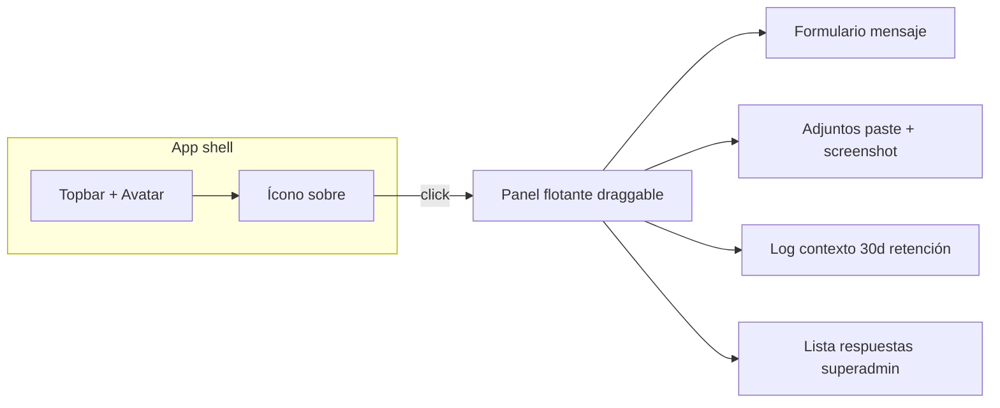

# SPEC — Difusión (SIGO, CC pin, plantillas) + Tickets flotante

**Fecha:** 2026-05-06 (reglas finales)  
**Maestro:** [`SPEC-MAESTRO-modulos-2026-05-06.md`](./SPEC-MAESTRO-modulos-2026-05-06.md)  
**Relacionado:** `SPEC-MAESTRO-Shelfy-Reporteria-Mapa-Difusion-CC-2026-05-05.md` (pin CC Telegram).

---

## A. SIGO — visibilidad (cerrado)

- La pestaña / flujo **SIGO** en difusión es **visible y usable solo para `superadmin`**.  
- **`directorio`**, **`admin`**, **`supervisor`**, etc.: **no** ven entrada SIGO (ni tab ni rutas asociadas).  
- Implementación: condicionar render en `shelfy-frontend/src/app/difusion/page.tsx` (tabs ~L296+ y `TabsContent value="sigo"`) con `user.rol === 'superadmin'` o helper de permisos existente.

Validar también en backend que endpoints SIGO de difusión no queden accesibles por URL directa a roles no permitidos.

---

## B. Cuentas corrientes — mensaje fijado

- Cada envío de **CC** por Telegram debe **fijar** el mensaje en el grupo (y desfijar el pin anterior del mismo tipo de envío si ya está en el spec maestro CC).  
- Backend: `CenterMind/services/cc_difusion_service.py` — `pinChatMessage` tras envío exitoso.

### B.1 Regla de comportamiento esperada

- Envío nuevo en un chat:
  1) enviar mensaje/documento  
  2) desfijar anterior (si existe y se conoce)  
  3) fijar mensaje nuevo  
- Si falla pin por permisos, no romper envío principal; registrar warning.

---

## C. Plantillas de mensaje (cerrado)

- Además de plantillas por defecto, el usuario puede **guardar plantillas personalizadas**.  
- **Persistencia: por usuario** (`id_usuario` / `usuarios_portal`), no por distribuidor como regla base.  
- Tabla sugerida: `difusion_plantilla_usuario` (`id`, `id_usuario`, `titulo`, `cuerpo`, `created_at`, …) o equivalente normalizado.

### C.1 UX mínimo de plantillas

- Crear / editar / eliminar plantilla propia.
- Seleccionar plantilla y previsualizar antes de enviar.
- Plantillas globales por defecto siguen disponibles.

---

## D. Tickets — ícono sobre junto al avatar

- Mover/duplicar la acción “mensaje al desarrollador” hacia un **ícono sobre** junto al **avatar** (top-right).  
- Panel **flotante, arrastrable**, no desmonta la ruta actual; z-index alto; respuestas visibles en el mismo panel.

### D.1 Adjuntos y captura

- Pegado **Ctrl+V / Cmd+V** en el área del formulario.  
- Botón **captura de pantalla** (`getDisplayMedia`) con fallback a subir archivo.

### D.2 Log automático (cerrado)

- Incluir **en lo posible todo** lo relevante: ruta actual, `id_distribuidor` activo, acciones recientes de navegación, IDs de contexto **no sensibles**.  
- **Retención del log/anexo al ticket:** **30 días** (TTL o job de limpieza documentado).

Campos sugeridos de log:

- ruta y query string
- rol e id de usuario
- dist activa
- evento UI disparador
- timestamp cliente/servidor

### D.3 Backend

- `POST /api/portal-feedback/messages` y adjuntos; ampliar payload con `metadata` / `context_log` si hace falta.  
- Router en `CenterMind/routers/` (portal-feedback).

Agregar endpoint/listado para lectura de respuestas en el mismo panel flotante.

---

## E. Diagrama — ticket flotante (Mermaid)

---

## F. Archivos

| Capa | Archivo |
|------|---------|
| UI Difusión | `shelfy-frontend/src/app/difusion/page.tsx` — tabs SIGO condicionados a superadmin |
| API CC | `CenterMind/services/cc_difusion_service.py` |
| Plantillas | Nuevo router o extensión + migración SQL |
| Layout | Componente Topbar actual (`shelfy-frontend/src/components/layout/*`) — ícono sobre |
| Feedback | `CenterMind/routers/*portal*`* |

---

## G. Estados UI del ticket flotante

- cerrado
- abierto minimizado
- abierto activo
- enviando
- enviado con confirmación
- error con retry

---

## H. Criterios de aceptación

- [ ] SIGO solo superadmin.  
- [ ] CC pin en Telegram según servicio.  
- [ ] Plantillas guardadas por usuario.  
- [ ] Ticket flotante con log rico; retención log **30 días**.
- [ ] El ticket puede abrirse desde cualquier módulo sin romper navegación actual.
- [ ] Respuestas del equipo desarrollo se visualizan en el mismo panel.
