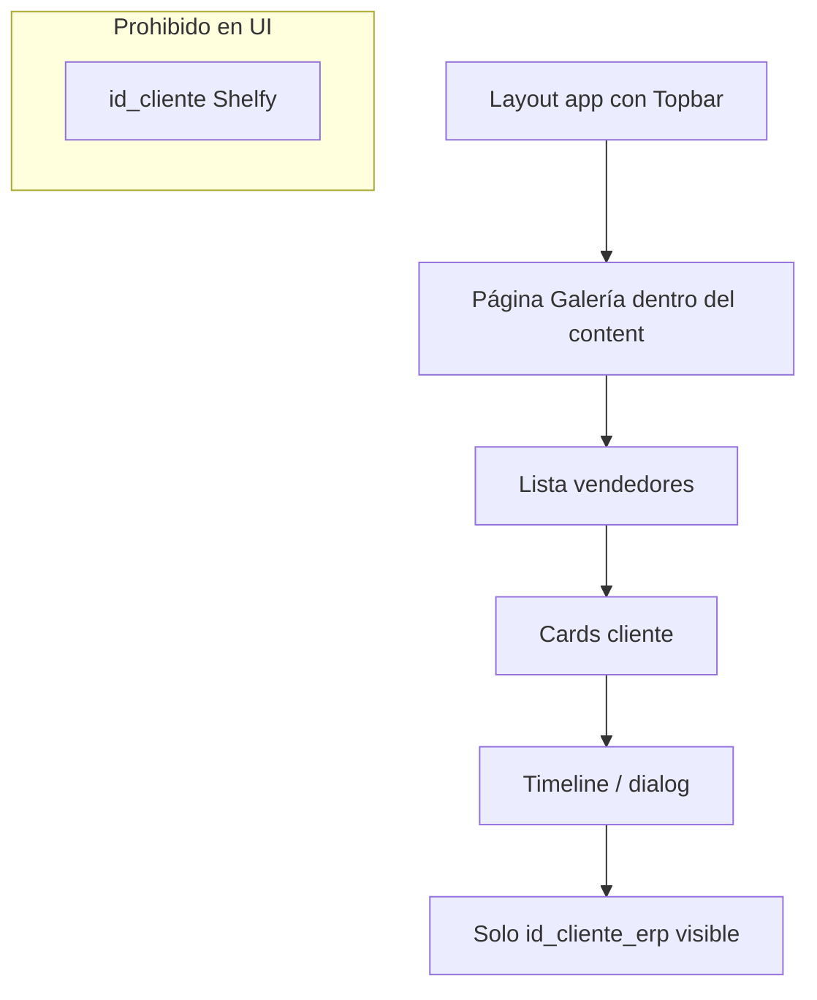

# SPEC — Galería: layout e identificación PDV

**Fecha:** 2026-05-06 (reglas finales)  
**Maestro:** [`SPEC-MAESTRO-modulos-2026-05-06.md`](./SPEC-MAESTRO-modulos-2026-05-06.md)

---

## 1. Regla absoluta — ID interno Shelfy

- **Nunca** mostrar el **ID interno** de PDV de Shelfy (`id_cliente` u otros PK internos) en esta galería, **en ningún rol** (incluido superadmin).
- Referencia operativa para el usuario: **solo `id_cliente_erp`** (y nombre / dirección cuando aplique). Si no hay ERP: texto **“Sin código ERP”**.

---

## 2. Problema de layout

- La pantalla no debe “romper” el shell del portal: debe verse **Topbar / navegación** como en otros módulos y permitir volver atrás con la misma UX habitual.

### 2.1 Objetivo UX

- Galería debe sentirse parte del mismo producto, no una vista “aislada”.
- Mantener consistencia de spacing, header, navegación y comportamiento responsive.

---

## 3. Archivos

| Archivo | Acción |
|---------|--------|
| `shelfy-frontend/src/app/galeria-exhibiciones/page.tsx` | Quitar wrappers full-viewport que oculten layout; ajustar alturas dentro del content |
| `shelfy-frontend/src/components/galeria/GaleriaClienteCard.tsx` | Quitar cualquier `id_cliente`; mostrar ERP |
| `shelfy-frontend/src/components/galeria/GaleriaVendedorCard.tsx` | Misma regla si mostraba IDs |
| `shelfy-frontend/src/components/galeria/ExhibicionesTimelineDialog.tsx` | Misma regla |

Verificar `grep` por `id_cliente` en carpeta `galeria/` tras cambio.

### 3.1 Reglas de presentación de identificación

- Mostrar siempre `id_cliente_erp` con label explícita (ej. “ERP”).
- Si falta ERP: “Sin código ERP”.
- Nunca usar IDs internos como fallback visual.

---

## 4. Diagrama — navegación (Mermaid)

---

## 5. Criterios de aceptación

- [ ] Barra superior visible como en Dashboard/Supervisión.  
- [ ] Cero apariciones de ID interno PDV en UI galería.  
- [ ] `id_cliente_erp` como referencia principal.
- [ ] En cards, dialogs y tooltips no aparecen identificadores internos.
- [ ] Validado en desktop y mobile.

---

## 6. Alcance

- Sin cambios de columnas en Supabase; solo presentación.
- Sin cambios en seguridad/roles de galería en este ticket.
