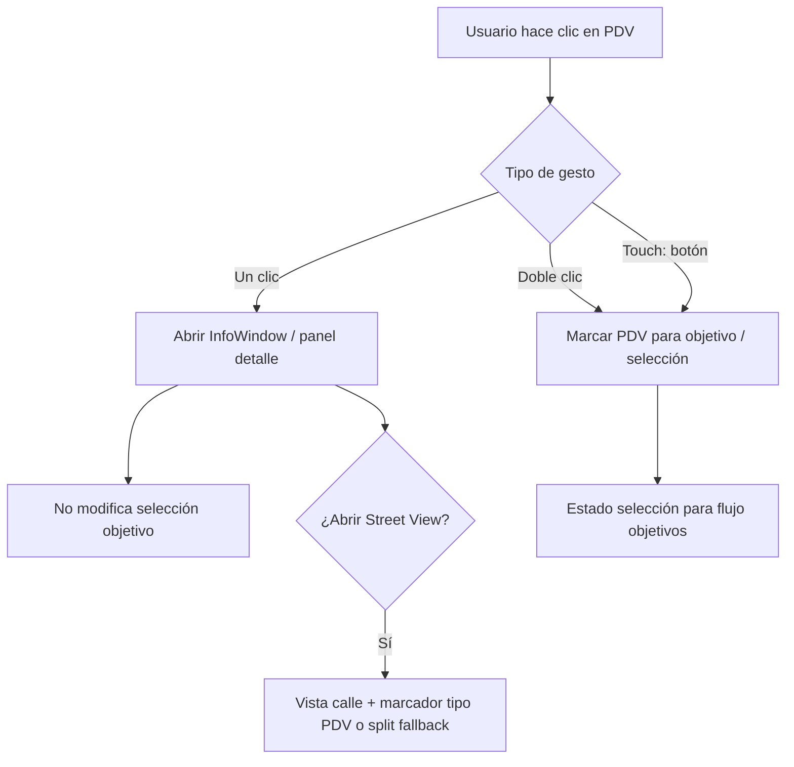

# SPEC — Módulo Mapa: leyenda, interacción, impresión, Street View

**Fecha:** 2026-05-06 (reglas finales)  
**Maestro:** [`SPEC-MAESTRO-modulos-2026-05-06.md`](./SPEC-MAESTRO-modulos-2026-05-06.md)

---

## 1. Objetivos de producto

1. **No** mostrar badges grandes de **corridas de motores / sync** en la vista de mapa para usuarios operativos (criterio alineado al maestro: foco en trabajo de calle).  
2. **Eliminar** el modo **Deudores** del mapa por completo.  
3. Iconos por tipo de PDV **más grandes**; misma forma en **leyenda / toggles** de visibilidad.  
4. Bajo cada vendedor: **solo** dos números:  
   - **N PDV nuevos (alta en base):** en ventana de **últimos 7 días corridos** (hacia atrás desde hoy, timezone AR).  
   - **N PDV activados:** transición **compra tras inactividad** (nunca o &gt;30 días sin comprar → compra), **no** confundir con alta en base.  
5. **Clic simple** en marcador: abre detalle, **no** selecciona para objetivo. **Doble clic:** selecciona para objetivo. En **touch**, botón explícito “Usar en objetivo” recomendado.  
6. Panel detalle PDV: sin bordes blancos fuera de tema; `max-height` acotado; scroll interno.  
7. **Street View:** marcar el punto (overlay o **fallback** split: mini mapa + Street View sincronizado — ver implementación si API limita overlay).  
8. **Imprimir:** el mapa impreso refleja **exactamente lo visible en el viewport en ese momento** (bounds, zoom, toggles de capas). Además, bloque de resumen: totales / desglose día→rutas según datos ya disponibles de rutas (spec funcional original).

---

## 1.1 Reglas UX cerradas

- Clic simple = inspección de PDV (información)  
- Doble clic = acción (selección para objetivo)  
- Nunca disparar ambas acciones juntas en desktop.
- En mobile/touch, doble clic no es confiable: usar botón explícito “Agregar a objetivo” dentro del popup/tarjeta.

---

## 2. Definiciones alineadas al maestro

| Métrica | Regla |
|---------|--------|
| **PDV nuevo (7 días)** | `created_at` (primera inserción en `clientes_pdv_v2_*`) cae en el intervalo **[hoy−7d 00:00, hoy]** corridos. |
| **PDV activado** (KPI vendedor) | Contar transiciones **activación** en la ventana de 7 días (misma lógica de negocio que Supervisión: compra tras nunca/&gt;30d). Implementación: misma fuente que eventos o query equivalente. |

---

## 3. Estado actual (anclajes código)

| Componente | Ruta |
|------------|------|
| Mapa | `shelfy-frontend/src/components/admin/MapaRutas.tsx` — `marker.addListener('click', …)` (~L465+) |
| Tab supervisión | `shelfy-frontend/src/components/admin/TabSupervision.tsx` — `mapMode`, `deudoresData`, toggles |
| Store | `shelfy-frontend/src/store/useSupervisionStore.ts` — `MapMode`, `setMapMode`, rehidratación |
| Página | `shelfy-frontend/src/app/modo-mapa/page.tsx` |

---

## 4. Cambios técnicos — Frontend

| Qué | Dónde |
|-----|-------|
| Quitar modo `deudores` | `useSupervisionStore.ts`: tipo `MapMode` solo `'activos'`; migrar persistencia |
| Quitar UI y datos deudores | `TabSupervision.tsx`: botones ~1332+, props a `MapaRutas` |
| Clic / doble clic | `MapaRutas.tsx`: separar handlers; no llamar selección objetivo en simple |
| KPI vendedor | Componente lista vendedores en `TabSupervision` / `MapaRutas`: queries o props hacia endpoint agregado o cálculo cliente |
| Impresión | Nueva util o `window.print` de contenedor que clone canvas/map viewport visible |
| SyncStatusPanel | No renderizar en mapa o versión mínima (según maestro) |

### 4.1 Interacción de marcador (detalle)

- El handler de `click` debe abrir popup y setear foco visual del marker, sin mutar `selectedTargets`.
- El handler de `dblclick` debe:
  - prevenir comportamiento por defecto del click previo,
  - alternar selección del PDV para objetivos,
  - emitir feedback visual claro (ring/badge).
- Debe existir debounce/guard para evitar selección accidental en clics rápidos.

### 4.2 Iconografía y leyenda

- Tamaño objetivo: aumentar visibilidad en zoom medio sin saturar (definir token único de tamaño).
- La leyenda debe usar exactamente los mismos símbolos y colores que los markers.
- Evitar duplicar semánticas (un símbolo = una categoría de negocio).

### 4.3 Popup de PDV

- Limitar alto máximo y usar scroll interno.
- Eliminar estilos fuera del tema (bordes/blancos duros).
- Mantener datos críticos visibles sin scroll: nombre, ERP, estado, acción principal.

### Backend (si KPI requiere servidor)

- Nuevo endpoint opcional `GET /api/supervision/vendedor/{dist_id}/{id_vendedor}/kpi-mapa?desde=&hasta=` devolviendo `{ pdv_nuevos_7d, pdv_activados_7d }` para consistencia con reglas y performance.

Si no se crea endpoint, el frontend debe consumir una fuente ya normalizada del backend y evitar recalcular activaciones con lógica divergente.

---

## 5. Diagrama — interacción marcador (Mermaid)

---

## 6. Impresión (cerrado)

- **Mapa:** captura el **viewport actual** (lo que el usuario ve).  
- **Texto resumen** (totales, desglose por día de semana con rutas hijas): puede usar datos del vendedor/rutas **independientes** del zoom, pero el **bloque mapa** debe ser fiel al visible.

### 6.1 Contenido obligatorio del resumen de impresión

- Fecha y hora de impresión (timezone AR).
- Vendedor/sucursal contextuales.
- Totales: PDVs visibles, activos, con exhibición.
- Desglose jerárquico:
  - Día (padre)
  - Rutas del día (hijas; mostrar múltiples si existen).

---

## 7. Pruebas

- [ ] 7 días corridos: borde correcto en cambio de mes (donde aplique).  
- [ ] Alta ≠ activación en contadores.  
- [ ] Impresión coincide con lo visible (toggles, zoom).  
- [ ] Persistencia antigua `deudores` no rompe carga.
- [ ] Clic simple nunca agrega a objetivos.
- [ ] Doble clic agrega/remueve objetivo consistentemente.
- [ ] En mobile, acción equivalente funciona con botón explícito.

---

## 8. Fuera de alcance

- Cambiar ingestas RPA en este ticket (solo consumo de datos / eventos).
- Rediseño total de estructura de rutas/vendedores fuera del módulo mapa.
