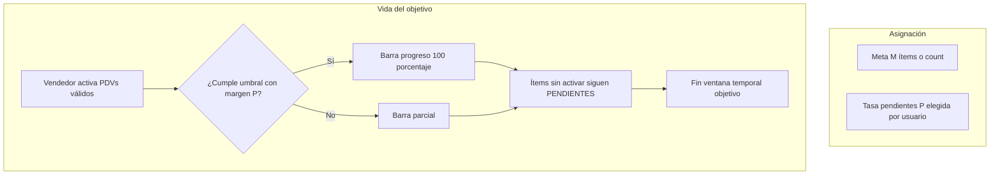

# SPEC — Objetivos: Compañía vs Distribuidora, tasa pendientes, Telegram, `/objetivos`

**Fecha:** 2026-05-06 (reglas finales)  
**Maestro:** [`SPEC-MAESTRO-modulos-2026-05-06.md`](./SPEC-MAESTRO-modulos-2026-05-06.md)

---

## 1. Convenciones de tipos (DB vs UI)

| Valor en DB | Etiqueta UI (solo frontend) |
|-------------|-----------------------------|
| `conversion_estado` | Activación |
| `ruteo_alteo` | Alteo |
| `exhibicion` | Exhibición |
| `cobranza` | *(oculto en UI estándar)* |
| `ruteo` | **Guía para armado de ruta** (flujo aparte, no card estándar de objetivo) |

**No** renombrar columnas ni valores enum en PostgreSQL.

---

## 2. Objetivos de compañía

### 2.1 Roles

- Pueden crear: **`directorio`** y **`superadmin`**.  
- Validar en `POST /api/supervision/objetivos` (`crear_objetivo`) con `check_dist_permission` / rol.

### 2.2 Una card por vendedor por tipo

- En el período (mes calendario de compañía), el vendedor ve **como mucho una card por cada tipo** de objetivo de compañía (ej. una de Activación compañía, una de Exhibición compañía, etc.).  
- **Unicidad:** constraint lógica o DB: no dos objetivos compañía **activos** mismo `(id_distribuidor, id_vendedor, tipo, mes_referencia)` para origen compañía.
- Si existe objetivo previo del mismo tipo y mes, la UI debe llevar al existente en vez de crear duplicado.

### 2.3 Mes calendario y drill-down

- Periodo: **mes calendario** (no 30 días rodantes).  
- Card: nivel 1 **mes**; click → desglose **semana**; click → **día**.  
- **Prorrateo de la meta mensual a subperíodos:** solo **lunes a sábado** (domingo **excluido** del reparto de meta y de barras esperadas).  
- Fórmula en implementación: distribuir `meta_mensual` en los **6/6.5** bloques semanales según diseño, y dentro de cada semana solo días lun–sáb del mes.

### 2.4 Semántica visual

- Objetivo de compañía lleva badge distintivo persistente.
- Estado de cumplimiento y pendientes siempre visibles en la card principal.
- Diferenciar claramente “cumplimiento de meta” de “ítems pendientes”.

---

## 3. Objetivos de distribuidora

- Se mantienen modos de plazo actuales (día, semana, mes, etc.) donde ya existan.  
- **Cobranza:** oculta en UI; no crear nuevos objetivos cobranza desde UI tenant (reparación solo superadmin si aplica).  
- **Ruteo:** presentado solo como **Guía para armado de ruta** (sin mezclarse con Kanban de objetivos “normales”).

### 3.1 Alteo — jerarquía día → rutas

- Agrupar por **día de la semana** (padre) y **rutas** (hijos).  
- Disclaimer sugerido: meta de altas orientada a ~**55 PDV por día** en ese día (constante configurable por tenant o constante en código documentada).
- La asignación de alteo debe evitar listas planas largas no legibles.

### 3.2 Panel lateral educativo

- Al seleccionar tipo en formulario, mostrar recuadro lateral con qué es Alteo / Activación / Exhibición (copy corto).
- El contenido del recuadro debe ser accionable y consistente con Telegram (misma terminología).

---

## 4. Activación — tasa de pendientes (cerrado)

### 4.1 Parámetros

- **M** = cantidad objetivo de activaciones (ítems o meta numérica según flujo actual).  
- **P** = **tasa de pendientes** — entero **≥ 0**, **definido por el usuario al asignar** el objetivo (no hay valor fijo por defecto obligatorio de 5).

### 4.2 Cumplimiento del objetivo

- El objetivo se considera **alcanzado** en términos de **progreso / barra** cuando las activaciones válidas cumplen la regla con margen **P** (ej. umbral = **M − P** activaciones válidas cuando el modelo es por conteo; ajustar si el modelo es por ítems nominados — misma filosofía: margen explícito).

### 4.3 Pendientes hasta el cierre

- Los PDV/ítems **no** activados **siguen pendientes** hasta el **fin del tiempo del objetivo**, **aunque** la barra ya esté al **100 %** por el margen.  
- La UI **siempre** debe mostrar:  
  - **Tasa de pendientes** configurada (valor **P**),  
  - **Cuántos** quedan pendientes,  
  - **Cuáles** (listado o acceso al listado nominado).  
- Copy: únicamente **pendiente / pendientes**; prohibido “fracaso”, “fallo”.

### 4.4 Casos borde

- Si `P >= M`, bloquear en validación o normalizar con regla explícita (decisión técnica obligatoria).
- Si el objetivo vence con pendientes, cerrar objetivo pero conservar trazabilidad de pendientes finales.
- Si se reactiva manualmente un objetivo, mantener histórico de tasas y pendientes previos.

---

## 5. Base de datos

Tabla `objetivos` (campos nuevos o reutilización):

| Campo | Uso |
|-------|-----|
| `origen` | `compania` \| `distribuidora` |
| `mes_referencia` | date primer día del mes (obligatorio si `origen=compania`) |
| `tasa_pendientes` | int nullable; obligatorio para flujos activación con margen |
| `desglose_cache` | jsonb opcional (targets lun–sáb por semana) |

**Migración:** backfill `origen = 'distribuidora'`, `tasa_pendientes = null` donde no aplica.

Tabla `objetivo_items`: puede requerir distinguir “pendiente operativo” vs “contabilizado para meta”; documentar en migración si se añade columna o se usa `estado_item` extendido sin romper jobs.

### 5.1 Integridad recomendada

- Check de dominio para `origen`.
- Índice único parcial para compañía por `(dist, vendedor, tipo, mes_referencia)` cuando está activo.
- Índice por `fecha_objetivo` para cierres/cron/watcher.

---

## 6. Backend — archivos y funciones

| Archivo | Qué tocar |
|---------|-----------|
| `CenterMind/models/schemas.py` | `ObjetivoCreate` / update: `origen`, `mes_referencia`, `tasa_pendientes` |
| `CenterMind/routers/supervision.py` | `crear_objetivo`, listados GET, `_compute_kanban_phase`, validación roles compañía |
| `CenterMind/services/objetivos_watcher_service.py` | Cálculo cumplimiento con margen y **pendientes vivos** hasta `fecha_objetivo` |
| `CenterMind/services/objetivos_notification_service.py` | `notify_new_objective_telegram` + variantes: ERP, ruta, día, dirección, P, pendientes |
| `CenterMind/bot_worker.py` | `cmd_objetivos` (~L1228): incluir origen compañía, tiempo restante, pendientes y P |

### 6.1 Reglas de validación API

- `origen=compania` exige rol permitido y `mes_referencia`.
- `tasa_pendientes` requerida para activación cuando aplica.
- bloquear duplicados de compañía según unicidad.
- normalizar timezone AR al persistir fechas de mes.

---

## 7. Frontend

| Archivo | Qué |
|---------|-----|
| `shelfy-frontend/src/app/objetivos/page.tsx` | Labels tipos; wizard compañía; tasa pendientes; drill mes→semana→día; ocultar cobranza; sección guía ruta |
| `shelfy-frontend/src/lib/api.ts` | Tipos TS alineados a payloads |

---

## 8. Telegram — contenido mínimo al notificar

- Tipo y origen (Compañía / Distribuidora).  
- Meta, mes o fecha fin.  
- Si hay PDVs: **ID ERP**, nombre, **ruta**, **día**, **dirección**.  
- **P** y listado/cantidad de **pendientes** si aplica.
- Evitar mensajes ambiguos sin contexto de acción (“qué hacer”, “hasta cuándo”, “con qué criterio se cumple”).

### Comando `/objetivos`

- Ya existe handler; ampliar respuesta con campos anteriores y tiempo restante por objetivo.
- Para compañía: agregar lectura mensual + avance semanal acumulado.

---

## 9. Diagrama — objetivo activación con tasa (Mermaid)

---

## 10. Criterios de aceptación

- [ ] Directorio y superadmin crean compañía; resto no.  
- [ ] Una card por vendedor por tipo (compañía) sin duplicados.  
- [ ] Prorrateo solo **lun–sáb**.  
- [ ] **P** configurable; UI muestra P, cantidad y nombres/ítems pendientes hasta cierre.  
- [ ] Valores DB sin cambio; solo labels en UI.
- [ ] Alteo se asigna por día con rutas hijas visibles.
- [ ] Telegram y `/objetivos` exponen la misma semántica de estado y pendientes.

---

## 11. Riesgos

- Mensajes Telegram largos → partir en múltiples mensajes si excede límite de la API.
