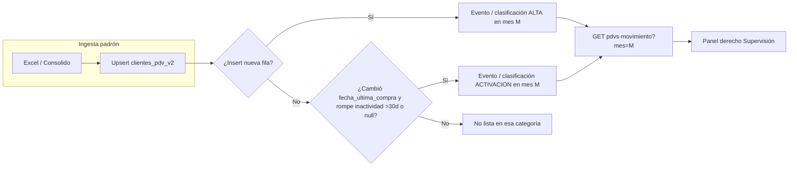

# SPEC — Módulo Supervisión: CC, Altas/Activaciones, selectores

**Fecha:** 2026-05-06 (reglas finales)  
**Maestro:** [`SPEC-MAESTRO-modulos-2026-05-06.md`](./SPEC-MAESTRO-modulos-2026-05-06.md)

---

## 1. Objetivos de producto

1. Ocultar badges de ingesta del **padrón**; mantener solo estado de **cuentas corrientes**: texto **“Cuentas corrientes actualizadas el [dd/mm/aa] a las [hh:mm]”** (24 h, `America/Argentina/Buenos_Aires`).  
2. Layout **~50 % izquierda:** panel CC; **~50 % derecha:** **Altas y Activaciones** (listado enriquecido, no solo KPIs).  
3. El panel derecho depende del **vendedor** seleccionado (mismo contexto que CC) y de un selector de **mes calendario (`YYYY-MM`)** que **solo** gobierna ese panel.  
4. Reordenar filtros (jerarquía clara) y **eliminar** cualquier selector de fecha **sin efecto**.
5. Incorporar explícitamente el nuevo bloque funcional “**Altas y Activaciones**” como pieza principal de Supervisión, no como sub-widget secundario.

---

## 2. Definiciones de negocio (cerradas)

### 2.1 PDV Nuevo = “Alta / alteo” en base Shelfy

- PDV que **no existía** en `clientes_pdv_v2_*` y se inserta por **ingesta de padrón** (alta desde cero).
- Para el listado **por mes calendario M:** incluir si la **primera fila** del PDV en nuestra base tiene `created_at` (o timestamp equivalente de creación de fila) dentro de **M** (00:00 del día 1 a 23:59 del último día, zona AR).
- **No** usar esta categoría para un PDV que ya existía y solo “volvió a comprar” → eso es **Activación**.

### 2.2 Activación (compra tras inactividad)

- PDV que **pasa** de **no comprar** a **comprar**:  
  - **Nunca** compró (`fecha_ultima_compra` nula antes del evento), **o**  
  - La última compra previa es **anterior a 30 días** respecto de la nueva compra registrada en padrón.
- Para el listado **por mes calendario M:** incluir el PDV si la **transición** (primera compra que rompe inactividad) se **registra en M** según la fuente operativa (`fecha_ultima_compra` actualizada en ese ciclo de ingesta o evento derivado).

### 2.3 Exhibido

- **Sí** si existe al menos una fila en `exhibiciones` para ese `id_cliente_pdv` (y `id_distribuidor`) cuya **fecha de exhibición** o campo de fecha estándar del modelo cae en el **mes calendario M** (mismo rango 00:00 primer día – último día, zona AR).

### 2.4 Separación estricta

| Concepto | Significado |
|----------|-------------|
| **Alta** | Primera aparición en DB Shelfy (PDV nuevo). |
| **Activación** | Pasó de inactivo (&gt;30d o nunca) a compra. |

### 2.5 Campos mínimos del panel Altas/Activaciones

Cada fila del panel debe mostrar al menos:

- `id_cliente_erp`
- nombre comercial (`nombre_fantasia` o equivalente)
- ubicación (dirección + localidad, si existe)
- categoría (`alta` o `activacion`)
- estado de exhibición en el mes (`si/no`)
- fecha de referencia del evento (alta o activación)

---

## 3. Base de datos y backend

### 3.1 Detección de eventos

**Opción mínima viable:** columnas existentes en `clientes_pdv_v2_*`:

- **Alta en M:** `created_at ∈ M` (primera inserción).  
- **Activación en M:** comparar **día a día** o job nocturno que detecte cambio de `fecha_ultima_compra` de estado “inactivo” a fecha reciente dentro de **M**.

**Opción recomendada (auditable):** tabla `pdv_negocio_eventos` (nombre final a elección del equipo):

| Campo | Uso |
|-------|-----|
| `id_distribuidor`, `id_cliente`, `tipo_evento` | `alta_base` \| `activacion_compra` |
| `fecha_referencia` | Momento del hecho (mes para filtro) |
| `metadata` jsonb | Snapshot opcional (erp id, etc.) |

Población: **ingesta padrón** al hacer upsert (si insert → `alta_base`; si update de `fecha_ultima_compra` cumple regla activación → `activacion_compra`).

### 3.2 Endpoint propuesto (contrato)

`GET /api/supervision/vendedor/{dist_id}/{id_vendedor}/pdvs-movimiento?mes=YYYY-MM`

Campos de respuesta sugeridos:

- `items: []`
- `total`
- `resumen: { altas, activaciones, exhibidos_altas, exhibidos_activaciones }`
- `mes`

Cada `item`:

- `id_cliente`
- `id_cliente_erp`
- `nombre`
- `direccion`
- `localidad`
- `categoria`
- `fecha_evento`
- `exhibido_en_mes`
- `fecha_ultima_exhibicion` (opcional)

**Opcionales:**

- `categorias=alta,activacion`
- `search=...`
- `offset`, `limit`

**Paginación:** obligatoria en backend para tenants grandes.

### 3.3 Funciones / archivos backend

| Archivo | Función / área |
|---------|----------------|
| `CenterMind/routers/supervision.py` | Nuevo handler `pdvs_movimiento`; posible helper privado `_query_pdvs_movimiento` |
| `CenterMind/services/` (nuevo o existente) | Servicio de agregación eventos o queries tenant |
| Migración SQL | Tabla eventos si se adopta; índices `(id_distribuidor, id_vendedor, mes)` o por `fecha_referencia` |

### 3.4 Reglas de performance

- Toda consulta a `clientes_pdv_v2_*` debe paginarse.
- Evitar cálculos de activación en frontend.
- Resolver exhibición en backend para devolver el panel listo para render.

### 3.5 Frontend — archivos y layout objetivo

| Archivo | Cambio |
|---------|--------|
| `shelfy-frontend/src/components/admin/TabSupervision.tsx` | Quitar badges padrón; grid 50/50; panel derecho; integrar API |
| `shelfy-frontend/src/app/supervision/page.tsx` | Selectores; eliminar date picker inútil; texto CC |
| `shelfy-frontend/src/lib/api.ts` | `fetchPdvsMovimiento(...)`, tipos |
| `shelfy-frontend/src/components/admin/SyncStatusPanel.tsx` | No renderizar bloque padrón en header supervisión si estaba acoplado |

Layout sugerido:

- **Columna izquierda:** CC (tabla/lista actual + estado de actualización).
- **Columna derecha:** “Altas y Activaciones” con:
  - selector mes calendario
  - tabs/filtros por categoría
  - listado con scroll
  - estados de vacío, loading y error.

---

## 4. Diagrama — flujo datos Altas/Activaciones (Mermaid)

---

## 5. UI — CC y selectores

- **CC:** timestamp desde metadatos del mismo snapshot que usa `supervision_cuentas` (si no hay datos: “Sin datos de CC recientes”).  
- **Orden filtros:** Distribuidor (si aplica) → **Sucursal** (`nombre_erp` exacto) → **Vendedor** → acciones.  
- **Eliminar** controles sin efecto (localizar `DatePicker` huérfanos).
- **Mes calendario:** selector exclusivo del panel derecho; nunca debe alterar CC.
- **Copy operativo:** evitar términos técnicos de motor/sync en panel principal.

---

## 6. Criterios de aceptación

- [ ] Mes **M** solo cambia el panel **Altas y Activaciones**, no la lista CC.  
- [ ] Filas mostradas distinguen **Alta** vs **Activación** según §2.  
- [ ] `id_cliente_erp` visible en tabla/listado.  
- [ ] Ningún selector visible sin efecto.
- [ ] Panel “Altas y Activaciones” permanece usable con vendedores de alto volumen (scroll/paginación/tiempos).
- [ ] La definición de Activación coincide con la utilizada en mapa y objetivos.

---

## 7. Fuera de alcance

- Rediseño del mapa embebido completo (ver spec mapa para `/modo-mapa`).
- Cambios en motores RPA (este spec consume datos existentes o eventos emitidos por ingesta).
