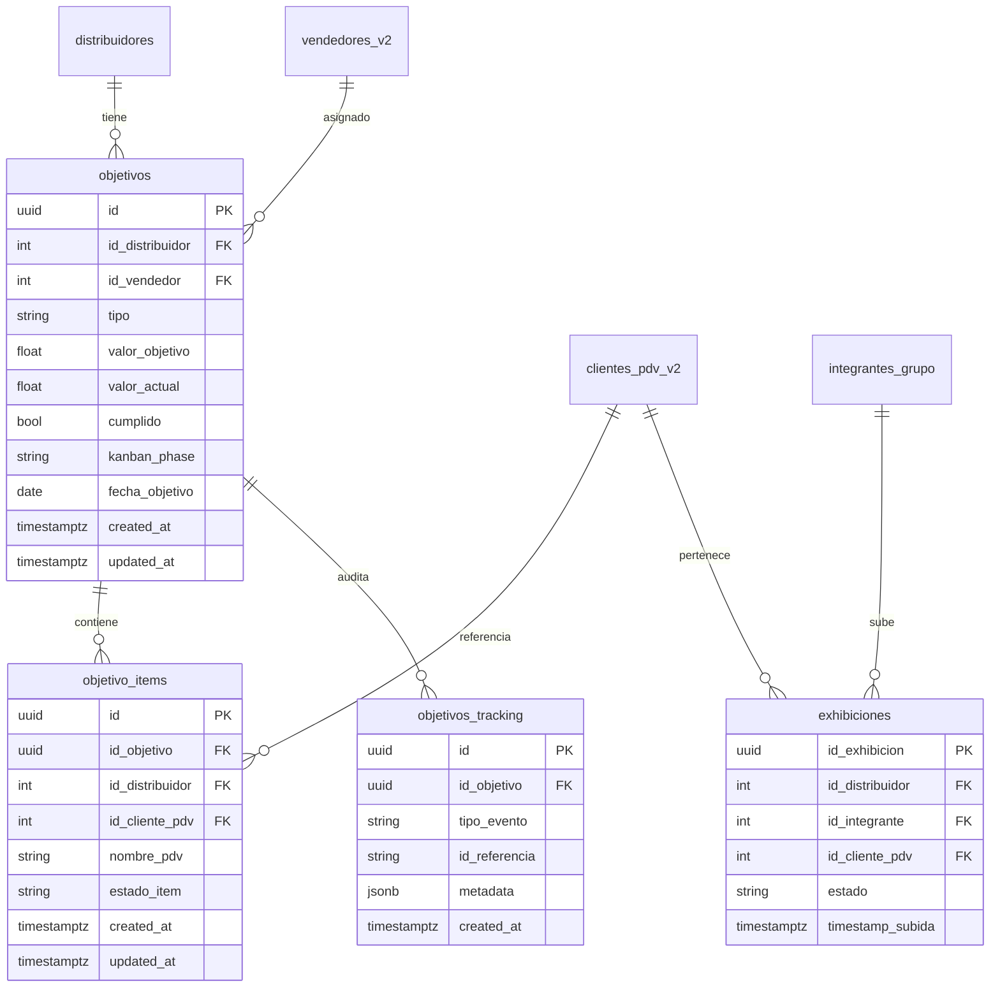
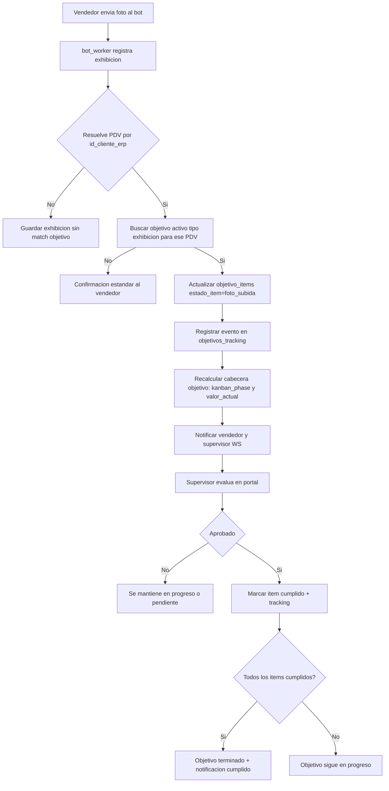

# Plan de Implementación — Objetivos Ultra Kanban + Timeline + PDV 1:N

## 0) Objetivo de arquitectura
Rediseñar `objetivos` para que sea **multi-PDV real** (1 objetivo cabecera -> N PDVs), con UI **ultra Kanban** (estilo Atlassian), animaciones, filtros por sucursal consistentes, vista Timeline por vendedor/sucursal, y modo imprimir estable.

---

## 1) Cambios de Base de Datos (modelo 1:N Objetivo -> PDV)

### Modelo propuesto
- Mantener `objetivos` como **cabecera** (meta, estado global, fechas, vendedor, tipo).
- Consolidar `objetivo_items` como detalle por PDV (uno por PDV asignado al objetivo).
- Reforzar `objetivos_tracking` para auditoría de eventos de ciclo de vida.

### Cambios concretos
1. **`objetivos`**
   - Mantener: `id`, `id_distribuidor`, `id_vendedor`, `tipo`, `valor_objetivo`, `valor_actual`, `cumplido`, `fecha_objetivo`, `created_at`, `updated_at`.
   - Agregar/confirmar:
     - `kanban_phase` (opcional materializado; si no, calcular en backend).
     - `resultado_final` (`exito`/`falla`) para cierre y timeline.
2. **`objetivo_items`** (si ya existe, endurecer reglas)
   - Confirmar columnas: `id`, `id_objetivo`, `id_distribuidor`, `id_cliente_pdv`, `nombre_pdv`, `estado_item`, timestamps.
   - Constraint crítico: `UNIQUE (id_objetivo, id_cliente_pdv)`.
   - Índices: `id_objetivo`, `id_distribuidor`, `id_cliente_pdv`, `estado_item`.
3. **`objetivos_tracking`**
   - Usar para timeline y auditoría (asignado, foto_subida, aprobado, en_progreso, cumplido, fallido, reagendado).
   - Recomendado: index por `(id_objetivo, created_at desc)`.

### Regla de negocio clave
- **Estado Kanban se deriva por items**:
  - `Pendiente`: ningún item avanzado.
  - `En progreso`: al menos un item avanzó.
  - `Terminado`: todos los items cumplidos o meta alcanzada por tipo.

---

## 2) Diagrama ER (MERMAID)

---

## 3) Diagrama de flujo Telegram (MERMAID)

---

## 4) Archivos y funciones exactas a modificar

## Backend

- `CenterMind/models/schemas.py`
  - `ObjetivoCreate`
  - `ObjetivoUpdate`
  - `ObjetivoItemCreate`
  - Agregar DTO de timeline (respuesta de eventos)
- `CenterMind/routers/supervision.py`
  - `crear_objetivo` (alta cabecera + items + sucursal-aware)
  - `listar_objetivos` (filtro por sucursal server-side + phase consistente)
  - `_compute_kanban_phase` (regla 100% item-driven)
  - `resumen_supervisor_objetivos` (agregado por vendedor/sucursal)
  - `evaluar` (al aprobar, actualizar item correspondiente y tracking)
  - Nuevo endpoint `GET /api/supervision/objetivos/{dist_id}/timeline`
- `CenterMind/services/objetivos_watcher_service.py`
  - `run_watcher`
  - `_diff_exhibicion`
  - `_update_item_estado`
  - `_insert_tracking_batch`
  - Objetivo: no recalcular global de forma destructiva; operar por objetivo/item
- `CenterMind/services/objetivos_notification_service.py`
  - `notify_new_objective_telegram`
  - `notify_vendor_telegram`
  - `notify_supervisor_ws`
  - `notify_objetivo_cumplido`
  - Objetivo: mensajes no duplicados por item
- `CenterMind/bot_worker.py`
  - `button_callback` (flujo de foto + interceptor objetivo)
  - Bloque trigger watcher scoped (evitar `run_watcher(dist_id)` global)
  - Objetivo: transición limpia `foto_subida` por item
- `CenterMind/routers/reportes.py` (si impresión server-side o export timeline PDF)
  - Endpoint de export/print estable (opcional fase 2)

## Frontend

- `shelfy-frontend/src/lib/api.ts`
  - `Objetivo`, `ObjetivoItem`, `ObjetivoCreate`
  - `fetchObjetivos` (agregar `sucursal_nombre` en query)
  - Nuevo `fetchObjetivosTimeline`
- `shelfy-frontend/src/store/useObjetivosStore.ts`
  - Reemplazar `viewMode` simple por estado de vistas:
    - `kanban`, `timeline`, `stats`, `print`
  - Filtros globales: sucursal, múltiples vendedores, rango de fechas, tipo
- `shelfy-frontend/src/app/objetivos/page.tsx`
  - `ObjetivosPage` (layout ultra-kanban por defecto)
  - `KanbanCard` (detalles expandibles, badges, checklist de PDVs)
  - `NuevoObjetivoModal` (shadcn Calendar/Popover para fecha límite)
  - `ObjectivePrintOut` (fix completo de impresión)
  - Agregar vista `Timeline` con filtros multi-vendedor/sucursal
- `shelfy-frontend/src/app/globals.css`
  - Tokens de impresión (`@media print`) y micro-interacciones
- `shelfy-frontend/tests/smoke/*.spec.ts`
  - Smoke para Kanban, Timeline, Print (obligatorio)

---

## 5) Orden recomendado de implementación (secuencia real)

### Fase 1 - Fundaciones de datos (bloqueante)
1. **DB hardening**: constraints/índices de `objetivo_items` + `objetivos_tracking`.
2. **Ajustes de esquema backend** en `CenterMind/models/schemas.py`:
   - ampliar `ObjetivoCreate`/`ObjetivoUpdate`
   - definir DTO de timeline.

### Fase 2 - Backend core de objetivos (sin UI todavía)
3. `CenterMind/routers/supervision.py`:
   - actualizar `crear_objetivo` (cabecera + items).
   - actualizar `listar_objetivos` (phase consistente + filtro sucursal server-side).
   - reforzar `_compute_kanban_phase` con lógica item-driven.
4. `CenterMind/services/objetivos_watcher_service.py`:
   - scope por objetivo/item (evitar recálculo global destructivo).
   - actualizar `_diff_exhibicion`, `_update_item_estado`, `_insert_tracking_batch`.
5. `CenterMind/services/objetivos_notification_service.py`:
   - garantizar notificaciones idempotentes (sin duplicados).
6. `CenterMind/routers/supervision.py`:
   - agregar endpoint timeline `GET /api/supervision/objetivos/{dist_id}/timeline`.

### Fase 3 - Integración Telegram y ciclo de vida real
7. `CenterMind/bot_worker.py`:
   - ajustar `button_callback` para transición por `objetivo_items`.
   - reemplazar trigger global por watcher scoped (objetivo afectado).
8. `CenterMind/routers/supervision.py` (`evaluar`):
   - al aprobar, cerrar item y recalcular cabecera (terminado solo cuando corresponde).

### Fase 4 - Contrato frontend + estado global
9. `shelfy-frontend/src/lib/api.ts`:
   - tipos `Objetivo`/`ObjetivoItem`/timeline.
   - `fetchObjetivos` con filtro sucursal.
   - nuevo `fetchObjetivosTimeline`.
10. `shelfy-frontend/src/store/useObjetivosStore.ts`:
   - nuevo estado de vistas (`kanban`, `timeline`, `stats`, `print`).
   - filtros globales (sucursal, multi-vendedor, rango fechas).

### Fase 5 - UI (en este orden para reducir retrabajo)
11. `shelfy-frontend/src/app/objetivos/page.tsx`:
   - Kanban como default (shadcn-first).
12. misma pantalla:
   - detalle enriquecido de tarjetas + animaciones.
13. misma pantalla:
   - vista Timeline por vendedor/sucursal.
14. misma pantalla + `shelfy-frontend/src/app/globals.css`:
   - fix de impresión robusto.

### Fase 6 - Validación y cierre
15. tests unitarios (phase resolver y agregaciones).
16. smoke tests de Kanban / Timeline / Print.
17. validación E2E anti-duplicación:
   - foto Telegram -> progreso item
   - aprobación supervisor -> cierre correcto
   - sin spam de notificaciones.

---

## 6) Prioridades absolutas

- **UI**: shadcn/ui en todos los controles nuevos (Tabs, Card, Dialog, Popover, Calendar, Select, Sheet, Tooltip, ScrollArea, Badge, Skeleton, Alert).
- **Estado cliente**: Zustand como fuente central de filtros/vistas.
- **Datos server**: TanStack Query para todo fetch/mutation/cache/invalidation.
- **Estética Atlassian/Kanban**: denso, legible, alto contraste semántico, motion sutil.
