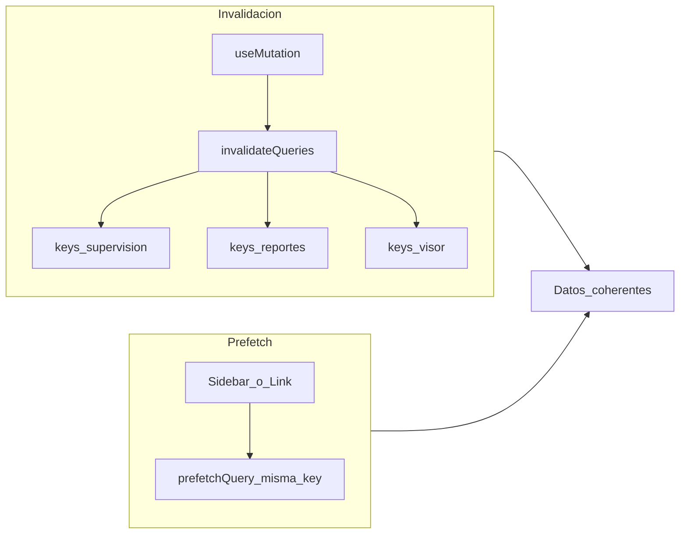

# Plan: carril paralelo de performance (TanStack Query + Zustand)

Este documento es **autocontenido**: describe el producto, el stack, el problema, el estado actual, el trabajo pendiente y los criterios de hecho. **No depende** de ningún otro plan de visor/supervisión/shadcn.

---

## 1. Contexto del producto

**Shelfy** es un SaaS B2B multi-tenant: portal **Next.js** (App Router) en `shelfy-frontend/`, API **FastAPI** en `CenterMind/CenterMind/`. Los datos viven en **Supabase (PostgreSQL)**; el portal usa **JWT** y funciones en `src/lib/api.ts` para hablar con el backend.

La percepción de velocidad del portal depende de:

1. **No repetir requests** cuando el usuario vuelve a una pantalla o cambia de tab.
2. **Actualizar listas coherentes** después de mutaciones (POST/upload/evaluar).
3. **No re-renderizar árboles grandes** por cambios triviales de UI (paneles, toggles).

---

## 2. Stack relevante (ya instalado)

| Pieza | Ubicación típica | Notas |
|-------|------------------|--------|
| **TanStack Query v5** | `useQuery`, `useMutation`, `QueryClientProvider` en layout | Caché por `queryKey`, `staleTime`, `invalidateQueries`, `prefetchQuery` |
| **Zustand** | `shelfy-frontend/src/store/*.ts` | Estado global de UI; usar **selectores** para suscripciones finas |
| **API tipada** | `shelfy-frontend/src/lib/api.ts` | Centralizar `apiFetch` y tipos; las `queryFn` deben reutilizar estas funciones |

No hace falta “instalar” estas librerías: ya forman parte del proyecto.

---

## 3. Problema que ataca este carril

- **Fetch manual** (`useEffect` + `useState` + `fetch`/`apiFetch`) en cada tab: al cambiar de pestaña se vuelve a red aunque los datos sigan siendo válidos.
- **Invalidación inconsistente**: tras una mutación, unos módulos refrescan y otros no; el mapa, las tablas y los KPIs pueden **desalinearse**.
- **Componentes muy grandes** (p. ej. `TabSupervision.tsx`) con muchos `useState`: un cambio en el **menú flotante de objetivos** puede provocar **re-render de listas y mapa** innecesario.

**Regla de oro**

- **TanStack Query** → datos del **servidor** (caché, refetch, loading/error).
- **Zustand** → **UI** (filtros, paneles abiertos, selección que no debe perderse al desmontar hijos).

---

## 4. Estado actual (referencia abril 2026)

### 4.1 Donde Query ya se usa bien

- `shelfy-frontend/src/app/dashboard/page.tsx` — varias queries con `placeholderData` y `refetchInterval`.
- `shelfy-frontend/src/app/visor/page.tsx` — pendientes, stats, vendedores; contexto ERP con `queryKey` tipo `['visor','erp-contexto', distId, nroCliente]`.
- `shelfy-frontend/src/components/admin/TabSupervision.tsx` — vendedores, ventas, distribuidoras, etc.
- `shelfy-frontend/src/app/objetivos/page.tsx` — listados de objetivos.

### 4.2 Donde Zustand ya existe

- `useSupervisionStore` — mapa, PDVs seleccionados para objetivo, visibilidad.
- `useViewerStore` — índice del visor.
- `useReportStore`, `useDashboardStore`, `useObjetivosStore`, etc.

### 4.3 Huecos típicos (trabajo pendiente del carril)

- **Reportes**: tabs que aún usan `useEffect` + estado local (p. ej. `TabAuditoriaSigo.tsx` y similares).
- **Academy** (`shelfy-frontend/src/app/academy/...`): patrones de carga manual en sub-tabs.
- **Modo oficina** (`modo-oficina/page.tsx`): `loadData` + `setInterval` sin compartir caché con dashboard.
- **Admin mapa** (`admin/mapa/page.tsx`): revisar si el fetch es manual y unificarlo a Query si aplica.
- **Prefetch** en navegación (`Sidebar.tsx`): aún no sistematizado tras estabilizar `queryKey`.

---

## 5. Tareas de seguimiento (frontmatter / tabla)

| ID | Objetivo |
|----|----------|
| **rq-inventory** | Listar archivos con fetch manual; proponer `queryKey` namespaced; opcionalmente crear `src/lib/query-keys.ts`. |
| **rq-migrate-reportes-academy** | Migrar tabs priorizados a `useQuery` + `useMutation` con `invalidateQueries`. |
| **rq-modo-oficina-prefetch** | Alinear polling con dashboard (`refetchInterval` / mismas keys); Query en admin mapa si corresponde; `prefetchQuery` en sidebar. |
| **zustand-supervision-visor** | Mover estado UI del panel de objetivos (y similares) a store con **selectores**; reducir `useState` en `TabSupervision`. |

---

## 6. Detalle por tarea

### 6.1 `rq-inventory`

**Entregable:** inventario priorizado (P0/P1/P2) con: archivo, endpoint o `apiFetch`, y `queryKey` propuesta.

**Método:** buscar en `shelfy-frontend/src` combinaciones de `useEffect` + `fetch`/`apiFetch` sin `useQuery`.

**Hecho cuando:** existe lista acordada y convención de prefijos (`['reportes']`, `['academy']`, `['supervision']`, …).

### 6.2 `rq-migrate-reportes-academy`

**Candidatos iniciales:**

- `src/app/reportes/components/TabAuditoriaSigo.tsx`
- Otros tabs bajo `reportes/components/` con el mismo patrón.
- `src/app/academy/cuentas-corrientes/components/*` con carga manual.

**Patrón:**

```text
useQuery({ queryKey, queryFn, staleTime, placeholderData: (p) => p })
useMutation({ mutationFn, onSuccess: () => queryClient.invalidateQueries({ queryKey: [...] }) })
```

**Hecho cuando:** tabs objetivo sin `fetchData()` en mount exclusivamente manual; errores visibles vía Query + toast si aplica.

### 6.3 `rq-modo-oficina-prefetch`

- Sustituir en `modo-oficina/page.tsx` el ciclo `loadData` + interval por `useQuery` con `refetchInterval` alineado al dashboard (p. ej. ~90s donde coincida el contrato).
- Reutilizar **la misma `queryKey`** que `dashboard/page.tsx` cuando el endpoint y parámetros sean idénticos (evita doble request).
- `admin/mapa/page.tsx`: evaluar Query + interval.
- Prefetch: en `Sidebar.tsx`, `queryClient.prefetchQuery` en hover o antes de navegar, **solo** si el usuario tiene permiso para esa ruta.

**Hecho cuando:** no hay duplicación innecesaria de intervalos para los mismos datos; prefetch documentado (qué key, qué condición).

### 6.4 `zustand-supervision-visor`

- Extraer estado del **menú flotante de objetivos** (apertura, tipo, fechas, modo ruteo global/per PDV, borradores) a:
  - extensión de `useSupervisionStore` con namespace `objetivosUi`, **o**
  - store dedicado `useSupervisionObjetivosUiStore`.
- Consumir siempre con selectores: `useStore((s) => s.objMenuOpen)` para no re-renderizar el mapa completo.

**Hecho cuando:** interacciones del panel objetivo no disparan re-renders masivos medibles (Profiler) y el archivo `TabSupervision` pierde complejidad local en ese bloque.

---

## 7. Invalidación y prefetch (diagrama)



Invalidar por **prefijo de dominio** cuando varias queries deban refrescarse juntas (según API de TanStack Query en uso: `queryKey` parcial o `predicate`).

---

## 8. Riesgos

| Riesgo | Mitigación |
|--------|------------|
| `queryKey` inconsistentes | Archivo central `query-keys.ts` + revisión en PR |
| `staleTime` demasiado alto en datos críticos | Tabla de políticas por tipo de dato |
| Store Zustand monolítico | Slices + selectores obligatorios |
| Prefetch sin permisos | Condicionar a JWT/permisos del ítem de menú |

---

## 9. Resumen ejecutivo

Este carril mejora **velocidad percibida** y **coherencia de datos** en el frontend Shelfy: **TanStack Query** donde hoy hay fetch manual (**rq-inventory**, **rq-migrate-reportes-academy**, **rq-modo-oficina-prefetch**), **Zustand** donde el estado UI genera re-renders innecesarios (**zustand-supervision-visor**), y **prefetch + invalidación** unificada sobre claves namespaced.

Los cambios de producto ya desplegados en otra línea de trabajo (visor, mapa, objetivos, Telegram) **no sustituyen** este carril: lo **complementan**; este plan solo cubre la capa de **performance y arquitectura de estado de datos/UI**.
