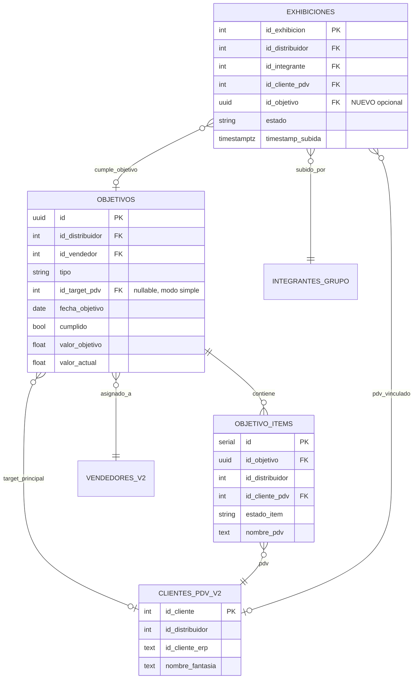
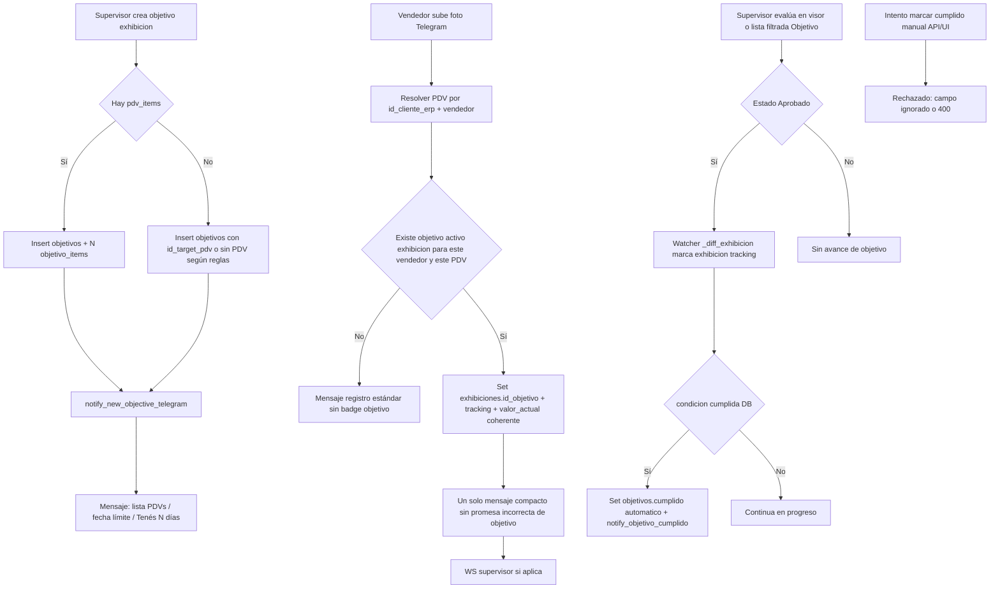

# Plan de implementación — Objetivos de exhibición, Telegram, visor y tutorial

Documento de arquitectura (sin código de producción). Objetivo: alinear notificaciones, validación estricta vendedor+PDV, cumplimiento solo automático, UI del visor y desactivar el flujo del tutorial en [https://shelfycenter.vercel.app/tutorial](https://shelfycenter.vercel.app/tutorial).

---

## 1. Contexto del estado actual (resumen técnico)

- **Asignación y Telegram inicial**: `crear_objetivo` en `CenterMind/routers/supervision.py` inserta en `objetivos` (+ `objetivo_items` si hay multi-PDV) y llama a `ObjetivosNotificationService.notify_new_objective_telegram()`.
- **Notificación “nuevo objetivo”**: `CenterMind/services/objetivos_notification_service.py` — ya enriquece un solo PDV vía `id_target_pdv` / ruta; **no** lista todos los PDV de `objetivo_items` ni calcula explícitamente “Tenés N días”.
- **Bot al subir foto**: `BotWorker` en `CenterMind/bot_worker.py` (bloque “INTERCEPTOR DE OBJETIVO DE EXHIBICIÓN”) hace match por `id_target_pdv` y, si no hay match, **fallback** `id_target_pdv IS NULL`, lo que puede asociar cualquier exhibición a un objetivo “global”. Además duplica mensajería: `objetivo_badge` en el mensaje principal, notificación separada “Foto recibida… objetivo”, y el mensaje incluye enlace a foto (`foto_line`).
- **Progreso automático**: `ObjetivosWatcherService._diff_exhibicion()` en `CenterMind/services/objetivos_watcher_service.py` ya acota por `objetivo_items` cuando existen ítems.
- **Marcar cumplido manual**: `PUT /api/supervision/objetivos/{id}` con `ObjetivoUpdate.cumplido` en `supervision.py` + UI en `shelfy-frontend/src/app/objetivos/page.tsx` (mutación `updateObjetivo`).
- **Visor**: `GET /api/pendientes/{dist_id}` agrupa filas de RPC `fn_pendientes`; hoy no distingue “exhibición de objetivo”.
- **Tutorial**: `CenterMind/routers/auth.py` (`show_tutorial` según `tutorial_views`), redirecciones en `shelfy-frontend/src/app/login/page.tsx`, `dashboard/page.tsx` y `AuthContext.tsx`.

---

## 2. Modelo de datos: relación 1:N Objetivo ↔ PDV

### 2.1 Modelo conceptual (ya parcialmente implementado)

- **`objetivos`**: cabecera del objetivo (tipo, vendedor, `fecha_objetivo`, `valor_objetivo`, `cumplido`, etc.).
- **`objetivo_items`**: tabla **1:N** — cada fila es un PDV (`id_cliente_pdv`) perteneciente al objetivo, con `estado_item` (`pendiente`, `foto_subida`, `cumplido`, …).

Relación lógica:

- **1 objetivo** → **N filas en `objetivo_items`** (modo multi-PDV).
- **Modo simple**: también existe `objetivos.id_target_pdv` (un PDV “principal” en la cabecera); debe mantenerse coherente con los ítems al crear/editar objetivos.

### 2.2 Cambios recomendados en base de datos

1. **`exhibiciones` (nueva columna, recomendada)**  
   - `id_objetivo` (nullable, FK lógica a `objetivos.id`) — se setea **solo** cuando el bot confirma match válido (mismo criterio que interceptor + ítems).  
   - *Propósito*: filtrado rápido en visor (“solo objetivo”), distintivo en UI, sin recalcular joins pesados por cada fila de `fn_pendientes`.  
   - Alternativa mínima sin columna: enriquecer en API post-RPC consultando `objetivos` + `objetivo_items` por `id_cliente_pdv` + `id_vendedor`; más costoso y duplicado con la lógica del bot.

2. **Índices**  
   - Índice en `exhibiciones(id_distribuidor, id_objetivo)` WHERE `id_objetivo IS NOT NULL` (o equivalente en Supabase).  
   - Verificar índices existentes en `objetivo_items(id_objetivo, id_cliente_pdv)`.

3. **Reglas de integridad (negocio)**  
   - Un exhibición con `id_objetivo` no nulo debe corresponder a un objetivo `tipo = 'exhibicion'`, mismo `id_distribuidor`, y PDV dentro del conjunto permitido (`id_target_pdv` o lista `objetivo_items`).

4. **RPC `fn_pendientes` (Supabase)**  
   - Opción A: extender la función SQL para devolver `id_objetivo` (join con `exhibiciones`).  
   - Opción B: dejar el RPC igual y en `get_pendientes` hacer un segundo `select` masivo a `exhibiciones` por lista de `id_exhibicion` y adjuntar `id_objetivo` / flag `es_objetivo`.

No es obligatorio cambiar la PK de `objetivos`; la relación 1:N sigue modelada en `objetivo_items` + opcionalmente `id_target_pdv`.

---

## 3. Diagrama MERMAID — Entidad-Relación

---

## 4. Diagrama MERMAID — Flujo de resolución (asignación → subida → evaluación → cierre)

---

## 5. Orden de trabajo y archivos/funciones a tocar

Ejecutar en este orden para minimizar regresiones.

### Fase 0 — Base de datos (Supabase SQL Editor / migración)

1. `ALTER TABLE exhibiciones ADD COLUMN id_objetivo …` (tipo alineado con `objetivos.id`), índice.  
2. Opcional: backfill solo si hay forma confiable histórica (si no, dejar null en legado).  
3. Si se elige exponer el flag solo vía RPC: ajustar `fn_pendientes` o documentar enriquecimiento en API.

### Fase 1 — Notificación “nuevo objetivo” (Telegram completo)

| Orden | Archivo | Función / lugar |
|------|---------|------------------|
| 1 | `CenterMind/services/objetivos_notification_service.py` | `notify_new_objective_telegram()` — cargar `objetivo_items` por `obj_id` recién creado (el `insert` devuelve `id`); listar nombres + ERP de cada PDV; si solo hay `id_target_pdv`, mantener comportamiento actual mejorado. Calcular `N = (fecha_objetivo - hoy).days` en TZ acordada (ej. Argentina) y texto “Tenés N días para completar”. |
| 2 | `CenterMind/routers/supervision.py` | `crear_objetivo` — tras insert, pasar a la notificación un dict que incluya `id` del objetivo y/o filas de ítems ya persistidos (hoy se pasa `payload` sin `id`). |

### Fase 2 — Interceptor del bot: match estricto y chat más limpio

| Orden | Archivo | Función / lugar |
|------|---------|------------------|
| 1 | `CenterMind/bot_worker.py` | Bloque ~1610–1804 (INTERCEPTOR OBJETIVO): **eliminar** fallback `.is_("id_target_pdv", "null")`. Implementar match: (a) `id_target_pdv == id_pdv_obj` y `id_vendedor` coincide, o (b) existe `objetivo_items` con ese `id_cliente_pdv` para un objetivo `exhibicion` activo del vendedor. Si no hay match, **no** setear tracking ni incrementar `valor_actual`, **no** `objetivo_badge`, **no** mensaje duplicado de objetivo. |
| 2 | `CenterMind/bot_worker.py` | Tras match válido: `UPDATE exhibiciones SET id_objetivo = …` junto con `id_cliente_pdv`. |
| 3 | `CenterMind/bot_worker.py` | Mensaje de confirmación: quitar o reducir `foto_line` (enlace que Telegram puede previewar como “otra foto”), **una sola** notificación objetivo (evitar `send_message` extra + bloque `objetivo_badge` redundante). Unificar copy con `notify_vendor_telegram` solo si el texto es idéntico y no duplica. |
| 4 | `CenterMind/services/objetivos_watcher_service.py` | `_diff_exhibicion()` — alinear reglas de “PDV permitido” con el interceptor (misma fuente: ítems + `id_target_pdv`). Revisar rama “sin ítems” para que no cuente exhibiciones fuera del PDV objetivo si `id_target_pdv` está definido. |

### Fase 3 — Cumplido solo automático

| Orden | Archivo | Función / lugar |
|------|---------|------------------|
| 1 | `CenterMind/models/schemas.py` | `ObjetivoUpdate` — quitar `cumplido` del modelo expuesto al cliente **o** documentar que el backend lo ignora. |
| 2 | `CenterMind/routers/supervision.py` | `actualizar_objetivo()` — no aceptar `cumplido` desde JWT de usuario (solo proceso interno si en el futuro se necesita admin script con API key). |
| 3 | `shelfy-frontend/src/lib/api.ts` | `updateObjetivo` / tipos: quitar envío de `cumplido`. |
| 4 | `shelfy-frontend/src/app/objetivos/page.tsx` | Eliminar controles/mutación que marcan completado manualmente; dejar solo lectura de estado `cumplido` desde watcher. |

### Fase 4 — Tutorial desactivado

| Orden | Archivo | Función / lugar |
|------|---------|------------------|
| 1 | `CenterMind/routers/auth.py` | Lógica `show_tutorial` / `tutorial_views` — forzar `show_tutorial: false` (o umbral que nunca se cumpla en la práctica). |
| 2 | `shelfy-frontend/src/contexts/AuthContext.tsx` | Tras login, no redirigir a `/tutorial`; opcional: `localStorage` `shelfy_tutorial_v2_seen` por defecto. |
| 3 | `shelfy-frontend/src/app/login/page.tsx` | Quitar redirección condicional a `/tutorial`. |
| 4 | `shelfy-frontend/src/app/dashboard/page.tsx` | Igual: sin `router.replace("/tutorial")`. |

La ruta `/tutorial` puede permanecer accesible por URL directa para quien la necesite; el requisito es **no empujar** a usuarios nuevos a [https://shelfycenter.vercel.app/tutorial](https://shelfycenter.vercel.app/tutorial).

### Fase 5 — Visor: solapa “Exhibiciones Objetivo” + distintivo

| Orden | Archivo | Función / lugar |
|------|---------|------------------|
| 1 | `CenterMind/routers/supervision.py` | `get_pendientes()` — enriquecer cada foto/grupo con `es_objetivo` o `id_objetivo` leyendo `exhibiciones` (batch por IDs). Opcional: query param `?filtro=objetivo` que filtre antes de agrupar. |
| 2 | `shelfy-frontend/src/lib/api.ts` | Tipo `GrupoPendiente` / fotos: campo booleano o `id_objetivo`; función `fetchPendientes` con parámetro opcional. |
| 3 | `shelfy-frontend/src/app/visor/page.tsx` | Estado de solapa (Tabs o toggle): “Todas” vs “Exhibiciones Objetivo” filtrando `grupos` donde alguna foto tiene flag. |
| 4 | `shelfy-frontend/src/app/visor/page.tsx` | Distintivo visual (badge “Objetivo”, pulso con `framer-motion`, coherente con `--shelfy-primary`) en tarjeta o overlay del `FotoViewer`. |

### Fase 6 — Tests y regresión

| Archivo | Acción |
|---------|--------|
| `shelfy-frontend/tests/smoke/objetivos.spec.ts` | Ajustar expectativas si desaparece acción manual de completar. |
| Nuevo smoke opcional | Visor: solapa objetivo visible con datos mock/fixture si aplica. |

---

## 6. Criterios de aceptación (checklist)

- [ ] Mensaje Telegram al **asignar** objetivo de exhibición incluye PDV(s) concretos, fecha límite y frase “Tenés N días…” (N coherente con calendario).  
- [ ] Subida de exhibición en PDV **sin** objetivo para ese vendedor **no** muestra texto de objetivo ni altera `valor_actual` / tracking.  
- [ ] No existe flujo de usuario para marcar `cumplido` manual; el flag solo cambia por lógica de watcher / DB.  
- [ ] Chat Telegram post-subida: una sola confirmación clara, sin sensación de “foto duplicada” (sin link preview redundante donde corresponda).  
- [ ] Login/dashboard **no** redirige al tutorial salvo decisión explícita futura.  
- [ ] Visor: solapa “Exhibiciones Objetivo” y marca animada/distintivo en ítems de objetivo.

---

## 7. Riesgos y notas

- **Coherencia multi-PDV**: al notificar en Telegram el “nuevo objetivo”, hay que leer `objetivo_items` recién insertados (el servicio actual no recibe `obj_id` en el dict de notificación).  
- **Fallback `id_target_pdv` null**: eliminarlo evita falsos positivos pero rompe el caso de negocio “objetivo sin PDV específico”; confirmar con producto si ese modo debe existir; si sí, definir reglas explícitas (ej. todos los PDV de una ruta) en DB.  
- **Doble incremento `valor_actual`**: al corregir el interceptor, verificar que no se sume dos veces respecto al watcher al aprobar (revisar tracking `exhibicion_pendiente`).

---

*Fin del plan. Implementación de código y despligue seguir el protocolo interno del proyecto tras completar las fases anteriores.*
