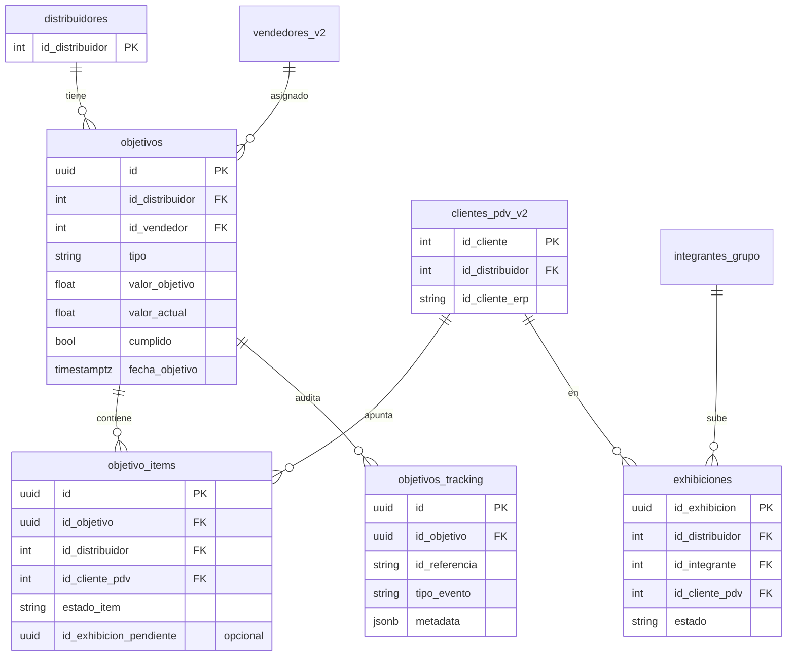
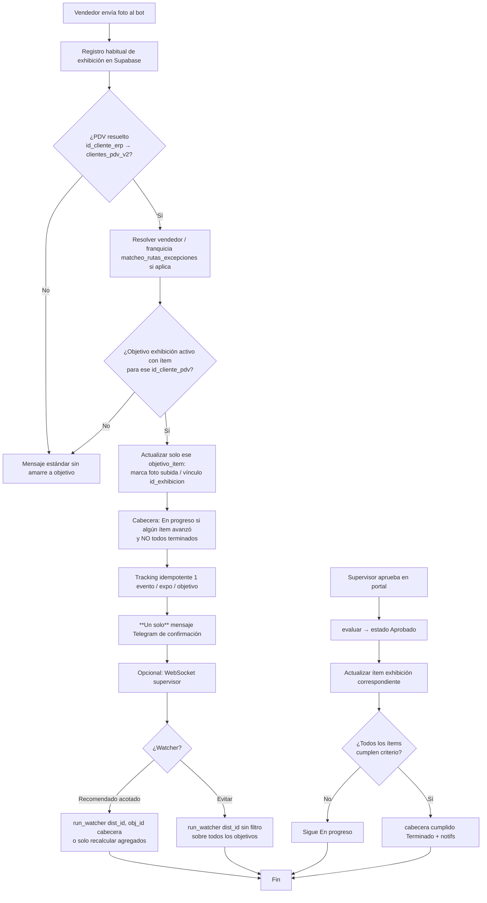

# Plan de implementación — Objetivos multi-PDV (Shelfy / CenterMind)

Documento único: modelo de datos, reglas de estado por tipo de objetivo, diagramas, fases de implementación y archivos a modificar. **No incluye código final.**

**Alcance explícito:** no se contempla migración de objetivos históricos (carga previa mínima); se puede arrancar con el nuevo modelo en limpio.

---

## 1. Reglas de negocio — Columnas Kanban / estados

El portal agrupa objetivos en **Pendiente**, **En progreso** y **Terminado** (cumplido). La definición depende del **tipo** y de si el objetivo involucra **uno o varios** PDVs (ítems).

### 1.1 Alteo (`ruteo_alteo`), activación (`conversion_estado`) y cobranza (`cobranza`)

| Situación | Transición |
|-----------|------------|
| **Varios PDVs** implicados | **Pendiente** → **En progreso** cuando **al menos un** PDV ya refleja el cambio de estado esperado (progreso parcial). El objetivo pasa a **Terminado** solo cuando **todos** los PDVs de la meta cumplen la condición (o se alcanza la meta numérica acordada, según cómo se modele el tipo). |
| **Un solo PDV** | **Pendiente** → **Terminado** directamente cuando ese único PDV cumple (no hace falta una fase intermedia “en progreso” si no hay otro PDV pendiente; la UI puede tratar “un ítem pendiente pero con evento” como terminado en el mismo paso). |

*Nota de implementación:* para “un solo PDV”, en cuanto `valor_actual` alcance la meta o el único ítem marque cumplido, `cumplido = true`. Para “varios”, `valor_actual > 0` (y meta no completa) → **En progreso**; `cumplido` cuando todos los ítems o el agregado según tipo.

### 1.2 Exhibición (`exhibicion`)

| Transición | Condición |
|------------|-----------|
| **Pendiente** → **En progreso** | El vendedor **subió la foto por Telegram** (exhibición registrada, típicamente `Pendiente` de evaluación) para **al menos un** PDV del objetivo **y** no todos los PDVs están ya cumplidos. |
| **En progreso** → **Terminado** | El **supervisor evaluó** (p. ej. **Aprobado**) las exhibiciones necesarias y **todos** los PDVs del objetivo tienen el requisito cumplido. |
| Mientras no estén **todos** los PDVs cumplidos tras evaluación | El objetivo permanece **En progreso** (aunque algunos PDVs ya estén aprobados). |

*Importante:* “En progreso” en exhibición está atado a **flujo foto → evaluación**, no solo a contadores genéricos del watcher sin PDV.

---

## 2. Objetivo de producto y problemas actuales (resumen)

| Problema | Causa técnica (resumen) |
|----------|-------------------------|
| Objetivos “En progreso” vuelven a “Pendiente” al crear otros | Kanban usa sobre todo `valor_actual > 0`; el `run_watcher(dist_id)` sin `obj_id` y `_diff_exhibicion` sin ámbito por PDV pueden recalcular o propagar contadores entre filas duplicadas. |
| N filas en BD por N PDVs | El frontend crea **un `POST` por PDV** en exhibición. |
| Una foto dispara N mensajes / “todo el objetivo” | Watcher + tracking por objetivo duplicado; interceptor y contadores globales por vendedor. |

**Dirección:** una **cabecera** `objetivos` + tabla **1:N** de ítems por PDV; lógica y notificaciones **por ítem** y agregación clara para el estado del Kanban.

---

## 3. Cambios de modelo de datos (1 objetivo → N PDVs)

### 3.1 Tabla `objetivos` (cabecera)

Mantiene: `id_distribuidor`, `id_vendedor`, `tipo`, `descripcion`, `fecha_objetivo`, `valor_objetivo`, `valor_actual`, `cumplido`, `nombre_vendedor`, campos de ruta/cobranza según tipo, etc.

- `valor_objetivo`: meta agregada (p. ej. **número de PDVs** en exhibición o alteo, o monto en cobranza).
- `valor_actual`: **progreso agregado** coherente con el tipo (conteo de ítems cumplidos o avance numérico).
- `cumplido` / **Terminado**: solo `true` cuando la regla de “todos los PDVs” o meta global esté satisfecha (según tipo).

### 3.2 Nueva tabla `objetivo_items` (o `objetivo_pdvs`)

Relación **1:N** con la cabecera.

| Campo | Uso |
|-------|-----|
| `id` | PK |
| `id_objetivo` | FK → `objetivos.id` |
| `id_distribuidor` | Tenant |
| `id_cliente_pdv` | FK a `clientes_pdv_v2.id_cliente` |
| `nombre_pdv` | Snapshot opcional |
| `estado_item` | Máquina de estados por tipo (ej. exhibición: `pendiente` → `foto_subida` → `aprobado`) |
| Referencias opcionales | `id_exhibicion_pendiente`, última expo aprobada, etc. |
| `created_at` / `updated_at` | Auditoría |

**Restricción:** `UNIQUE (id_objetivo, id_cliente_pdv)`.

### 3.3 `objetivos_tracking`

Mantener deduplicación por evento; conviene asociar **`id_objetivo_item`** en `metadata` o como columna para no repetir notificaciones entre lógicas legacy.

### 3.4 Migración

**No requerida** por decisión de negocio: tablas nuevas + nuevos objetivos solo con el modelo ítem; filas viejas pueden ignorarse o borrarse manualmente si existieran pocas.

---

## 4. Diagrama ER (Mermaid)

---

## 5. Diagrama de flujo — Foto al bot (Telegram) para objetivo exhibición

---

## 6. Lógica de Kanban en frontend (derivación sugerida)

Centralizar una función `getObjectiveKanbanPhase(obj)` que use **cabecera + ítems** (o flags enriquecidos desde API):

- **Terminado:** `obj.cumplido === true`.
- **Exhibición — En progreso:** no cumplido y (**algún** ítem con foto subida o pendiente evaluación relevante) y **no** todos aprobados/cumplidos.
- **Exhibición — Pendiente:** no cumplido y ningún ítem con ese avance.
- **Alteo / activación / cobranza — En progreso (multi-PDV):** no cumplido, `valor_actual > 0` o **al menos un** ítem con progreso, y no se alcanzó meta global.
- **Alteo / activación / cobranza — un solo ítem:** puede ir directo a Terminado cuando el único ítem cumple (sin pasar por En progreso en UI, o con En progreso mínimo según preferencia UX).

Esto sustituye la regla frágil actual `valor_actual > 0` únicamente.

---

## 7. Plan por fases (6 partes)

### Fase A — Base de datos

1. Crear `objetivo_items` + índices + `UNIQUE (id_objetivo, id_cliente_pdv)`.
2. (Opcional) Ampliar `objetivos_tracking` con `id_objetivo_item` o convención estricta en `metadata`.
3. Sin migración masiva de datos viejos (acordado).

### Fase B — Contratos API y modelos

1. `CenterMind/models/schemas.py`: `ObjetivoCreate` con lista de PDVs para tipos multi-ítem; DTOs de ítem en respuestas.
2. `CenterMind/routers/supervision.py`:
   - `crear_objetivo`: insert cabecera + N ítems; fijar `valor_objetivo` según tipo (p. ej. exhibición = número de PDVs).
   - `listar_objetivos` / `objetivos_por_vendedor`: incluir ítems o totales para la UI.
   - `actualizar_objetivo` / `eliminar_objetivo`: cascada o borrado de ítems.
   - Tras `evaluar` con **Aprobado**: disparar lógica que marque ítems exhibición y recalcule **Terminado** solo si **todos** los PDVs cumplen.

### Fase C — Watcher y notificaciones

1. `CenterMind/services/objetivos_watcher_service.py`:
   - Acotar cálculos por **conjunto de `id_cliente_pdv` de los ítems** del objetivo (alteo, activación, exhibición).
   - Evitar que el mismo `id_exhibicion` dispare N notificaciones por N filas antiguas; una cabecera + tracking único por evento.
2. `CenterMind/services/objetivos_notification_service.py`: mensajes de nuevo objetivo con resumen multi-PDV; idempotencia en progreso.

### Fase D — Bot Telegram

1. `CenterMind/bot_worker.py`:
   - Interceptor exhibición: matchear **objetivo + ítem por PDV**; actualizar solo ese ítem; **un** `send_message` de confirmación (o consolidar con el mensaje principal sin duplicar).
   - Sustituir `run_watcher(dist_id)` sin `obj_id` tras foto por actualización puntual o `run_watcher(dist_id, obj_id=...)` solo para la cabecera afectada.

### Fase E — Frontend

1. `shelfy-frontend/src/lib/api.ts`: tipos con ítems / fase Kanban.
2. `shelfy-frontend/src/app/objetivos/page.tsx`: un solo create con múltiples PDVs en exhibición; Kanban según sección 6.
3. Ajustar certificados / estadísticas si leen solo `nombre_pdv` único.

### Fase F — Ingesta ERP y reportes

1. `padron_ingestion_service.py` / `ventas_ingestion_service.py`: revisar `run_watcher(dist_id)` global — mantener solo si el watcher ya es **seguro por objetivo/ítem** y no sobrescribe progreso.
2. `routers/reportes.py` + RPC `fn_reporte_vendedor_objetivos` en Supabase: alinear con cabecera + ítems.

---

## 8. Archivos y funciones concretas

| Área | Archivo | Elementos |
|------|---------|-----------|
| Esquemas | `CenterMind/models/schemas.py` | `ObjetivoCreate`, `ObjetivoUpdate`; modelo ítem |
| API | `CenterMind/routers/supervision.py` | `crear_objetivo`, `listar_objetivos`, `objetivos_por_vendedor`, `resumen_supervisor_objetivos`, `actualizar_objetivo`, `eliminar_objetivo`, flujo `evaluar` |
| Watcher | `CenterMind/services/objetivos_watcher_service.py` | `run_watcher`, `_process_objetivo`, `_diff_alteo`, `_diff_activacion`, `_diff_exhibicion`, `_compute_cobranza`, `_insert_tracking_batch` |
| Notificaciones | `CenterMind/services/objetivos_notification_service.py` | `notify_new_objective_telegram`, `notify_vendor_telegram`, `notify_supervisor_ws`, `notify_objetivo_cumplido` |
| Bot | `CenterMind/bot_worker.py` | Trigger watcher ~1448–1460; interceptor ~1584–1758 |
| Ingesta | `CenterMind/services/padron_ingestion_service.py`, `ventas_ingestion_service.py` | `objetivos_watcher.run_watcher` |
| Frontend | `shelfy-frontend/src/lib/api.ts`, `shelfy-frontend/src/app/objetivos/page.tsx` | API + formulario + Kanban |
| Reportes | `CenterMind/routers/reportes.py` | RPC objetivos en BD |

---

## 9. Criterios de aceptación (checklist)

- [ ] Exhibición multi-PDV: primera foto → cabecera **En progreso**; hasta que **todos** evaluados según regla → **Terminado**.
- [ ] Exhibición: **un** mensaje Telegram por carga asociada al objetivo (no duplicados por ítems fantasma).
- [ ] Alteo / activación / cobranza multi-PDV: **En progreso** con **un** PDV que cambió; **Terminado** con meta / todos satisfechos.
- [ ] Un solo PDV en esos tipos: comportamiento **Pendiente → Terminado** cuando corresponde, sin depender de columna “en progreso” forzada.
- [ ] Crear objetivos nuevos **no** resetea el Kanban de otros objetivos del mismo vendedor/distribuidor.

---

*Fin del documento.*
