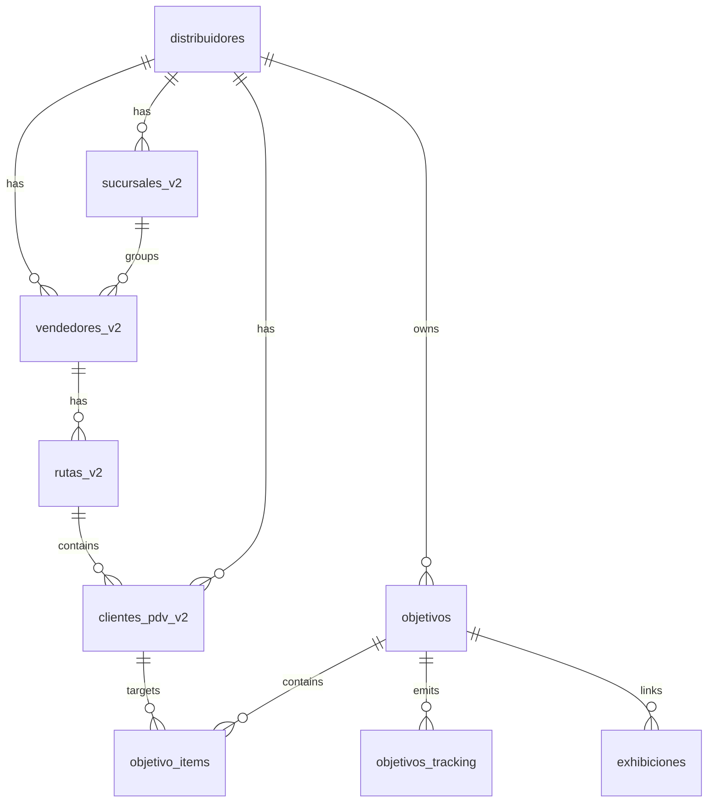
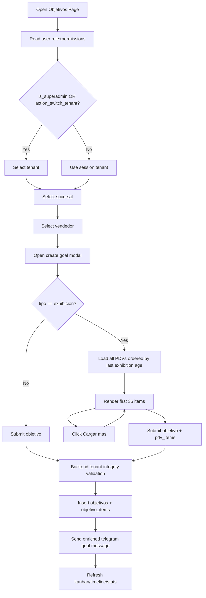

# Plan Implementación Objetivos Multi-tenant UX

## Alcance y objetivo
Habilitar que `superadmin` y `directorio` gestionen objetivos para cualquier distribuidora desde `/objetivos`, mejorar la experiencia de carga (selector jerárquico + calendario), permitir objetivos de exhibición sobre todos los PDV (con orden por antigüedad de exhibición y paginado de 35), enriquecer mensaje Telegram del objetivo y simplificar UI redundante de vistas.

## Modelo de datos (relación 1:N Objetivo -> PDV)
Cambios de base de datos para consolidar el modelo multi-PDV y soportar payloads ricos de notificación:

- Mantener `objetivos` como cabecera (1) y `objetivo_items` como detalle (N).
- Asegurar constraints e índices:
  - `objetivo_items UNIQUE (id_objetivo, id_cliente_pdv)` para deduplicación.
  - `objetivo_items FK id_objetivo -> objetivos.id ON DELETE CASCADE`.
  - `objetivo_items FK id_cliente_pdv -> clientes_pdv_v2.id_cliente`.
  - Índices: `objetivo_items(id_distribuidor,id_objetivo)`, `objetivo_items(id_distribuidor,id_cliente_pdv,estado_item)`.
- Homologar columnas en `objetivos` para trazabilidad UI/bot:
  - Persistir `id_objetivo_padre` al crear reintentos.
  - Mantener `kanban_phase` y `resultado_final` como estado derivado/final.
- Nuevo soporte para notificación enriquecida (sin romper compatibilidad):
  - Usar `objetivo_items` + join a `clientes_pdv_v2` para obtener `nombre`, `id_cliente_erp`, `domicilio`, `telefono` (si existe), `lat/lng`.
- Validaciones de integridad multi-tenant en backend:
  - `id_vendedor` debe pertenecer al `id_distribuidor` del objetivo.
  - Cada `id_cliente_pdv` de `pdv_items` debe pertenecer al mismo `id_distribuidor`.

## Flujo funcional objetivo (nuevo)

## Cambios por archivo y función (orden recomendado)

1) **Backend: contratos y validaciones multi-tenant**
- [CenterMind/models/schemas.py](/Users/ignaciopiazza/Desktop/CenterMind/CenterMind/models/schemas.py)
  - Revisar `ObjetivoCreate`/`ObjetivoItemCreate` para soportar lista de items y campos necesarios de reintento.
- [CenterMind/routers/supervision.py](/Users/ignaciopiazza/Desktop/CenterMind/CenterMind/routers/supervision.py)
  - `crear_objetivo()`:
    - Validar pertenencia de `id_vendedor` al `id_distribuidor`.
    - Validar que todos los `pdv_items.id_cliente_pdv` pertenezcan a ese tenant.
    - Persistir `id_objetivo_padre` cuando venga.
  - `listar_objetivos()`:
    - Mantener enriquecimiento de items y estado; revisar filtros por sucursal/vendedor para uso cross-tenant.
  - Nuevo endpoint de catálogo de PDVs para modal de exhibición (recomendado):
    - `GET /api/supervision/pdvs-catalog/{dist_id}?vendedor_id=&limit=35&offset=`
    - Orden: primero `fecha_ultima_exhibicion IS NULL` (nunca exhibidos), luego mayor antigüedad a menor.

2) **Backend: watcher + notificaciones**
- [CenterMind/services/objetivos_watcher_service.py](/Users/ignaciopiazza/Desktop/CenterMind/CenterMind/services/objetivos_watcher_service.py)
  - Confirmar actualización por item para multi-PDV y no romper progreso incremental.
- [CenterMind/services/objetivos_notification_service.py](/Users/ignaciopiazza/Desktop/CenterMind/CenterMind/services/objetivos_notification_service.py)
  - `notify_new_objective_telegram()`:
    - enriquecer texto con: nombre PDV, nro cliente ERP, dirección, teléfono, link mapa, fecha límite, "tenés N días".
    - en multi-PDV, incluir resumen + top items, evitando mensajes gigantes.
- [CenterMind/bot_worker.py](/Users/ignaciopiazza/Desktop/CenterMind/CenterMind/bot_worker.py)
  - Homologar datos del PDV en respuestas relacionadas a objetivo de exhibición para consistencia (nombre/cliente/mapa).

3) **Frontend: API client y tipos**
- [shelfy-frontend/src/lib/api.ts](/Users/ignaciopiazza/Desktop/CenterMind/shelfy-frontend/src/lib/api.ts)
  - Agregar tipo `PDVCatalogItem` y fetch paginado `fetchPDVCatalog(...)`.
  - Si hace falta, ampliar `fetchObjetivos(...)` para filtros por tenant desde UI.

4) **Frontend: página Objetivos (UX principal)**
- [shelfy-frontend/src/app/objetivos/page.tsx](/Users/ignaciopiazza/Desktop/CenterMind/shelfy-frontend/src/app/objetivos/page.tsx)
  - `ObjetivosPage`:
    - agregar selector jerárquico para `superadmin/directorio`: tenant -> sucursal -> vendedor.
    - mantener para roles normales tenant fijo de sesión.
  - `NuevoObjetivoModal`:
    - reemplazar `input type=date` por calendario UX (popover/calendar + quick actions: hoy/7d/15d/30d).
    - para `tipo=exhibicion`: consumir catálogo paginado de PDV, ordenar por antigüedad de exhibición, mostrar 35 y botón `Cargar más`.
  - Simplificar UI de vistas:
    - dejar una sola fuente de navegación de vistas en el header derecho (`Kanban/Timeline/...`).
    - eliminar toggle redundante de lista/kanban interno y el bridge `data-lista-toggle`.

5) **Frontend: permisos de navegación**
- [shelfy-frontend/src/components/layout/Sidebar.tsx](/Users/ignaciopiazza/Desktop/CenterMind/shelfy-frontend/src/components/layout/Sidebar.tsx)
- [shelfy-frontend/src/components/layout/BottomNav.tsx](/Users/ignaciopiazza/Desktop/CenterMind/shelfy-frontend/src/components/layout/BottomNav.tsx)
  - asegurar que `/objetivos` respete matriz real de permisos para `directorio/superadmin`.
  - evitar overrides de rol que abran menús admin no deseados.

6) **Migración SQL (antes de deploy app)**
- Crear/validar constraints e índices de `objetivo_items` y tracking en Supabase.
- Verificar que consultas de catálogo usen índices por `id_distribuidor` y fecha exhibición.

7) **QA y validación funcional**
- Casos:
  - `superadmin` crea objetivo para tenant distinto sin cambiar de página.
  - `directorio` con permiso puede crear objetivo cross-tenant.
  - exhibición permite seleccionar PDVs con y sin exhibición previa.
  - paginado de 35 + `Cargar más`.
  - bot recibe mensaje completo con datos PDV y deadline.
  - no hay regresión en kanban/timeline/estadísticas.

## Orden de implementación recomendado
1. Migración DB + validaciones backend en `crear_objetivo()`.
2. Endpoint catálogo PDV paginado.
3. Enriquecimiento de notificaciones Telegram.
4. Integración frontend API + selector jerárquico.
5. Refactor UX modal (calendario y listado PDV).
6. Limpieza de UI redundante de vistas.
7. QA end-to-end por rol/tenant.
