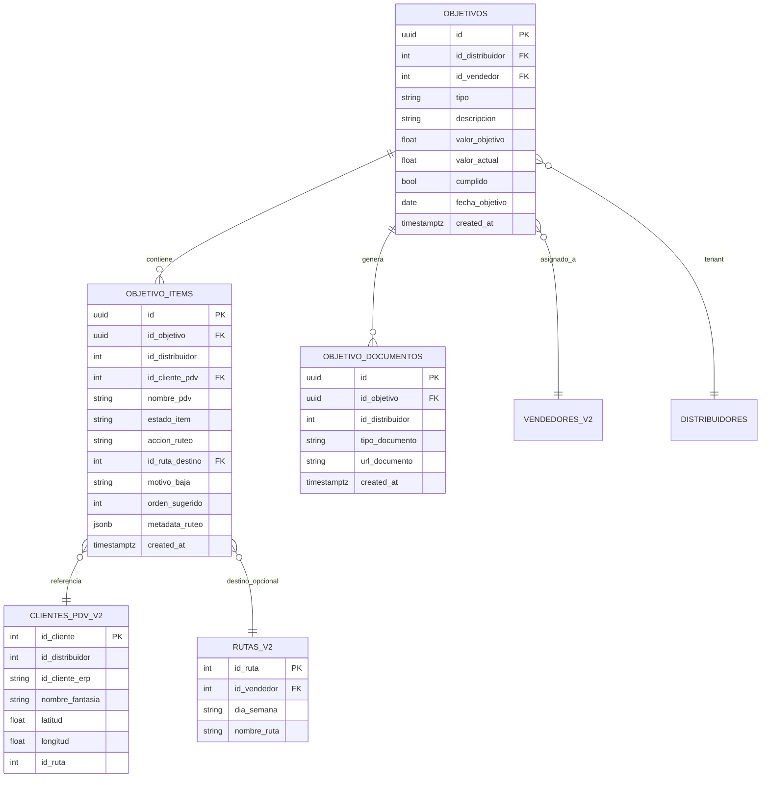
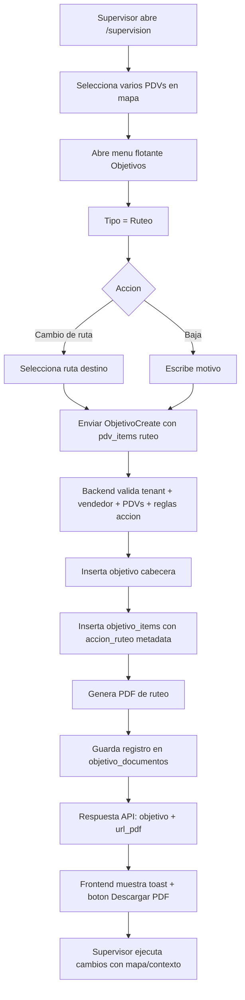

# Plan de Implementación — Objetivos de Ruteo + Menú Flotante

## Objetivo del plan
Retomar el objetivo de **Ruteo** con UX simple y consistente con Exhibición, permitiendo:
- Seleccionar múltiples PDVs.
- Elegir acción de ruteo: **Cambio de ruta** o **Baja**.
- Si es cambio: seleccionar **ruta destino**.
- Si es baja: informar **motivo**.
- Generar el objetivo y además un **PDF descargable** con mapa de contexto para ejecución del supervisor.
- Unificar la experiencia en `supervision` (menú flotante) y en `/objetivos`.

---

## 1) Cambios de Modelo de Datos (Relación 1:N Objetivo -> PDV)

Estado actual:
- Ya existe `objetivos` (cabecera) y `objetivo_items` (detalle 1:N).
- Hoy `objetivo_items` está orientada a estados de cumplimiento (pendiente/foto_subida/cumplido), útil para exhibición.

Necesidad para ruteo:
- Guardar la **acción por PDV** (cambio/baja) y su metadata operativa.
- Mantener 1 objetivo con N PDVs y permitir detalle heterogéneo por item.

### Propuesta de esquema
1. **Mantener** `objetivos` como cabecera.
2. **Extender** `objetivo_items` para soportar ruteo:
   - `accion_ruteo` (`cambio_ruta` | `baja` | NULL)
   - `id_ruta_destino` (FK a `rutas_v2.id_ruta`, nullable)
   - `motivo_baja` (text, nullable)
   - `orden_sugerido` (int, nullable) para ordenar ejecución en PDF/listado
   - `metadata_ruteo` (jsonb, nullable) para flexibilidad futura (ej. prioridad, notas)
3. **Agregar** tabla de trazabilidad documental:
   - `objetivo_documentos`:
     - `id`
     - `id_objetivo` FK
     - `id_distribuidor`
     - `tipo_documento` (`ruteo_pdf`)
     - `url_documento`
     - `created_at`

### Reglas de integridad (DB)
- `CHECK`: si `accion_ruteo='cambio_ruta'` -> `id_ruta_destino IS NOT NULL`.
- `CHECK`: si `accion_ruteo='baja'` -> `motivo_baja IS NOT NULL AND length(trim(motivo_baja))>0`.
- `CHECK`: si `accion_ruteo='baja'` -> `id_ruta_destino IS NULL`.
- Índices recomendados:
  - `objetivo_items(id_objetivo, accion_ruteo)`
  - `objetivo_items(id_distribuidor, id_cliente_pdv)`
  - `objetivo_documentos(id_objetivo, tipo_documento, created_at desc)`

---

## 2) Diagrama ER (MERMAID)

---

## 3) Flujo de resolución (MERMAID Flowchart)

---

## 4) Plan de implementación paso a paso (orden exacto)

## Fase A — Contrato de datos y backend

- **Paso 1 — Migración SQL (primero)**
  - Crear script SQL en `CenterMind/base_datos/` (ej. `objetivos_ruteo_phase1.sql`) con:
    - `ALTER TABLE objetivo_items ...` (nuevas columnas)
    - checks/constraints
    - índices
    - `CREATE TABLE objetivo_documentos`
  - Ejecutar en Supabase SQL Editor.

- **Paso 2 — Modelos Pydantic**
  - Archivo: `CenterMind/models/schemas.py`
  - Funciones/clases a modificar:
    - `ObjetivoItemCreate`
    - `ObjetivoCreate`
  - Agregar payload por ítem para ruteo:
    - `accion_ruteo`, `id_ruta_destino`, `motivo_baja`, `orden_sugerido`, `metadata_ruteo`.

- **Paso 3 — Endpoint crear objetivo**
  - Archivo: `CenterMind/routers/supervision.py`
  - Función: `crear_objetivo`
  - Cambios:
    - Reemplazar tipo legacy `general` por `ruteo` explícito en `TIPOS_VALIDOS`.
    - Validar reglas por ítem según `accion_ruteo`.
    - Para tipo `ruteo`, forzar uso de `pdv_items` (no `id_target_pdv` unitario).
    - Persistir columnas nuevas en `objetivo_items`.
    - Dejar `valor_objetivo = len(pdv_items)` si no viene informado.

- **Paso 4 — Endpoint listar objetivos**
  - Archivo: `CenterMind/routers/supervision.py`
  - Función: `listar_objetivos`
  - Cambios:
    - Enriquecer `items` devolviendo campos ruteo.
    - Exponer `documentos` (último PDF) opcionalmente para botón de descarga.

- **Paso 5 — Servicio PDF ruteo**
  - Nuevo archivo: `CenterMind/services/objetivos_ruteo_pdf_service.py`
  - Nuevas funciones:
    - `build_ruteo_context(dist_id, objetivo_id)` (joins PDV actual, ruta actual, ruta destino, coordenadas).
    - `render_ruteo_pdf(context)` (tabla + mini-mapa contextual).
    - `store_pdf_and_get_url(...)` (Supabase Storage o respuesta stream).
  - Integración en `crear_objetivo` para generar PDF post-insert y registrar en `objetivo_documentos`.

- **Paso 6 — Endpoint de descarga explícito**
  - Archivo: `CenterMind/routers/supervision.py`
  - Nueva función:
    - `download_objetivo_ruteo_pdf(objetivo_id)` o `get_objetivo_documentos(objetivo_id)`.
  - Objetivo: permitir re-descarga desde `/objetivos` y desde auditoría.

## Fase B — API TypeScript + tipos frontend

- **Paso 7 — Contrato API frontend**
  - Archivo: `shelfy-frontend/src/lib/api.ts`
  - Modificar:
    - `ObjetivoTipo` (quitar `general`, agregar `ruteo`).
    - `ObjetivoItem` y `ObjetivoCreate.pdv_items` con campos de ruteo.
  - Agregar funciones:
    - `fetchRutasByVendedor(...)` (si no alcanza la actual)
    - `fetchObjetivoDocumentos(...)` / `downloadObjetivoRuteoPdf(...)`.

## Fase C — UX principal (PC-first)

- **Paso 8 — Menú flotante en supervision (carrito)**
  - Archivo: `shelfy-frontend/src/components/admin/TabSupervision.tsx`
  - Funciones/zonas a modificar (en este orden):
    1. estado local del menú flotante (bloque `Floating Objetivos Menu`)
    2. `useEffect` contextual loader de objetivos (hoy usa `objTipo === "ruteo_alteo"`)
    3. `buildObjectivePhrase(...)`
    4. `handleSubmitObjectives`
    5. render de selector cascada de tipo en bloque visual del carrito
  - Cambios UX:
    - Tipo cascada: `Activacion / Exhibicion / Ruteo / Alteo` (sin `general`).
    - Para `Ruteo`: sub-form por item:
      - Acción global por defecto (cambio/baja) editable por PDV.
      - Si cambio: selector ruta destino.
      - Si baja: input motivo.
    - Layout desktop: tabla compacta en panel lateral del menú (no solo modal vertical).

- **Paso 9 — Modal de creación en /objetivos**
  - Archivo: `shelfy-frontend/src/app/objetivos/page.tsx`
  - Función/componente: `NuevoObjetivoModal`
  - Cambios:
    - Ajustar `TIPO_CONFIG`, `ACTIVIDADES_FRASE`, `TIPOS_DISPONIBLES`.
    - Eliminar `general`.
    - Crear bloque UI específico para `tipo === "ruteo"`:
      - lista de PDVs seleccionados
      - acción por PDV + destino/motivo
    - `handleSubmit` debe enviar `pdv_items` con metadata de ruteo.

- **Paso 10 — Vista de objetivo y CTA PDF**
  - Archivo: `shelfy-frontend/src/app/objetivos/page.tsx`
  - Funciones: `ObjetivoRow`, `KanbanCard`, posibles acciones de toolbar.
  - Cambios:
    - Si `tipo=ruteo`, mostrar resumen legible por item.
    - Botón `Descargar PDF de ruteo`.

## Fase D — Integración mapa + calidad

- **Paso 11 — Gate de auditoría de componentes (shadcn Components Check)**
  - Objetivo: agregar una verificación explícita de componentes UI disponibles antes de cerrar la implementación de página.
  - Acción:
    1. Relevar componentes instalados en `shelfy-frontend/src/components/ui/`.
    2. Contrastar contra la lista oficial de Components (`Accordion`, `Alert`, `Button`, `Calendar`, `Date Picker`, `Dialog`, `Popover`, `Select`, `Table`, `Tabs`, `Tooltip`, etc.).
    3. Marcar para este alcance cuáles son **obligatorios** en la página de objetivos/ruteo:
       - `Button`, `Calendar`, `Date Picker`, `Dialog`, `Popover`, `Select`, `Table`, `Tooltip`, `Alert`, `Tabs`, `Badge`, `Skeleton`.
    4. Si falta alguno obligatorio, instalarlo/agregarlo antes del QA final.
  - Entregable: checklist en PR/nota técnica con `OK / Missing / Replaced`.

- **Paso 12 — Mapa contextual del PDF**
  - Backend: `CenterMind/services/objetivos_ruteo_pdf_service.py`
  - Fuente de datos: `clientes_pdv_v2`, `rutas_v2`, `vendedores_v2`.
  - Mínimo viable:
    - Tabla por PDV: cliente, ruta actual, acción, destino/motivo.
    - Mapa de contexto simplificado (coordenadas + leyenda visual).

- **Paso 13 — Permisos y navegación**
  - Archivos:
    - `shelfy-frontend/src/components/layout/Sidebar.tsx`
    - `shelfy-frontend/src/components/layout/BottomNav.tsx`
    - `shelfy-frontend/src/app/admin/permissions/page.tsx` (si agregas permiso nuevo de descarga/gestión ruteo)
  - Asegurar que roles con `menu_objetivos` mantengan acceso al nuevo flujo.

- **Paso 14 — Validación funcional**
  - Flujo QA mínimo:
    1. Crear objetivo ruteo multi-PDV con mezcla cambio/baja.
    2. Confirmar persistencia en `objetivo_items`.
    3. Descargar PDF y validar legibilidad en PC.
    4. Reabrir objetivo y verificar que no se perdió metadata.
    5. Ejecutar el `Components Check` y adjuntar resultado de cobertura de componentes.

---

## 5) Archivos y funciones exactas a modificar (checklist corto)

- `CenterMind/models/schemas.py`
  - `ObjetivoItemCreate`
  - `ObjetivoCreate`
- `CenterMind/routers/supervision.py`
  - `crear_objetivo`
  - `listar_objetivos`
  - `actualizar_objetivo` (si se edita acción/motivo/destino)
  - `nuevo endpoint descarga/listado de documentos`
- `CenterMind/services/objetivos_ruteo_pdf_service.py` (nuevo)
  - `build_ruteo_context`
  - `render_ruteo_pdf`
  - `store_pdf_and_get_url`
- `shelfy-frontend/src/lib/api.ts`
  - `ObjetivoTipo`
  - `ObjetivoItem`
  - `ObjetivoCreate`
  - `createObjetivo`, `fetchObjetivos` (tipos)
  - `downloadObjetivoRuteoPdf` (nuevo)
- `shelfy-frontend/src/components/admin/TabSupervision.tsx`
  - estados `obj*`
  - `useEffect` contextual (`objTipo`)
  - `buildObjectivePhrase`
  - `handleSubmitObjectives`
  - render del menú flotante (selector cascada + formulario ruteo)
- `shelfy-frontend/src/app/objetivos/page.tsx`
  - `TIPO_CONFIG`, `ACTIVIDADES_FRASE`, `TIPOS_DISPONIBLES`
  - `NuevoObjetivoModal` (`handleSubmit`, UI ruteo)
  - `ObjetivoRow`/`KanbanCard` para botón de PDF y resumen ruteo
- `shelfy-frontend/src/components/ui/`
  - Validación de cobertura de componentes para la página (`calendar`, `date-picker`, `dialog`, `popover`, `select`, `table`, `tooltip`, etc.)

---

## 6) Decisiones UX críticas para PC (recomendadas)

- Menú flotante en desktop con ancho mayor (panel tipo `max-w-[560px]`) y tabla de items.
- Edición masiva:
  - acción global + override por fila.
  - cambio de ruta masivo + override por fila.
- Validación inline por fila (ej. baja sin motivo, cambio sin ruta).
- CTA final doble:
  - `Crear objetivo`
  - `Crear objetivo + Descargar PDF`

---

## 7) Riesgos y mitigación

- **Riesgo:** mezclar semántica de `ruteo_alteo` con nuevo `ruteo`.
  - **Mitigación:** mantener `ruteo_alteo` para objetivo comercial actual; crear `ruteo` nuevo orientado a reasignación/baja.
- **Riesgo:** PDFs pesados o lentos.
  - **Mitigación:** MVP con mapa simplificado + tabla; luego versión enriquecida.
- **Riesgo:** inconsistencias por tenant.
  - **Mitigación:** validaciones en backend por `id_distribuidor` para rutas y PDVs.

---

## 8) Resultado esperado

Un flujo único y claro para supervisores:
- Seleccionan PDVs desde mapa/carrito.
- Definen acción de ruteo (cambio/baja) en cascada.
- Crean objetivo multi-PDV 1:N.
- Descargan PDF operativo con contexto visual y lista accionable.

