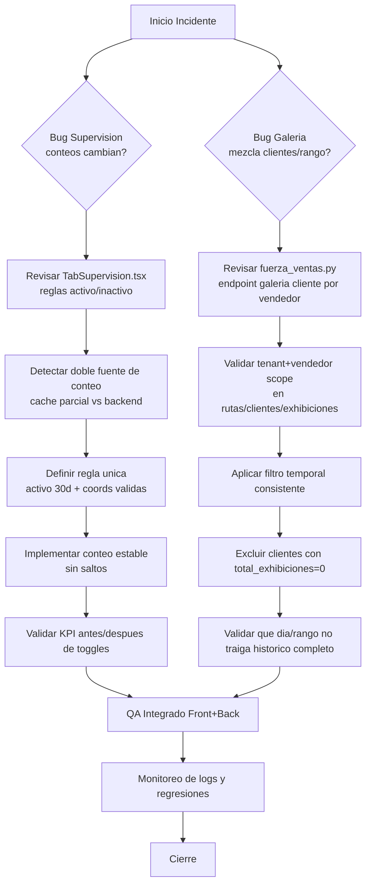

# Plan de Resolucion - Bugs Supervisión/Galería - 2026-04-17

## Objetivo

Resolver 2 incidentes criticos sin introducir regresiones:

1. **Supervision / Mapa**: al encender PDVs cambian los N de activos/inactivos.
2. **Galeria de Exhibiciones**:
   - se mezclan clientes de un vendedor en otro,
   - el filtro por dia/rango no respeta la fecha y termina mostrando todo.

---

## 1) Cambios necesarios en Modelos de Datos (DB)

> Nota: la mayor parte del fix puede hacerse en logica sin tocar esquema.  
> Estos cambios son de hardening/observabilidad y ayudan a evitar recurrencia.

### 1.1 Base de datos (opcional recomendado)

- **Tabla `rutas_v2`**  
  - Validar que exista y este operativo el enlace de tenant via `vendedores_v2.id_distribuidor`.
  - Si no existe indice util para joins por vendedor:
    - indice por `id_vendedor`.

- **Tabla `clientes_pdv_v2`**
  - Confirmar indice compuesto para consultas de galeria:
    - `id_distribuidor`, `id_ruta`, `id_cliente`.
  - Confirmar que `id_cliente` sea PK consistente en todo el backend.

- **Tabla `exhibiciones`**
  - Verificar indice para filtro principal de galeria:
    - `id_distribuidor`, `id_cliente_pdv`, `timestamp_subida DESC`.
  - Verificar que no se usen claves legacy ambiguas en filtros nuevos (`id_cliente` legacy) cuando se requiere precision por PDV.

### 1.2 Modelo de respuesta backend (sin migracion DB)

En los modelos Pydantic actuales no hace falta agregar campos nuevos para cerrar el bug, pero si conviene estandarizar semantica:

- `GaleriaClienteCard.total_exhibiciones`:
  - Debe representar **exhibiciones dentro del rango temporal solicitado**.
  - Si `0`, no deberia listarse el cliente en modo “clientes con exhibiciones”.

---

## 2) Cambios necesarios en Backend

### 2.1 Archivo principal backend a tocar

- `CenterMind/routers/fuerza_ventas.py`

### 2.2 Funciones especificas a modificar

1. `galeria_list_clientes_por_vendedor(...)`
2. (Hardening menor) `galeria_list_vendedores(...)`
3. (Validacion de consistencia) `galeria_timeline_cliente(...)`

### 2.3 Cambios de logica requeridos

#### A) `galeria_list_clientes_por_vendedor` (fix critico)

- Asegurar **scope estricto por tenant y vendedor** en cada paso:
  - resolver `dist_id` desde vendedor (ya existe),
  - rutas solo del vendedor correcto,
  - clientes solo de rutas de ese vendedor + `id_distribuidor=dist_id`,
  - exhibiciones solo por `id_distribuidor=dist_id` y `id_cliente_pdv IN pdv_pk_ids`.

- Aplicar filtro temporal de forma consistente (sin dobles interpretaciones):
  - normalizar borde de fecha (`00:00:00` a `23:59:59` local/UTC coherente),
  - evitar mezclar filtro SQL + filtro en memoria con criterios distintos.

- Regla de salida obligatoria:
  - **si cliente tiene `total_exhibiciones = 0` en el rango**, no se incluye en respuesta (cuando la pantalla es “galeria de exhibiciones”).
  - Esto elimina el bug “filtro por dia muestra todo”.

- Logging de auditoria (temporal o permanente):
  - `dist_id`, `id_vendedor`, `rutas_count`, `pdvs_base_count`, `exhibiciones_rango_count`, `clientes_result_count`.

#### B) `galeria_list_vendedores` (hardening para coherencia de tarjetas)

- Confirmar que el conteo por vendedor use exactamente el mismo criterio temporal de clientes/timeline.
- Confirmar que no se cuenten exhibiciones de integrantes mapeados a otro vendedor por errores de mapping legacy.

#### C) `galeria_timeline_cliente` (consistencia final)

- Mantener validacion tenant-safe (ya esta), y validar que paginacion no se pase de rango.
- Verificar limite/offset para no generar `has_more` inconsistente.

---

## 3) Cambios necesarios en Frontend

### 3.1 Archivos frontend a tocar

1. `shelfy-frontend/src/components/admin/TabSupervision.tsx`
2. `shelfy-frontend/src/app/galeria-exhibiciones/page.tsx`
3. `shelfy-frontend/src/lib/api.ts`
4. (Opcional de UX) `shelfy-frontend/src/store/useGaleriaStore.ts`

### 3.2 Funciones/zonas especificas a modificar

#### A) `TabSupervision.tsx` (fix conteo activos/inactivos)

Zonas:
- `isInactivo(...)`
- `isInactivo30(...)`
- `getVendorMapEligibleStats(...)`
- bloque de `vendorMapEligibleStats` + calculo `totalPdv/totalActivos/pctActivos`
- render de indicadores (`{pdvTot} PDV · {pct}% activos`)

Cambios:
- Definir una **unica regla operativa** de activo/inactivo para KPI del mapa (recomendado 30 dias, misma que pines).
- Eliminar fallback mixto que cambia fuente (cache parcial vs backend agregado) sin marcar estado.
- Si dataset de mapa no esta completo, mostrar estado intermedio (“calculando...”) o congelar ultima metrica estable en lugar de saltar valores.

#### B) `api.ts` (sin cambios de contrato obligatorios, si de semantica)

Zonas:
- `fetchGaleriaClientesPorVendedor(...)`
- (si se decide) interfaces de `GaleriaClienteCard`.

Cambio:
- Mantener contrato, pero documentar que backend devuelve solo clientes con exhibiciones en rango.

#### C) `galeria-exhibiciones/page.tsx` (alineacion con backend)

Zonas:
- query `["galeria-clientes", ...]`
- estados de empty/resultados.

Cambio:
- Ajustar mensajes para distinguir:
  - “sin clientes con exhibiciones en este rango” vs
  - “sin datos del vendedor”.

#### D) `useGaleriaStore.ts` (opcional)

- Si aparecen inconsistencias por persistencia cross-tenant de fechas/sucursal, resetear tambien rango al cambiar tenant (si negocio lo aprueba).

---

## 4) Orden exacto de implementacion (recomendado)

1. **Backend primero (bloqueante)**
   - Archivo: `CenterMind/routers/fuerza_ventas.py`
   - Funcion 1: `galeria_list_clientes_por_vendedor` (fix principal)
   - Funcion 2: `galeria_list_vendedores` (coherencia de metricas)
   - Funcion 3: `galeria_timeline_cliente` (validacion final)

2. **Frontend supervision**
   - Archivo: `shelfy-frontend/src/components/admin/TabSupervision.tsx`
   - Unificar regla de activos/inactivos y fuente de conteo.

3. **Frontend galeria**
   - Archivo: `shelfy-frontend/src/app/galeria-exhibiciones/page.tsx`
   - Ajustes de UX/estados para nueva semantica de respuesta.

4. **Borde API tipado**
   - Archivo: `shelfy-frontend/src/lib/api.ts`
   - Ajuste de comentarios/tipos si cambia semantica de resultados.

5. **(Opcional) Store persistido**
   - Archivo: `shelfy-frontend/src/store/useGaleriaStore.ts`
   - Hardening de reset de filtros al cambiar tenant.

6. **Pruebas y validacion**
   - smoke manual + (ideal) pruebas automatizadas.

---

## 5) Diagrama MERMAID (Flowchart) - Proceso de resolución

---

## 6) Checklist de validacion (post-implementacion)

### Supervision mapa
- Al prender/apagar vendedor y rutas, el % y N activos/inactivos **no saltan** de forma artificial.
- Conteo coincide con universo visible de pines (misma regla de activo).

### Galeria
- Vendedor A no muestra clientes de vendedor B.
- Filtro “hoy” muestra solo exhibiciones de hoy.
- Rango personalizado respeta exactamente desde/hasta.
- Si no hay exhibiciones en rango, lista vacia (sin “ruido” de clientes sin fotos).

---

## 7) Riesgos y mitigaciones

- **Riesgo**: tenants con datos legacy (mapeos incompletos).
  - **Mitigacion**: logs de auditoria por request + fallback controlado.

- **Riesgo**: cambio de semantica en galeria (antes mostraba clientes sin exhibiciones).
  - **Mitigacion**: confirmar criterio de producto; si necesitan ambos modos, agregar flag explicito.

- **Riesgo**: timezone en filtros de fecha.
  - **Mitigacion**: estandarizar conversion fecha local->timestamp y documentar criterio unico.

---

Si aprobás este plan, el siguiente paso es ejecutar los cambios en ese orden y validar con casos reales de al menos 2 distribuidores.
