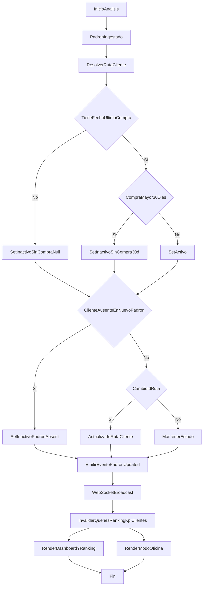

# Plan de Resolución — Padrón, Dashboard y Ranking Realtime

## Objetivo
Alinear la actualización de base de clientes con reglas de negocio (baja por ausencia en padrón, inactividad por última compra, cambios de ruta visibles), corregir UX del dashboard/ranking y asegurar comportamiento realtime consistente (dashboard y modo oficina) mediante WebSocket + invalidación de cache.

## Alcance por capa

- **Base de datos (modelo):** ajustar semántica de `clientes_pdv_v2` para estados y trazabilidad de inactividad/ruteo.
- **Backend:** centralizar reglas de estado/ruta durante ingesta de padrón y exponer eventos de actualización para refresco realtime.
- **Frontend:** corregir UI de KPIs/ranking y consolidar consumo realtime en dashboard y modo oficina.

## Cambios necesarios en Modelos de Base de Datos

- En `[clientes_pdv_v2]` (tabla Supabase), mantener `estado` como flag principal y agregar trazabilidad:
  - `motivo_inactivo` (`padron_absent` | `sin_compra_30d` | `sin_compra_null` | `baja_manual` | `ruta_obsoleta`)
  - `fecha_inactivacion` (timestamp)
  - opcional: `fecha_reactivacion` para auditoría
- Revisar/definir unicidad funcional del cliente por tenant:
  - objetivo recomendado: `UNIQUE(id_distribuidor, id_cliente_erp)` para que `id_ruta` sea mutable y no genere duplicados por cambio de ruta.
  - si no se migra a esa constraint, mantener `on_conflict=id_ruta,id_cliente_erp` pero reforzar tombstone de ruta anterior de forma determinística.
- Índices recomendados para consultas críticas:
  - `(id_distribuidor, estado)`
  - `(id_distribuidor, id_ruta)`
  - `(id_distribuidor, fecha_ultima_compra)`

## Cambios necesarios en Backend

### 1) Ingesta de padrón y estado de clientes
- Archivo: [`/Users/ignaciopiazza/Desktop/CenterMind/CenterMind/services/padron_ingestion_service.py`](/Users/ignaciopiazza/Desktop/CenterMind/CenterMind/services/padron_ingestion_service.py)
- Funciones a modificar:
  - `_sync_clientes(...)`
    - aplicar regla de estado al construir payload:
      - `fecha_ultima_compra` null => `estado='inactivo'`
      - `fecha_ultima_compra` > 30 días => `estado='inactivo'`
      - caso contrario => `estado='activo'`
    - setear `motivo_inactivo` / `fecha_inactivacion` cuando corresponda.
    - asegurar que cambio de `id_ruta` se refleje de forma consistente (sin dejar cliente “activo” duplicado en ruta vieja).
  - `_tombstone_padron_absents(...)`
    - mantener baja por ausencia del padrón.
    - completar motivo/timestamp de inactivación.

### 2) Supervisión de clientes por ruta
- Archivo: [`/Users/ignaciopiazza/Desktop/CenterMind/CenterMind/routers/supervision.py`](/Users/ignaciopiazza/Desktop/CenterMind/CenterMind/routers/supervision.py)
- Función a modificar:
  - `supervision_clientes(id_ruta: int, ...)`
    - fortalecer validación multi-tenant (resolver `id_distribuidor` de la ruta y aplicar `check_dist_permission`).
    - confirmar respuesta consistente con nuevos campos de estado/motivo (si se exponen en API).

### 3) Realtime para cambios de evaluación/ranking
- Archivos:
  - [`/Users/ignaciopiazza/Desktop/CenterMind/CenterMind/api.py`](/Users/ignaciopiazza/Desktop/CenterMind/CenterMind/api.py)
  - [`/Users/ignaciopiazza/Desktop/CenterMind/CenterMind/core/lifespan.py`](/Users/ignaciopiazza/Desktop/CenterMind/CenterMind/core/lifespan.py)
  - [`/Users/ignaciopiazza/Desktop/CenterMind/CenterMind/bot_worker.py`](/Users/ignaciopiazza/Desktop/CenterMind/CenterMind/bot_worker.py)
  - [`/Users/ignaciopiazza/Desktop/CenterMind/CenterMind/routers/supervision.py`](/Users/ignaciopiazza/Desktop/CenterMind/CenterMind/routers/supervision.py)
- Cambios:
  - estandarizar mensajes WS (`new_exhibition`, `evaluation_updated`, `ranking_changed`, `padron_updated`).
  - emitir evento al evaluar/revertir exhibiciones para que dashboard y modo oficina invaliden ranking/KPIs inmediatamente.
  - emitir evento al finalizar ingesta de padrón para refrescar mapa/rutas/clientes.

## Cambios necesarios en Frontend

### 1) Dashboard KPI (números cortados)
- Archivos:
  - [`/Users/ignaciopiazza/Desktop/CenterMind/shelfy-frontend/src/components/dashboard/KpiCard.tsx`](/Users/ignaciopiazza/Desktop/CenterMind/shelfy-frontend/src/components/dashboard/KpiCard.tsx)
  - [`/Users/ignaciopiazza/Desktop/CenterMind/shelfy-frontend/src/app/dashboard/page.tsx`](/Users/ignaciopiazza/Desktop/CenterMind/shelfy-frontend/src/app/dashboard/page.tsx)
- Cambios:
  - en `KpiCard`, evitar clipping del valor (quitar/ajustar `overflow-hidden`, permitir `min-w-0`, revisar `valueFontClass` y layout).
  - en `DashboardPage`, ajustar densidad/responsive de grilla KPI (`lg:grid-cols-5`) para anchos intermedios.

### 2) Ranking UI
- Archivo: [`/Users/ignaciopiazza/Desktop/CenterMind/shelfy-frontend/src/components/dashboard/RankingTable.tsx`](/Users/ignaciopiazza/Desktop/CenterMind/shelfy-frontend/src/components/dashboard/RankingTable.tsx)
- Función/componente a modificar:
  - `RankingTable(...)`
- Cambios solicitados:
  - eliminar estrella junto a “Ranking en Vivo”.
  - quitar iniciales/avatar previas al nombre.
  - quitar progress bar bajo nombre.
  - unificar etiqueta “live/en vivo” (dejar solo una señal con mini animación).

### 3) Realtime ranking en Dashboard y Modo Oficina
- Archivos:
  - [`/Users/ignaciopiazza/Desktop/CenterMind/shelfy-frontend/src/app/dashboard/page.tsx`](/Users/ignaciopiazza/Desktop/CenterMind/shelfy-frontend/src/app/dashboard/page.tsx)
  - [`/Users/ignaciopiazza/Desktop/CenterMind/shelfy-frontend/src/app/modo-oficina/page.tsx`](/Users/ignaciopiazza/Desktop/CenterMind/shelfy-frontend/src/app/modo-oficina/page.tsx)
  - [`/Users/ignaciopiazza/Desktop/CenterMind/shelfy-frontend/src/lib/api.ts`](/Users/ignaciopiazza/Desktop/CenterMind/shelfy-frontend/src/lib/api.ts)
- Cambios:
  - corregir uso de `fetchLiveMapEvents(...)` (hoy se le pasa `distId` como si fuera `minutos`).
  - en `ModoOficinaPage`, usar fuente unificada `allEvents` en mapa/contador (no solo `events`).
  - robustecer ciclo WS (flag `alive`, cierre limpio y reconexión controlada).
  - normalizar mapping WS de timestamps/campos para `LiveMapEvent`.
  - sumar listener WS en dashboard (o hook compartido) para invalidar queries de ranking/KPIs al recibir eventos de evaluación/exhibición.

## Orden exacto recomendado de implementación

1. Definir migración SQL de `clientes_pdv_v2` (nuevas columnas + índices + estrategia de unicidad).
2. Ajustar lógica de estado/ruta en `_sync_clientes(...)` y `_tombstone_padron_absents(...)`.
3. Endurecer permisos/tenant en `supervision_clientes(...)`.
4. Estandarizar y emitir eventos WS backend (`evaluation_updated`, `padron_updated`, etc.).
5. Corregir contrato de `fetchLiveMapEvents(...)` y tipado/event mapping en frontend API.
6. Corregir `modo-oficina/page.tsx` (allEvents, WS lifecycle, invalidaciones).
7. Corregir `KpiCard.tsx` + grid KPI en `dashboard/page.tsx`.
8. Simplificar `RankingTable.tsx` según UX solicitada.
9. Integrar WS en dashboard para refresh realtime de ranking/KPIs.
10. Validación E2E funcional (padrón + cambio de ruta + evaluación en vivo + modo oficina).

## Mermaid — Flowchart de resolución

## Validación funcional (criterios de aceptación)

- Carga de padrón:
  - cliente ausente en archivo => `inactivo` con motivo correcto.
  - cliente con `fecha_ultima_compra` null o >30 días => `inactivo`.
  - cambio de `id_ruta` visible en endpoints de supervisión y en frontend.
- Dashboard:
  - KPI cards sin números recortados en breakpoints medios.
  - ranking sin estrella, sin iniciales/avatar, sin progress bar.
  - una sola señal “live” con animación sutil.
- Realtime:
  - al evaluar una exhibición, ranking/KPI se actualizan sin refresh manual en dashboard y modo oficina.
  - reconexión WS estable, sin bucles al desmontar páginas.
