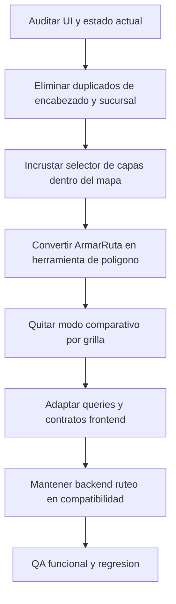

# Plan Rediseño Supervisión Mapa

## Alcance confirmado
- Se elimina el **modo comparativo de grilla/cuadrantes entre vendedores** (actual `ruteo` visual del mapa).
- **No** se elimina el objetivo de ruteo del backend en esta fase; queda compatible para flujos vigentes.
- Se conserva **solo** el selector de sucursal del topbar y se eliminan chips/paneles duplicados.

## Objetivo UX
- Dejar una sola jerarquía de entrada: **Topbar -> Mapa -> Herramientas dentro del mapa -> Panel lateral**.
- Cambiar el selector de modo a un patrón tipo “capas” dentro del mapa para `Activos/Inactivos` y `Deudores`.
- Convertir `Armar Ruta` en herramienta contextual de dibujo de polígono dentro del mapa, sin modo de pantalla aparte.
- Eliminar duplicados: doble título “Panel de Supervisión” y doble selector de sucursal.
- Reemplazar el modo `ruteo` comparativo por herramientas contextuales dentro del mapa (capas + polígono).

## Flujo de resolución

## Cambios necesarios por capa

### Modelos de base de datos
- No requiere migración obligatoria para el rediseño UI.
- Mantener tablas y columnas actuales de objetivos/ruteo para compatibilidad histórica:
  - `objetivos`, `objetivo_items`, `objetivo_documentos`.
- Documentar explícitamente que `ruteo` queda “legacy-compatible” en esta fase.

### Backend
- Mantener endpoints de supervisión base sin cambios funcionales mayores:
  - `/api/supervision/vendedores/{dist_id}`
  - `/api/supervision/rutas/{id_vendedor}`
  - `/api/supervision/clientes/{id_ruta}`
  - `/api/supervision/cuentas/{dist_id}`
- Mantener endpoints de ruteo activos para compatibilidad operativa (crear/listar/regenerar), pero sin acoplarlos al modo comparativo eliminado:
  - `POST /api/supervision/objetivos`
  - `GET /api/supervision/objetivos/{dist_id}`
  - `POST /api/supervision/objetivos/{objetivo_id}/regenerar-pdf-ruteo`
- Si luego se decide retiro total del objetivo ruteo: abrir fase 2 con migración/deprecación.

### Frontend
- Unificar layout y eliminar duplicados de encabezado/selector.
- Reemplazar selector externo de modos por control interno en mapa (“capas”).
- Integrar `Armar Ruta` como herramienta de polígono en `MapaRutas` (sin navegar a `ModoRuteo`).
- Asegurar que panel lateral y mapa consuman el mismo estado fuente para filtros y KPIs.

## Archivos y funciones específicas a modificar (en orden)
1. `/Users/ignaciopiazza/Desktop/CenterMind/shelfy-frontend/src/app/supervision/page.tsx`
- Ajustar estructura para evitar doble título “Panel de Supervisión”.
- Dejar un único encabezado semántico (Topbar o H1, no ambos).

2. `/Users/ignaciopiazza/Desktop/CenterMind/shelfy-frontend/src/components/admin/TabSupervision.tsx`
- `MAP_MODES`: eliminar `ruteo` (modo comparativo por grilla/cuadrantes) de opciones visibles.
- `MapModeSelector()`: reemplazar por wiring hacia control interno del mapa.
- Render principal: quitar branch `mapMode === 'ruteo' ? <ModoRuteo/> : ...` y usar siempre `MapaRutas`.
- Eliminar selectores duplicados de sucursal (`chips` y selector secundario en panel), dejando solo topbar.
- Consolidar estado de `selectedSucursal`, `selectedPDVsForObjective`, `activePolygonPdvIds`.

3. `/Users/ignaciopiazza/Desktop/CenterMind/shelfy-frontend/src/components/admin/MapaRutas.tsx`
- Agregar control “capas de mapa” interno para `Activos/Inactivos` y `Deudores`.
- Integrar botón/herramienta `Armar Ruta` dentro del mapa (polígono + selección de PDVs).
- Mantener callbacks actuales (`onPolygonSelectionChange`, `onModeChange`) simplificando contrato a modos finales.

4. `/Users/ignaciopiazza/Desktop/CenterMind/shelfy-frontend/src/components/admin/ModoRuteo.tsx`
- Quitar del flujo principal y de navegación visible.
- Dejar como legacy temporal solo si hay dependencias indirectas; si no, remover imports y referencias.

5. `/Users/ignaciopiazza/Desktop/CenterMind/shelfy-frontend/src/store/useSupervisionStore.ts`
- Simplificar estado global: retirar dependencias de `mapMode='ruteo'`.
- Mantener estado para herramienta de polígono y selección de PDVs dentro del mapa.
- Revisar actions/toggles para eliminar ramas muertas.

6. `/Users/ignaciopiazza/Desktop/CenterMind/shelfy-frontend/src/lib/api.ts`
- Verificar tipos usados por panel/mapa tras eliminar modo `ruteo` visual.
- Mantener contratos de objetivos por compatibilidad (fase 1), sin romper tipado.

7. `/Users/ignaciopiazza/Desktop/CenterMind/CenterMind/routers/supervision.py`
- Sin cambios obligatorios para esta fase UI.
- Opcional: agregar notas de deprecación para endpoints no usados por UX principal.

## Secuencia recomendada
1. Limpiar layout duplicado (título + sucursal), conservando selector topbar.
2. Quitar el modo comparativo por grilla/cuadrantes del selector global.
3. Unificar render a `MapaRutas` únicamente.
4. Mover modos finales a control interno del mapa tipo capas (`Activos/Inactivos`, `Deudores`).
5. Integrar `Armar Ruta` dentro del mapa con polígono y objetivación.
6. Retirar referencias activas a `ModoRuteo` y ramas de store asociadas.
7. Validar regresión de KPIs, panel lateral, filtros y deudores.
8. Documentar compatibilidad backend ruteo y abrir fase 2 si se quiere eliminación total.

## Checklist de verificación
- Con una sucursal: selector único visible y preseleccionado.
- Con múltiples sucursales: un solo selector, sin chips duplicados.
- Mapa: cambios de capa instantáneos (`Activos/Inactivos`, `Deudores`) sin rerender roto.
- Herramienta `Armar Ruta`: seleccionar polígono, reflejar selección en panel y crear objetivo.
- Sin rastro del modo comparativo por grilla/cuadrantes en UI para ningún rol.
- Sin “doble Panel de Supervisión” en la vista final.
