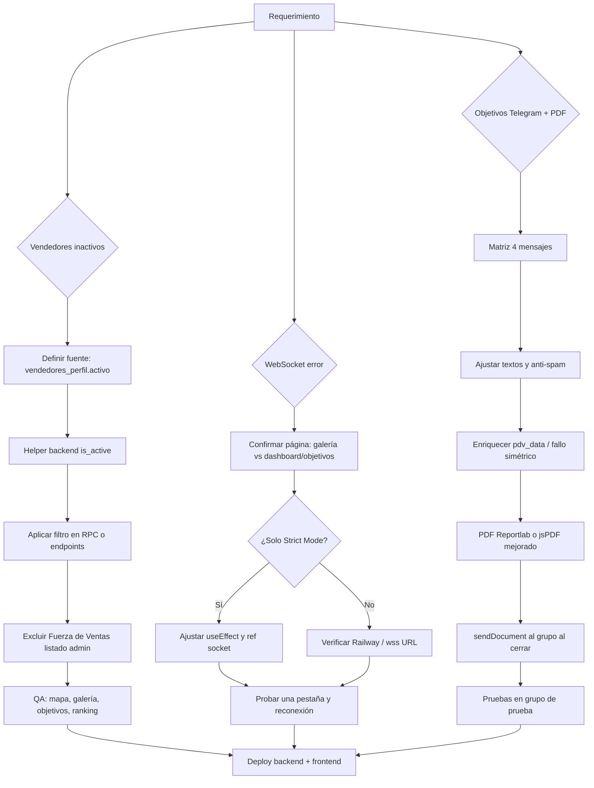

# Plan técnico: vendedores inactivos, WebSocket galería/objetivos, notificaciones y PDF de objetivos

**Fecha:** 2026-04-15  
**Alcance:** análisis y plan de implementación (sin código final).

---

## 1. Resumen ejecutivo

| Tema | Causa probable | Enfoque recomendado |
|------|----------------|---------------------|
| Ocultar vendedores marcados inactivos en Fuerza de Ventas | El flag vive en `vendedores_perfil.activo`; muchos listados leen solo `vendedores_v2` o RPCs sin filtrar | Regla única en backend (y/o RPC Supabase) + filtros puntuales en UI donde haga falta |
| Error WebSocket `wss://api.shelfycenter.com/api/ws/exhibiciones/3` | La galería **no** abre WebSocket en el código actual; el error suele venir de **Dashboard / Modo Oficina / Objetivos** o de **React Strict Mode** (doble mount) / proxy (Railway) | Confirmar página real en DevTools; endurecer lifecycle del cliente WS; validar soporte WS en Railway |
| Mensajes Telegram objetivos (4 tipos) | Lógica dispersa: `objetivos_notification_service`, `objetivos_watcher_service`, `bot_worker.sync_evaluaciones_job` | Matriz de mensajes + deduplicación + enriquecer `pdv_data` en notificaciones |
| PDF cortado / poco datos | Certificado en frontend (`downloadCertificado` con jsPDF) sin sucursal/lista PDVs; líneas largas sin wrap | Ampliar datos en el objeto + `splitTextToSize` o generar PDF en backend (reportlab, ya usado en `objetivos_ruteo_pdf_service`) |
| Enviar PDF al grupo al cerrar objetivo | Solo hay `sendMessage` hoy | `sendDocument` de Telegram Bot API + PDF generado o subido a Storage |

---

## 2. Modelos de base de datos

### 2.1 Estado actual relevante

- **`vendedores_perfil`**: `id_distribuidor`, `id_vendedor_v2`, `activo` (boolean; default típico `true`). Ya se expone en `GET /api/fuerza-ventas/vendedores/{dist_id}` (`CenterMind/routers/fuerza_ventas.py`).
- **`vendedores_v2`**: no tiene columna `activo` de negocio; el “inactivo” operativo para FV es el perfil.

### 2.2 Cambios de esquema (solo si se elige centralizar en SQL)

- **Opción A (recomendada sin migración):** filtrar en Python leyendo `vendedores_perfil` en join con `vendedores_v2` donde corresponda.
- **Opción B (RPC):** alterar `fn_supervision_vendedores` (y otras RPC usadas en ranking/dashboard si aplica) para **excluir** vendedores con `vendedores_perfil.activo = false` mediante `LEFT JOIN vendedores_perfil` y `WHERE (activo IS DISTINCT FROM false)` o equivalente.
- **Índice (opcional):** `(id_distribuidor, id_vendedor_v2)` en `vendedores_perfil` si no existe, para joins rápidos.

### 2.3 Objetivos / PDFs

- Tablas existentes: `objetivos`, `objetivo_items`, `objetivos_tracking` — no requieren cambio para “más texto en PDF”.
- Si se guarda PDF en Storage para Telegram: reutilizar patrón de `objetivos_ruteo_pdf_service` (bucket `objetivos-pdf`) o tabla `objetivo_documentos` si ya se usa en creación de objetivos ruteo.

---

## 3. Backend — cambios conceptuales

### 3.1 Vendedores inactivos (visibilidad global excepto Fuerza de Ventas)

- **Principio:** Un helper reutilizable, por ejemplo `def vendedor_is_active_for_ui(dist_id, id_vendedor_v2) -> bool` que lea `vendedores_perfil` (default activo si no hay fila).
- **Aplicar filtro en endpoints que alimentan supervisión, mapas, galería, objetivos (selectores), ranking**, etc.
- **Excluir explícitamente** `/api/fuerza-ventas/*` de ese filtro (debe listar **todos** los vendedores con su `activo`).

Archivos típicos a tocar (detalle en orden más abajo):

- `CenterMind/routers/supervision.py` — `supervision_vendedores` (post-proceso del RPC o filtro en RPC).
- `CenterMind/routers/fuerza_ventas.py` — `galeria_list_vendedores` / `galeria_list_clientes_por_vendedor`: excluir vendedores inactivos del **listado** de la galería (no del módulo FV).
- `CenterMind/routers/reportes.py` (y otros que listan vendedores por `dist_id`): revisar KPIs/ranking que agreguen por vendedor.
- Cualquier RPC en Supabase: documentar cambio en migración SQL aparte.

### 3.2 WebSocket `/api/ws/exhibiciones/{dist_id}`

- **Servidor:** `CenterMind/api.py` → `websocket_endpoint`; `ConnectionManager` en `CenterMind/core/lifespan.py` (acepta sin JWT — comportamiento actual).
- **Problemas frecuentes:**
  1. **Strict Mode (React):** `useEffect` monta, abre WS, desmonta, cierra → mensaje “closed before connection is established”. Mitigación: ref de “connecting”, un solo socket, o `useEffect` con dependencias estables.
  2. **Railway:** confirmar que el servicio permite upgrade WebSocket (HTTP/1.1); revisar timeouts idle.
  3. **URL:** `shelfy-frontend/src/lib/api.ts` → `getWSUrl` — debe ser `wss://api.shelfycenter.com/...` cuando `NEXT_PUBLIC_API_URL` es https.

**Nota sobre galería:** `shelfy-frontend/src/app/galeria-exhibiciones/page.tsx` no usa `getWSUrl`. Si el error aparece “al ver imágenes del cliente”, puede ser pestaña/objetivos en paralelo o caché de otro módulo; documentar reproducción con una sola pestaña y sin objetivos abiertos.

### 3.3 Notificaciones Telegram de objetivos (4 mensajes)

Estado actual (referencia):

| # | Intención | Dónde está hoy | Notas |
|---|-----------|------------------|-------|
| 1 | Asignación | `ObjetivosNotificationService.notify_new_objective_telegram` | Ya envía mensaje rico (PDVs, fechas). Revisar texto/emoji y no duplicar con descripción automática. |
| 2 | “Exhibición cuenta para objetivo” | `notify_vendor_telegram` con `tipo_evento == "exhibicion"` | Mensaje genérico “Objetivo en Marcha”; **no** distingue “cuenta para meta” vs otro avance. |
| 3 | Progreso: “el supervisor evaluó” | Parcialmente en `bot_worker.sync_evaluaciones_job` (edita mensaje de la foto, no canal objetivos) | **No** hay mensaje dedicado objetivo en Telegram cuando el supervisor aprueba en portal; el watcher dispara `exhibicion` al detectar aprobado en DB. |
| 4 | Cumplimiento / fallo al terminar | `notify_objetivo_cumplido` | Solo éxito; **no** hay nombre `notify_objetivo_fallido` simétrico para todos los cierres en falla. |

**Spam / cuándo enviar:**

- `objetivos_watcher_service._insert_tracking_batch` notifica **por cada ítem** en `items` — para muchas fotos el mismo día puede saturar. Definir: máximo N mensajes por objetivo por día, o agrupar por batch, o solo notificar transiciones importantes (ej. primera aprobación por PDV).
- **Deduplicación:** ya existe `objetivos_tracking` — no reenviar si `id_referencia` ya estaba.

**Enriquecimiento:** `notify_vendor_telegram` usa `pdv_data` desde `exhibiciones`; hoy puede venir sin `nombre_cliente`. Resolver con join a `clientes_pdv_v2` en el watcher antes de notificar, o en el servicio de notificación por `id_cliente_pdv`.

### 3.4 PDF al grupo y diseño del certificado

- **Telegram:** añadir envío con `sendDocument` (multipart) además de `sendMessage`.
- **Generación PDF:**
  - **Opción A:** Mejorar `downloadCertificado` en frontend (jsPDF: márgenes, `splitTextToSize`, sucursal desde `obj` si el API la envía).
  - **Opción B (recomendada para paridad con Telegram):** nuevo método en backend tipo `objetivos_certificado_pdf_service` usando **reportlab** (como `objetivos_ruteo_pdf_service.py`), subir a Storage y enviar archivo o bytes por Telegram.
- **Disparo:** al marcar `cumplido` + `resultado_final` en `objetivos_watcher_service` (y en ramas de expiración/cierre), llamar a notificación con PDF adjunto **una vez** por cierre.

---

## 4. Frontend — cambios conceptuales

### 4.1 Vendedores inactivos

- Donde se listan vendedores desde `fetchSupervisionVendedores` / queries de objetivos / mapas: si el backend ya filtra, la UI solo se beneficia.
- **Fuerza de Ventas:** `shelfy-frontend/src/app/fuerza-ventas/` (ruta según proyecto) — **no** filtrar inactivos; mostrar toggle/estado para administración.
- **Galería:** lista de vendedores debe omitir inactivos (preferible backend).

### 4.2 WebSocket

- `shelfy-frontend/src/app/dashboard/page.tsx`, `modo-oficina/page.tsx`, `objetivos/page.tsx`: revisar `useEffect` de WebSocket (cleanup, `socket`, reconexión, suprimir error en unmount intencional).
- `shelfy-frontend/src/lib/api.ts` → `getWSUrl`: validar `NEXT_PUBLIC_API_URL` en Vercel.

### 4.3 PDF objetivos

- `shelfy-frontend/src/app/objetivos/page.tsx` → función `downloadCertificado` (aprox. líneas 328–392): ampliar layout, datos (sucursal, lista de `items`, distribuidora), corrección “Éxito” vs “EXITO”.

---

## 5. Diagrama Mermaid — flujo de resolución global

---

## 6. Archivos y funciones — orden de trabajo recomendado

### Fase 1 — Visibilidad vendedores inactivos

1. **`CenterMind/routers/fuerza_ventas.py`**  
   - **No** filtrar inactivos en `fuerza_ventas_list_vendedores` / `fuerza_ventas_get_vendedor`.  
   - **Sí** añadir filtro en `galeria_list_vendedores` y, si aplica, `galeria_list_clientes_por_vendedor` (omitir si `vendedores_perfil.activo === false`).

2. **Nuevo helper (o `CenterMind/core/helpers.py`)**  
   - `load_active_vendedor_ids(dist_id)` o `perfil_activo_map(dist_id)` para reutilizar.

3. **`CenterMind/routers/supervision.py`**  
   - `supervision_vendedores`: tras `fn_supervision_vendedores`, filtrar filas cuyo `id_vendedor` esté inactivo en perfil **o** cambiar la RPC en Supabase (migración SQL).

4. **`CenterMind/routers/reportes.py`** (y endpoints de dashboard que listan vendedores)  
   - Alinear con el mismo criterio de activo.

5. **Supabase (si aplica)**  
   - Script SQL para `fn_supervision_vendedores` / `fn_vendedores_pendientes` si el filtrado en Python no es suficiente para rendimiento.

6. **Frontend**  
   - Revisar `shelfy-frontend/src/lib/api.ts` (`fetchSupervisionVendedores` y similares) — solo si el contrato cambia.  
   - `shelfy-frontend/src/components/admin/TabSupervision.tsx` y páginas que construyan listas locales de vendedores: solo si queda algún listado que no pase por backend.

### Fase 2 — WebSocket

1. **`shelfy-frontend/src/lib/api.ts`** — `getWSUrl` (validación de URL producción).  
2. **`shelfy-frontend/src/app/objetivos/page.tsx`** — efecto WebSocket (líneas ~2155–2180).  
3. **`shelfy-frontend/src/app/dashboard/page.tsx`** — mismo patrón.  
4. **`shelfy-frontend/src/app/modo-oficina/page.tsx`** — mismo patrón.  
5. **`CenterMind/api.py`** (`websocket_endpoint`) y **`CenterMind/core/lifespan.py`** (`ConnectionManager`) — solo si hace falta ping/pong o logs.  
6. **Infra:** Railway — documentar timeouts y WebSocket.

### Fase 3 — Objetivos: Telegram y PDF

1. **`CenterMind/services/objetivos_notification_service.py`**  
   - `notify_new_objective_telegram` — revisión de copy.  
   - `notify_vendor_telegram` — nuevos textos por `tipo_evento`; mensaje explícito “supervisor evaluó / cuenta para objetivo” cuando `tipo_evento == "exhibicion"`; método nuevo `notify_objetivo_fallido` o parámetro `resultado`.  
   - Helpers: `send_document` para Telegram.  
   - `notify_objetivo_cumplido` — ampliar datos o delegar a PDF.

2. **`CenterMind/services/objetivos_watcher_service.py`**  
   - `_insert_tracking_batch` — opcional: enriquecer `item` con nombre PDV/sucursal antes de notificar; reglas anti-spam.  
   - Ramas que marcan `cumplido` / `resultado_final` — disparar envío de PDF + Telegram.

3. **`CenterMind/bot_worker.py`**  
   - `sync_evaluaciones_job` — coherencia con mensajes de objetivos (evitar duplicar con watcher si ambos hablan del mismo evento).

4. **PDF**  
   - Nuevo servicio tipo `objetivos_certificado_pdf_service.py` (reportlab) **o** ampliar `shelfy-frontend/src/app/objetivos/page.tsx` → `downloadCertificado`.  
   - Si se genera en backend, endpoint opcional `GET /api/objetivos/{id}/certificado.pdf` para descarga web y mismo binario para Telegram.

5. **`CenterMind/requirements.txt`** — ya suele incluir reportlab si ruteo PDF está activo; confirmar.

---

## 7. Riesgos y pruebas

- **Homónimos / integrantes:** notificaciones ya usan `resolve_integrante_for_objetivos`; cualquier cambio de grupo debe mantener esa resolución.  
- **Datos históricos:** ocultar vendedores inactivos no debe borrar exhibiciones; solo afecta selectores y vistas.  
- **Telegram límites:** `sendDocument` ~50MB máx.; PDFs livianos.  
- **Pruebas:** grupo de Telegram de prueba; un vendedor con `activo=false`; reproducción WS con consola limpia.

---

## 8. Referencias rápidas de código

| Archivo | Qué revisar |
|---------|-------------|
| `CenterMind/routers/fuerza_ventas.py` | `vendedores_perfil`, `galeria_list_vendedores` |
| `CenterMind/api.py` | WebSocket route |
| `CenterMind/core/lifespan.py` | `ConnectionManager` |
| `shelfy-frontend/src/lib/api.ts` | `getWSUrl` |
| `CenterMind/services/objetivos_notification_service.py` | Telegram completo |
| `CenterMind/services/objetivos_watcher_service.py` | Tracking y notificaciones |
| `CenterMind/services/objetivos_ruteo_pdf_service.py` | Patrón reportlab + Storage |
| `shelfy-frontend/src/app/objetivos/page.tsx` | `downloadCertificado`, WebSocket |

---

*Fin del plan. Implementar siguiendo las fases; ajustar orden si una dependencia de infra (Railway/WS) bloquea pruebas.*
